# Guía 1 : Sistema Base MicroBlaze V

## Objetivo

En esta guía se detalla como describir el sistema base de MicroBlaze V, como correr aplicaciones sobre este y que funcionalidades posee la herramienta Vitis al momento de trabajar con el flujo embebido.

## Contexto


### ¿ Que es RISC-V?

RISC-V es una arquitectura de conjunto de instrucciones que funciona como el vocabulario básico que permite la comunicación entre el software y el hardware de un procesador. Se basa en la filosofía RISC, que prioriza el uso de un conjunto reducido y simplificado de instrucciones para que el procesador ejecute tareas de forma más rápida y eficiente, a diferencia de otras arquitecturas tradicionales que usan instrucciones más complejas. La letra V indica que es la quinta generación de este diseño, el cual fue creado originalmente en la Universidad de California, Berkeley.


Lo que realmente hace especial a RISC-V frente a otras opciones del mercado es que es un estándar de código abierto y totalmente libre de regalías. Mientras que para usar arquitecturas dominantes como x86 de Intel o ARM de los teléfonos móviles las empresas deben pagar licencias muy costosas y restrictivas, cualquier persona o compañía puede tomar las especificaciones de RISC-V para diseñar, modificar y fabricar sus propios chips sin pagar derechos de propiedad intelectual. Esto permite una enorme flexibilidad, ya que los desarrolladores pueden adaptar el procesador exactamente a sus necesidades añadiendo funciones específicas, lo que reduce drásticamente los costos de desarrollo y está democratizando la creación de nuevo hardware para todo tipo de tecnologías.

 
Para mas información visitar la pagina de [RISC-V international](https://riscv.org/).

{ #fig:flow width="500" }
{ #fig:flow width="500" }


### ¿Que es Microblaze -V ?

MicroBlaze V es un procesador soft-core de tipo RISC-V desarrollado por AMD para sus FPGAs y SoCs adaptativos . A diferencia de un procesador hard-core, el cual posee una microarquitectura fija en el silicio del dispositivo, un procesador soft-core se distribuye como un bloque IP que se importa al diseño y se implementa sobre la lógica programable del FPGA, lo que lo vuelve agnóstico a la placa: el mismo bloque puede ser instanciado en cualquier dispositivo soportado por Vivado, replicarse en varias instancias dentro de un mismo chip y configurarse a la medida de la aplicación, habilitando únicamente las funcionalidades que se necesitan.

 Esta flexibilidad se traduce, en el caso de MicroBlaze V, en una arquitectura modular que admite los conjuntos base RV32I y RV64I junto con extensiones opcionales para multiplicación/división (M), instrucciones atómicas (A), punto flotante (F), compresión de código (C) y manipulación de bits (B), además de configuraciones predefinidas que abarcan desde un microcontrolador simple hasta un procesador de aplicación, y de mecanismos de seguridad funcional como dual-core lockstep y redundancia modular triple (TMR). A esto se suma la compatibilidad de hardware con el MicroBlaze clásico  y el acceso al ecosistema de software RISC-V, todo integrado de forma nativa en el flujo de Vivado y Vitis y sin costo adicional sobre las licencias de la suite de diseño.

En la [](#fig:EstructuraMBV) se muestra un diagrama simplificado de la 
implementación de MicroBlaze V. La arquitectura sigue un esquema tipo Harvard,
en el que la memoria de instrucciones y la de datos se acceden a través de 
buses independientes, lo que permite solapar la búsqueda de la siguiente 
instrucción con un acceso a datos en el mismo ciclo de reloj.

{ #fig:EstructuraMBV width="500" }
{ #fig:EstructuraMBV width="500" }

Los bloques que componen el sistema son los siguientes:

- **Procesador RISC-V**: núcleo del sistema, que implementa el conjunto de
  instrucciones RISC-V. El procesador expone dos puertos de memoria local 
  que operan en paralelo:
    - **ILMB (Instruction Local Memory Bus)**: bus por el cual el procesador 
      obtiene las instrucciones a ejecutar. La región de memoria asociada a 
      este bus contiene el código ejecutable del programa.
    - **DLMB (Data Local Memory Bus)**: bus por el cual el procesador lee y 
      escribe datos. La región asociada aloja las variables, el *heap* y 
      el *stack*. Como se aprecia en la [](#fig:EstructuraMBV), este bus 
      dispone además de una salida hacia los módulos de entrada/salida del 
      sistema, interconectados internamente mediante el bus AXI, lo que 
      permite acceder a los periféricos del SoC.

- **Bus de Memoria (LMB)**: cada uno de los buses ILMB y DLMB se implementa 
  como una instancia independiente del IP de bus LMB. El LMB es un bus 
  sincrónico, de un solo maestro, optimizado para accesos de un único ciclo 
  a memoria interna de la FPGA, lo que minimiza la latencia entre el 
  procesador y la BRAM.

- **Control Interfaz BRAM LMB**: bloque que actúa como puente entre el 
  protocolo LMB y la interfaz nativa de las Block RAM de la FPGA. Su 
  función es traducir las transacciones LMB en operaciones de lectura y 
  escritura sobre el puerto correspondiente de la BRAM. Al instanciarse un 
  controlador independiente para ILMB y otro para DLMB, ambos accesos 
  pueden coexistir sin contienda.

- **Block RAM (BRAM)**: recursos lógicos dedicados a memoria, integrados en 
  el silicio de la FPGA. En esta configuración se implementan en modalidad 
  *dual port*, es decir, con dos puertos físicos independientes que 
  comparten el mismo arreglo de almacenamiento. Esta característica permite 
  que el bus de instrucciones y el bus de datos accedan simultáneamente —en 
  el mismo ciclo y a direcciones distintas— al mismo banco de memoria, 
  materializando la separación lógica de la arquitectura Harvard sobre un 
  único recurso físico.

- **MicroBlaze Debug Module (MDM)**: bloque opcional que provee acceso al 
  procesador a través de JTAG. Permite cargar el programa en memoria, fijar 
  *breakpoints*, ejecutar paso a paso y leer el estado de los registros, 
  funcionalidades utilizadas por el depurador integrado en Vitis durante el 
  desarrollo y la verificación del *firmware*.

 Para mas información se adjunta el enlace a [la documentación oficial de MicroBlaze V](https://www.amd.com/en/products/software/adaptive-socs-and-fpgas/microblaze-v.html).


## Diseño de Hardware

### Creación de proyecto


Ejecute Vivado y haga click en *Create Project* para iniciar la ventana del asistente para crear un proyecto de Vivado.
En la ventana emergente, indique un nombre para el proyecto y su ubicación, luego de click a *Next*.
En la ventana titulada *Project Type* se detallan las distintas opciones para la generación de un nuevo proyecto:

* **RTL Project**: Permite crear un diseño desde cero haciendo uso de lenguajes de descripción de hardware.
* **Post-synthesis Project**: Este proyecto se salta la síntesis lógica, asumiendo que fue realizada en un trabajo previo u otra herramienta.
* **I/O Planning Project**: Usado para la definición del asignado de los pines.
* **Imported Project**: Usado para importar proyectos desde otras herramientas o versiones previas de las herramientas de AMD.
* **Example Project**: Permite cargar un proyecto de ejemplo del repositorio de AMD.

Seleccione *RTL Project* y marque la casilla *Do not specify sources at this time*, puesto que en este proyecto no se va a hacer manejo directo de archivos HDL.

La siguiente ventana es *Default Part*, en esta ventana se elige la FPGA a usar donde:

* **Part**: Le indica a Vivado que chip posee la placa, pero nada mas. Esto implica que se tiene que escribir manualmente el archivo de constraints e indicar configuraciones específicas a bloques IP como frecuencia de reloj y parámetros varios.
* **Boards**: Le indica a Vivado que debe cargar un Archivo de Placa (**Board File**) que posee metadata del hardware especifico, agilizando el diseño al permitir el importado directo de periféricos propios de este.


En este caso se hará uso de la **Board File** de la placa Nexys A7-100T por lo que debe dar click a *Boards*, sin embargo es probable que no posea la Board File asociada a esta placa, por lo que para descargarla es necesario actualizar el catálogo de Board Files haciendo click en el botón indicado en la [](#fig:board1). Dependiendo de la calidad de su conexión a internet, este proceso puede demorarse hasta 10 minutos.

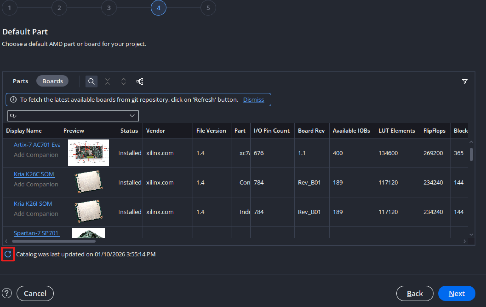{ #fig:board1 width="1000" }

---

Una vez que ha actualizado el catalogo use el buscador para encontrar la placa escribiendo "Nexys A7-100T", tras lo cual instale haciendo click en el botón indicado en la [](#fig:board2).

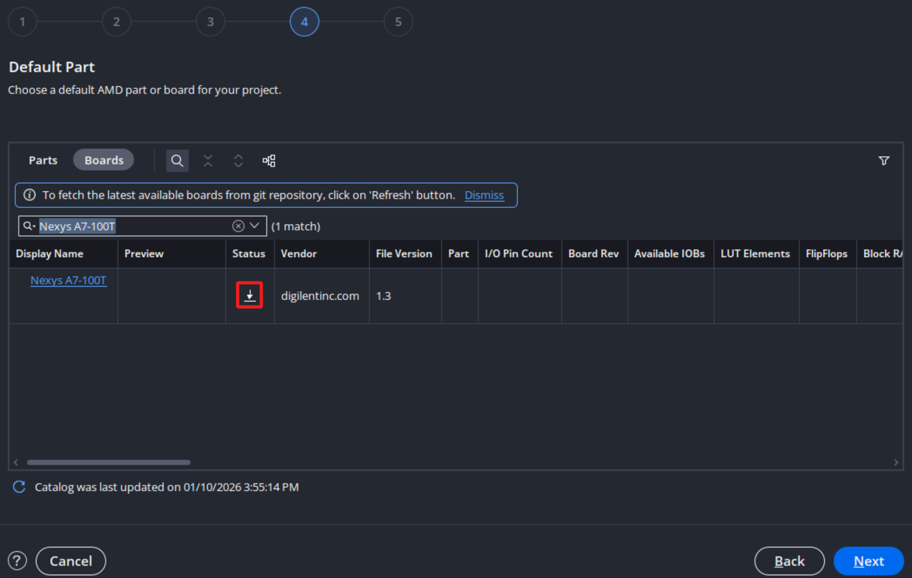{ #fig:board2 width="1000" }

Tras la descarga seleccione la placa y prosiga hasta *Finish Setup*.

### Descripción del Sistema Base

Una vez creado el proyecto, en la ventana *Flow Navigator*, se hace uso del menú *IP Integrator* donde se le da click a *Create Block Design* como se indica en la [](#fig:flow).

Tras asignarle un nombre al diagrama se abrirá una ventana vacía, titulada *Diagram* donde se realiza la descripción del sistema a través de la interconexión de bloques IP. Una ventaja que ofrece hacer uso del diagrama de bloques para diseñar el sistema, es que las interconexiones de protocolos de comunicación del sistema se realizan de manera automatizada.

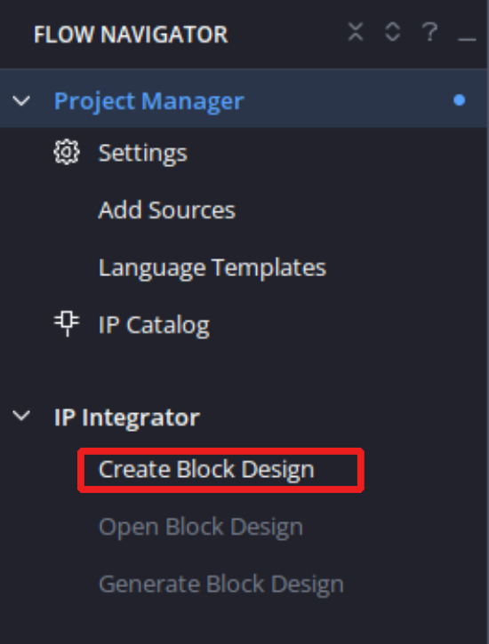{ #fig:flow width="250" }

---

Explorando la ventana del diagrama de bloques en la [](#fig:diagram), se tiene que consta de las siguientes funcionalidades:

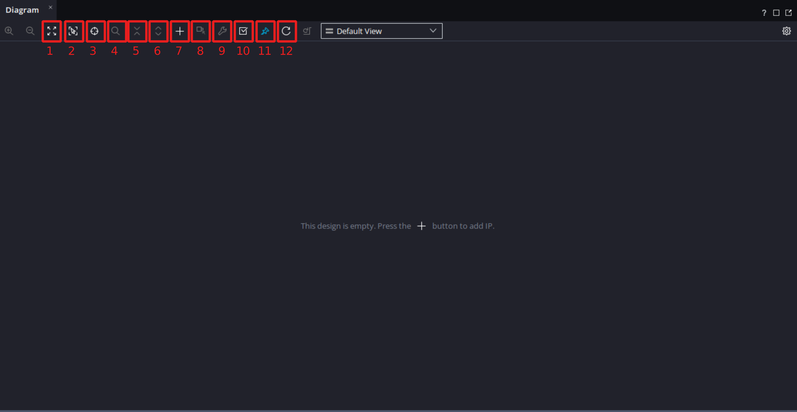{ #fig:diagram width="1000" }

1. **Zoom Fit**: Ajusta la visualización de manera de que se vean todos los bloques.
2. **Select Area**: Permite seleccionar múltiples bloques de IP.
3. **Auto-fit Selection**: Enfoca la visualización en el bloque(s) seleccionado(s).
4. **Search**: Busca un bloque o una señal.
5. **Collapse All**: Minimiza todos los bloques que estén compuestos por múltiples bloques.
6. **Expand All**: Expande todos los bloques compuestos por múltiples bloques.
7. **Add IP**: Expande un catalogo de bloques, tras seleccionar uno, este es añadido al diagrama de bloques, también puede ser invocado usando **Ctrl+i**.
8. **Make External**: Permite seleccionar una señal y mapearla a un pin de la placa.
9. **Customize block**: Permite configurar un bloque del diseño.
10. **Validate Design**: Revisa que el diseño cumpla con los requisitos de los bloques importados.
11. **Pin block and ports to location**: Mapea pines a espacios fisicos.
12. **Regenerate layout**: Reordena los bloques para mejorar visualización sin realizar cambios en las conexiones.


Note que el boton **Validate Design** solo  valida que se cumplan los checks de reglas de diseño (DRC) de cada bloque. Es decir que pines que esperen una conexión a un reloj la posean, que este reloj posea una frecuencia en el rango esperado y que no se realicen conexiones incompletas en las interfaces de los bloques. La validación del diagrama de bloques no es un asegurado de que el sistema funcione. Para más información visitar [la guia de usuario](https://docs.amd.com/r/en-US/ug994-vivado-ip-subsystems/Running-Design-Rule-Checks).

Otra nota adicional, es que si en un punto sus diagramas no coinciden con alguna figura mostrada en estas guías, se recomienda hacer click en **Regenerate Layout**.

Haga click en **Add IP** y escriba en el buscador "MicroBlaze V", aparecerán 3 opciones como indica la [](#fig:microblazevmodules).

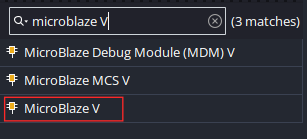{ #fig:microblazevmodules width="250" }

---

Estas opciones corresponden a:

1. **MicroBlaze V**: Implementación base del procesador.
2. **MicroBlaze Debug Module (MDM) V**: Modulo que permite el depurado de aplicaciones en Vitis a través de JTAG. Al momento de completar la implementación base del MicroBlaze V se da la opción de integrarlo automáticamente.
3. **MicroBlaze MCS V**: Una implementación de MicroBlaze V orientada a microcontroladores, importa periféricos fijos junto al procesador de manera compacta. Posee la limitación de que las aplicaciones no pueden correr desde la memoria externa y posee un numero fijo de periféricos disponibles. 

En este caso se hará uso de la opción *MicroBlazeV*.

Una vez que se haya importado el modulo, este aparecerá en el diagrama de bloques como se puede apreciar en la [](#fig:microblazevonbd), en esta ventana haga click *Run Block Automation*, este botón automatiza la generación de los bloques mínimos necesarios para el funcionamiento del procesador.

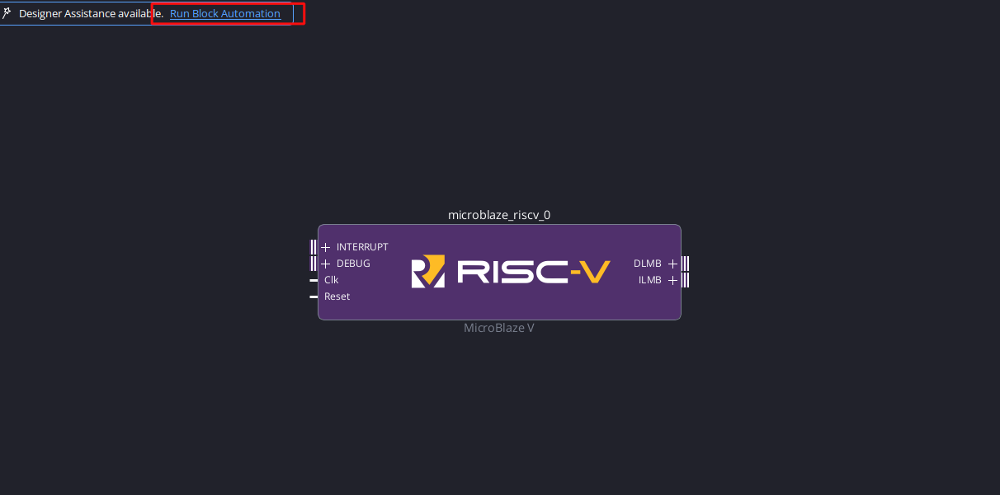{ #fig:microblazevonbd width="1000" }

En la ventana emergente **Run Block Automation** vista en la [](#fig:microblazevautomation) se pueden apreciar una variedad de configuraciones.

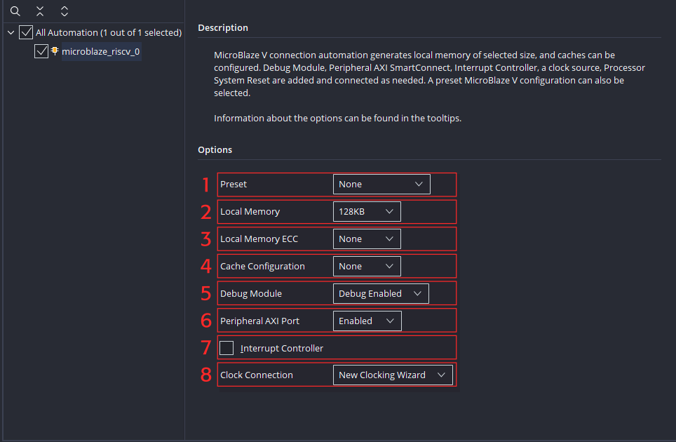{ #fig:microblazevautomation width="1000" }

---

1. **Preset**: Implementaciones especificas de MicroBlaze, se puede elegir entre la predeterminada, la implementación orientada a microcontrolador previamente mencionada, un procesador orientado a operaciones en tiempo real y un procesador dedicado a una aplicación única.
2. **Local Memory**: Define cuanta memoria es dedicada al procesador, es en esta memoria donde se corren aplicaciones y se guardan librerías de código varias.
3. **Local Memory Error Corrective Code**: Código que detecta y arregla corrupción de datos dentro de la memoria local del procesador.
4. **Cache configuration**: Define establecer la cantidad de recursos asignados a la memoria cache, la cual es una memoria de alta velocidad que actúa como intermediaria entre el procesador MicroBlaze y la memoria externa. Su implementación no es estrictamente necesaria si el sistema no utiliza memoria DDR, ya que la memoria local se ejecuta directamente sobre bloques de RAM internos (BRAM), que ya ofrecen un rendimiento elevado.
5. **Peripheral AXI Port**: Habilita la conexión de periféricos al procesador a través del protocolo AXI.
6. **Interrupt Controller**: Habilita el uso de interrupciones externas generadas por el usuario o a través del uso de periféricos.
7. **Clock conection**: Define si el procesador hará uso de un reloj generado a través de un Clocking Wizard o si hará uso del reloj del sistema.

En *Local Memory* aumente su valor al máximo posible (128KB), se elige este valor para evitar que el tamaño de la aplicación generada sea una limitante para esta guía. Al momento de compilar la aplicación Vitis muestra su tamaño total y lanza un mensaje de error si la memoria interna no es suficiente para almacenar el binario. Mantenga el resto de los parámetros en sus valores predeterminados.

Tras presionar *OK* actualizara el diagrama de bloques al importar varios bloques y sus respectivas interconexiones, debería quedar de la forma vista en la [](#fig:microblazevbdpostautomation). 

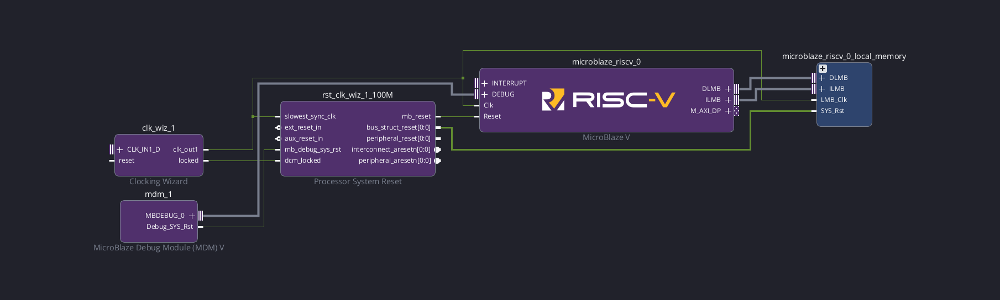{ #fig:microblazevbdpostautomation width="1000" }

Los modulos importados son:

* **MicroBlaze Debug module (MDM) V**: Modulo de depurado, se integro debido a la opción *Debug Enabled*.
* **Local memory**: 128Kb de memoria implementada a través de BRAM.
* **Clock Wizard**: Generado debido a la opción *New Clocking Wizard* en **Clock Connection**, genera el reloj que alimenta al sistema.
* **Processor System Reset**: Genera un reset sincrónico que tiene en cuenta sensibilidades del sistema computacional.

---

Luego, prosiga haciendo doble click sobre el bloque Clocking Wizard, el cual lanzara su ventana de configuraciones, sobre esta dejar la opción *CLK_IN1* en sys_Clock, de manera de que sea alimentado por el reloj de la placa, realice el mismo proceso con **EXT_RESET_IN**, fijándolo en reset.

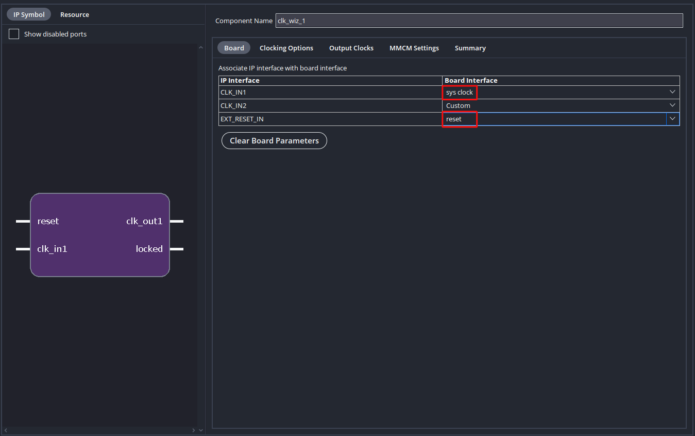{ #fig:clockwizzard width="1000" }

Tras apretar *OK* se vuelve al diagrama de bloques, en esta instancia hay que hacer click sobre el botón *Run connection automation* el cual realizara las conexiones mínimas entre el sistema en el diagrama de bloque y los correspondientes pines en la tarjeta.

Este lanzara una ventana emergente donde preguntara que conexiones realizar, marque *All Automation* de manera que se automatice la conexión de los puertos externos de reloj y reset al sistema.

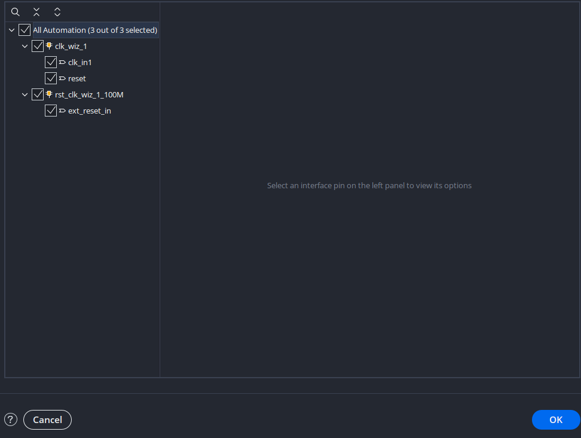{ #fig:allautomation width="1000" }

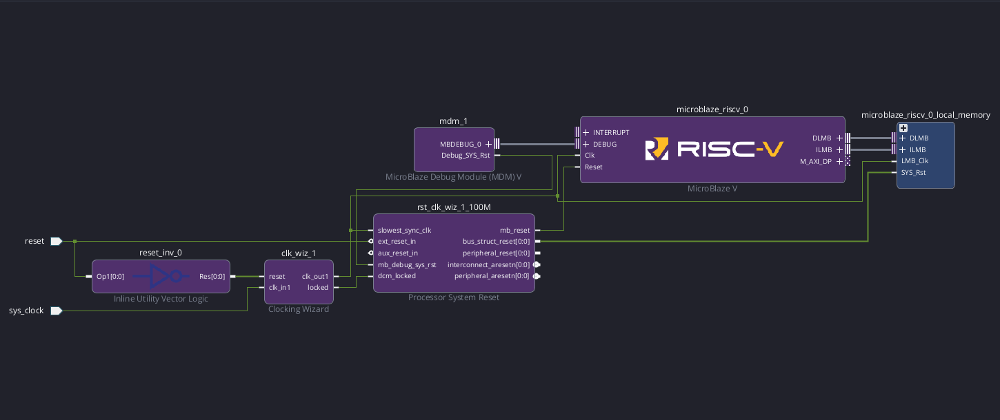{ #fig:microblazevbdpostautomation2 width="1000" }

---

Teniendo ya las conexiones armadas, diríjase al panel lateral en la sección *Boards*. Debido a que se realizó la selección de *Boards* en el inicio, Vivado facilita la integración de los periféricos y puertos al diagrama de bloques. En este caso para el envió de datos se hará uso de UART, por lo que arrastre *USB UART* al diagrama de bloques como indica la [](#fig:boardcomponents).

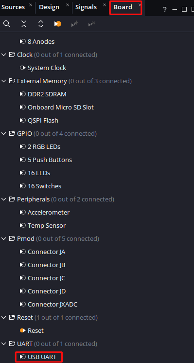{ #fig:boardcomponents width="250" }

---

Tras agregar el periférico al diagrama de bloques haga doble click sobre este y presione **IP Configuration** para configurar las caracteristicas de esta IP. Note que las características del bloque Uart se configuran en esta etapa y no pueden ser cambiadas desde software. En este caso se mantendrán con los valores predeterminados vistos en la [](#fig:UART_Config).

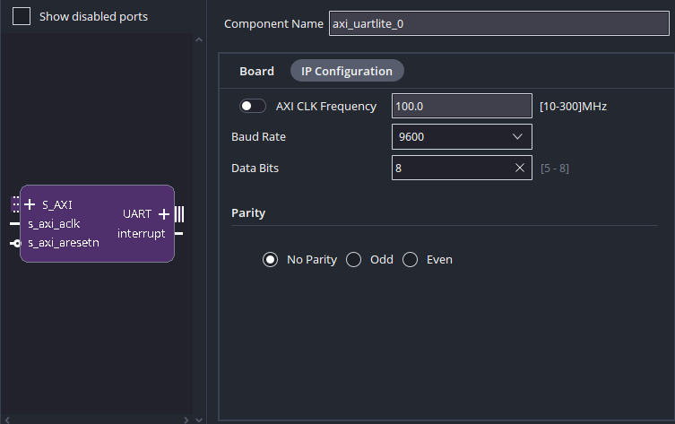{ #fig:UART_Config width="500" }


 Luego nuevamente haga click en *Run Connection automation*, nuevamente saltara una ventana emergente como se ve en la [](#fig:uartconnection), marque *All Connection Automation*, en caso de IPs que se conectan por AXI se puede elegir con que reloj se alimenta tanto la IP como el esquema de comunicación AXI (no se recomienda usar un reloj distinto del esquema AXI para evitar inestabilidades con el timing).

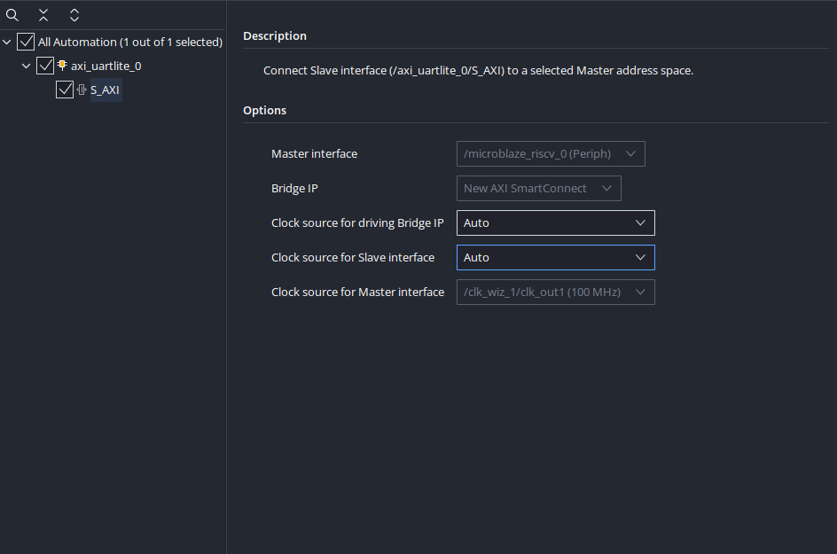{ #fig:uartconnection width="1000" }

Tras aceptar, se importara el modulo **AXI SmartConnect** y se conectará el periférico al esquema AXI del sistema, conectara sus salidas y entradas a los puertos fisicos de la FPGA, como se ve en la [](#fig:microblazevbdpostuart). En sistemas con un solo AXI SmartConnect, todos los periféricos se conectaran de forma predeterminada a este.

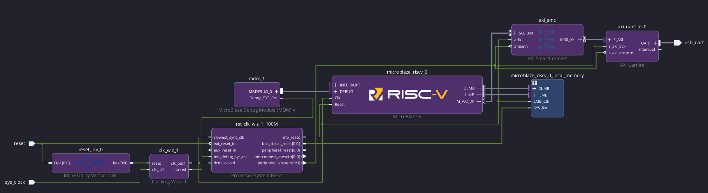{ #fig:microblazevbdpostuart width="1000" }


---

Ya esta listo el sistema que formara la base donde se ejecutara la aplicación, ahora se recomienda visitar el editor de direcciones de memoria al hacer click en *Address Editor*. 
En esta sección se puede visualizar el mapa de memoria, el cual define cómo el procesador accede a instrucciones, datos y periféricos dentro de un sistema embebido implementado en FPGA, cabe destacar que el procesador no ve a los periféricos directamente, sino que los ve como espacios de memoria donde puede realizar escrituras y lecturas para obtener datos. Como lo es el caso del periferico de uart, donde su espacio de lectura va desde 0x4000_0000 hasta 0x4060_0000. En caso de escribir o leer fuera del rango definido entre periféricos y el procesador, solo se apreciaran datos basura, para mas detalle referirse a la sección [](#s:memory). Estos conceptos se verán en mas detalle en la [Guía 3](../../Ejemplo_3_Interrupts/Ejemplo_3/).

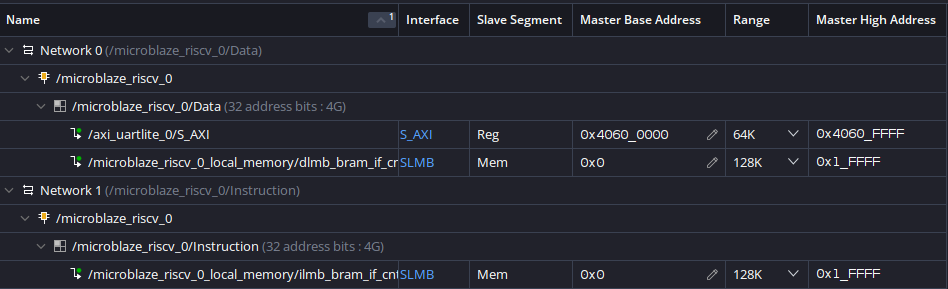{ #fig:addresseditor1 width="1000" }

---

Ahora valide el diseño usando el botón respectivo en el diagrama. Luego diríjase a *Sources* en el panel lateral, haga click derecho en el diagrama de bloques y elija *Generate Output products* como se ilustra en la [](#fig:generateoutputproducts).

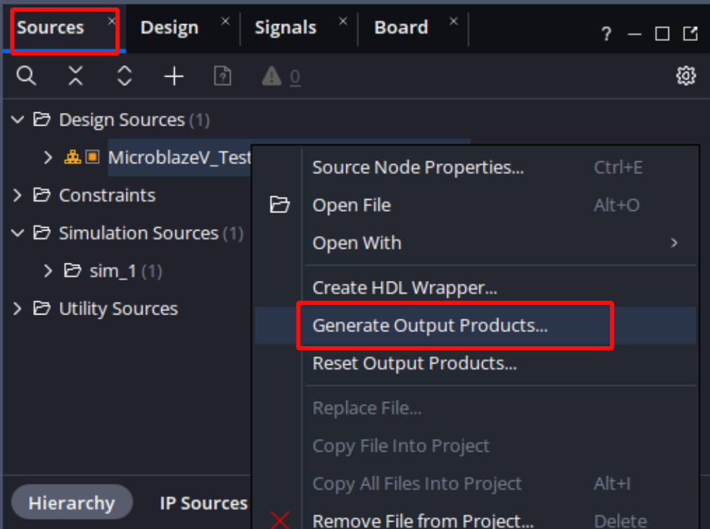{ #fig:generateoutputproducts width="500" }

Esto generara los archivos RTL descritos en el diagrama de bloques tras lanzar la ventana emergente vista en la [](#fig:outputproducts), en cual donde se define si se decide realizar la síntesis del sistema diagrama de bloques como un sistema completo, realizar síntesis individual por IP o en caso de tener multiples diagramas de bloques, hacer síntesis individual para cada uno. 

Cabe destacar que este proceso se demora un par de minutos, en este caso elija *Global* de manera que se le notifique una vez que se haya realizado la síntesis completa. En el caso de haber seleccionado *Out of context per IP* se le lanzaran notificaciones esporádicas a medida que termine la síntesis de cada IP y no podrá continuar hasta que cada una de estas haya concluido.

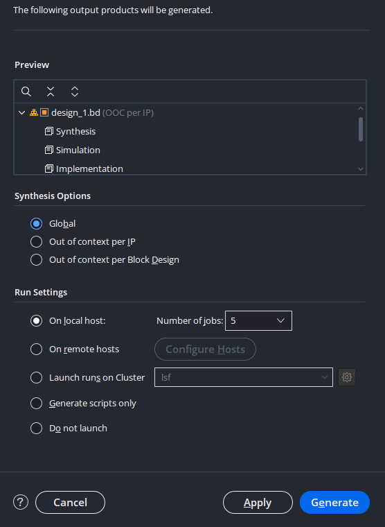{ #fig:outputproducts width="500" }

Una vez que se hayan generado los archivos RTL, haga click derecho sobre el archivo del diagrama de bloques y haga click en *Create HDL Wrapper...* como se indica en la [](#fig:wrapper), para generar un archivo RTL que importa el diseño generado previamente, actuando como el modulo top que la herramienta verá. En la ventana emergente mantenga los valores predeterminados, de manera que Vivado se encargue del mapeo de módulos internamente.

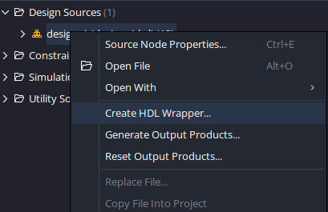{ #fig:wrapper width="500" }

Esto lanzara la ventana emergente  vista en la [](#fig:vivado-manage), donde se pregunta si desea que esta envoltura sea generada automaticamente por Vivado o si desea realizar una copia editable de manera que uno tenga que encargarse de las conexiones a nivel de HDL. En esta guia se dejará con los valores predeterminados, puesto que el análisis del HDL se escapa del objetivo de esta Guía.

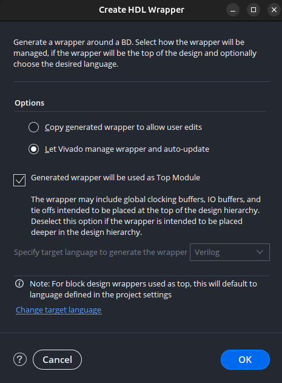{ #fig:vivado-manage width="500" }


Tras crear la envoltura, la jerarquia de archivos se debería ver como en la [](#fig:wrapper-file).

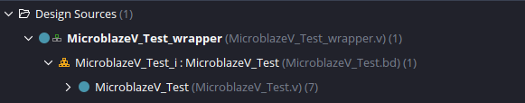{ #fig:wrapper-file width="1000" }

---

Luego proceda a lanzar **Run Synthesis** desde el menu lateral, este proceso toma el RTL y genera una traducción a las componentes lógicas disponibles en el dispositivo a programar, en este caso siendo compuertas logicas, FF y bloques mas complejos como lo son las BRAM y DSP.

Luego realice lo mismo con *Run Implementation*, proceso que se encarga del mapeo físico, donde se disponen los componentes y como se realizan las conexiones fisicas teniendo en cuenta las restricciones temporales del sistema. Este proceso es iterativo y complejo computacionalmente asi que también puede tomar un par de minutos.

**Note que ambos procesos se pueden demorar entre 3 y 6 minutos dependiendo del poder de procesamiento de su maquina.**


Finalmente corra *Generate Bitstream* el cual genera el archivo binario que programa la FPGA.

Cabe destacar que en cada paso puede ver tanto el consumo de recursos como si se llego a las restricciones de tiempo haciendo click en *Design Runs* como se aprecia en la [](#fig:designruns).

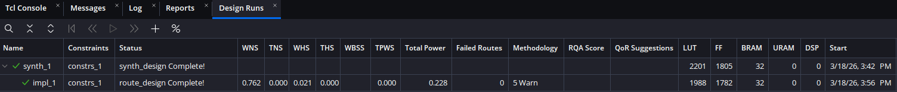{ #fig:designruns width="1000" }


Note que dependiendo de si eligió **Global** o **Out of context per IP** en la ventana emergente de la [](#fig:outputproducts) obtendrá resultados distintos como se ve en la  [](#tbl-resources-global) y la [](#tbl-resources-context). Esta diferencia se debe a que en **Global** las IP's se sintetizan junto con el diseño top-level, lo que permite que la herramienta de síntesis de Vivado vea dentro de la IP y optimice a través de ella, mientras que en **Out of context per IP** sintetiza cada IP por separado y al momento de realizar el diseño top-level, las integra como cajas negras. Por este motivo la síntesis de **Out of context per IP** se ve un uso de recursos mucho menor, no es sino hasta la implementación donde debe realizar un mapeo físico de cada IP donde se aprecia la utilización de recursos real.

<div markdown="1" style="text-align: center;">

Table: Utilización de recursos con opción **Global** {#tbl-resources-global}

| Proceso  | LUT | FF | BRAM      | 
| ------- | ----- | --------- | ---------------- |
| `Sintesis`   | 2201     | 1805        | 32     | 
| `Implementacion`  | 1988    | 1782    | 32         |

</div>


<div markdown="1" style="text-align: center;">

Table: Utilización de recursos con opción **Out of context per IP** {#tbl-resources-context}

| Proceso  | LUT | FF | BRAM      | 
| ------- | ----- | --------- | ---------------- |
| `Sintesis`   | 1     | 0        | 0     | 
| `Implementacion`  | 1988    | 1781    | 32         |

</div>


En caso de haber errores que impidan la finalizacion del proceso (Como no haber generado el wrapper o haber dejado alguna conexion no deseada), el proceso finalizara con un error o de plano no empezara, en cuyo caso se recomendia leer la salida de la consola Tcl o directamente indagar en la ventana *Messages* por Warnings o Critical Warnings.

Ya teniendo el hardware es momento de exportar el hardware para poder correr la aplicación. Para esto seleccione *File > Export > Export Hardware* como se ilustra en la [](#fig:exporthw).

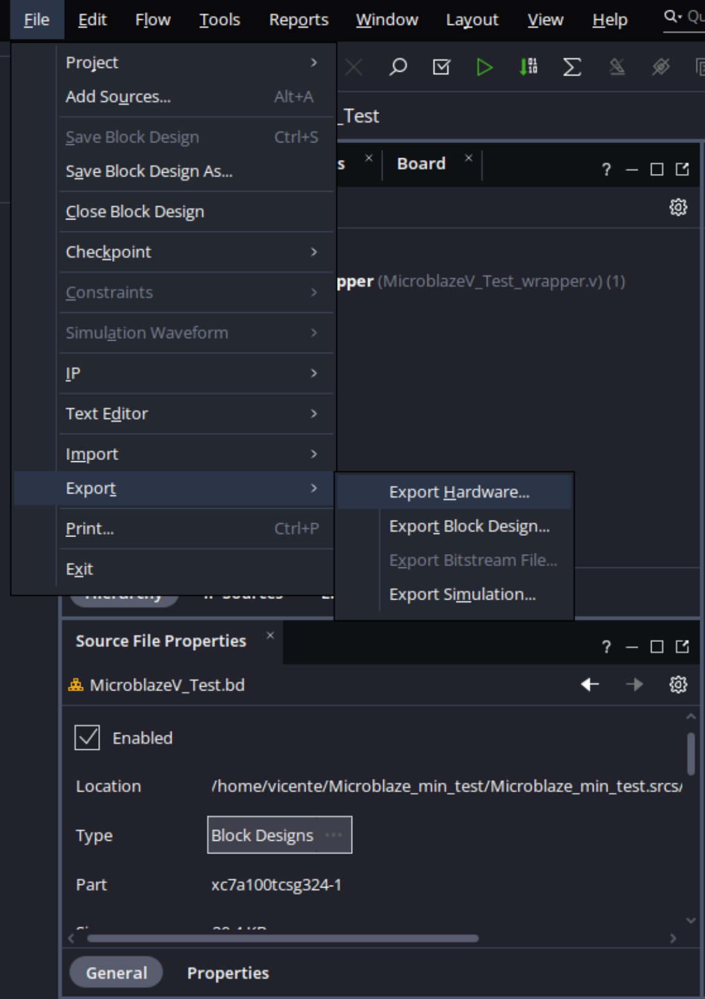{ #fig:exporthw width="500" }

Esto lanzara la configuración de archivos de salida, incluya el bitstream de manera que se pueda programar la aplicación apenas sea diseñada.

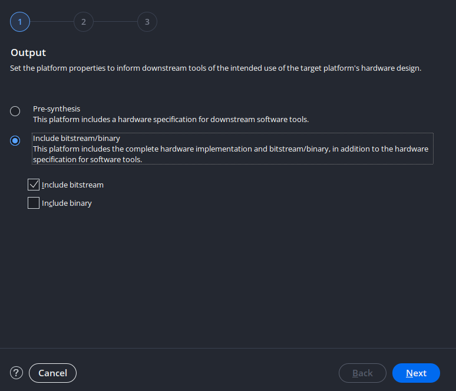{ #fig:exporthwoutput width="1000" }

---

Luego se configura el nombre del archivo de salida **Xillinx support Archive** *xsa*, el cual es un archivo comprimido que contiene toda la especificación del hardware que has diseñado en Vivado. Su propósito es informarle al entorno de desarrollo de software (Vitis) qué componentes existen en el chip, cómo están conectados y cuáles son sus direcciones de memoria. Note que como se aprecia en la [](#fig:exporthwxsa) se usa por defecto el nombre de la envoltura HDL generada pero este puede ser cambiado por el usuario. Recuerde el nombre del xsa generado puesto que será usado en los pasos siguientes.

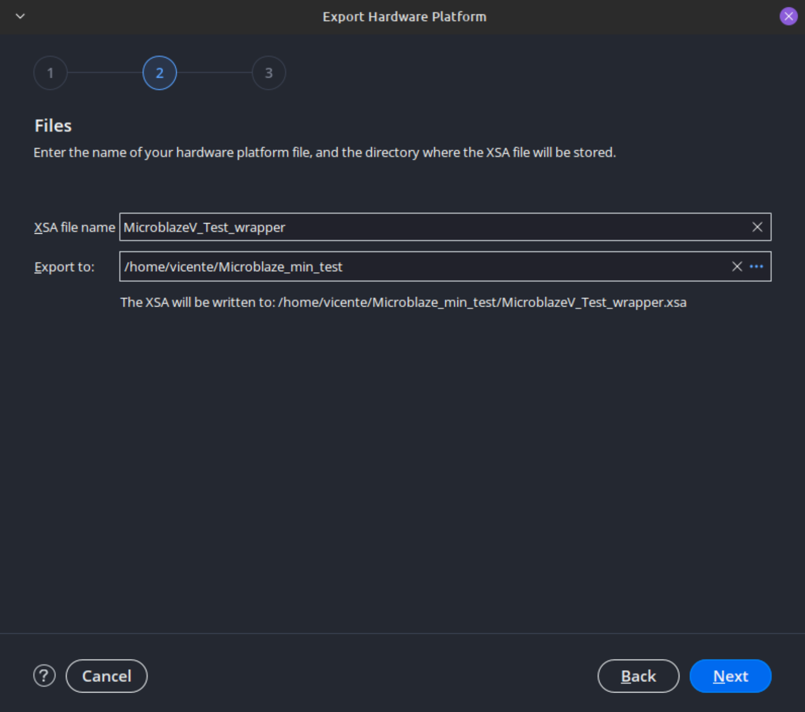{ #fig:exporthwxsa width="1000" }

Continúe hasta exportar el el archivo xsa, con esto finaliza la etapa de trabajo en Vivado.


## Diseño de Firmware


Abra Vitis, elija un espacio de trabajo haciendo click en *Set Workspace*, en esta carpeta se realizará el trabajo de esta seccion. Puede hacer uso de la misma carpeta donde desarolló su diseño en Vivado, note que si lo hace ahí Vitis reconocerá la carpeta como un espacio de trabajo de AMD por lo que le pedira actualizar la metadata del espacio de trabajo como se ve en [](#fig:updateworkspace). Esto no afectará su trabajo ya realizado en Vivado.

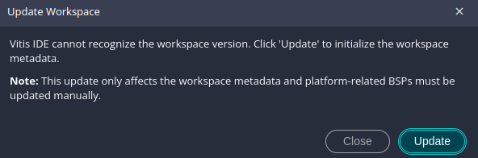{ #fig:updateworkspace width="1000" }

---

En la ventana inicial mostrada en la [](#fig:vitisinit) seleccione *New Platform component* de la sección *Embedded Development* para crear un componente de **plataforma**.
Un componente de plataforma (*Platform Component*) es el entorno de software fundamental que actúa como la base sobre la cual se construirán las aplicaciones finales. Su función principal es abstraer los detalles del hardware definidos previamente en el archivo *.xsa* para proporcionar una interfaz de programación coherente. 

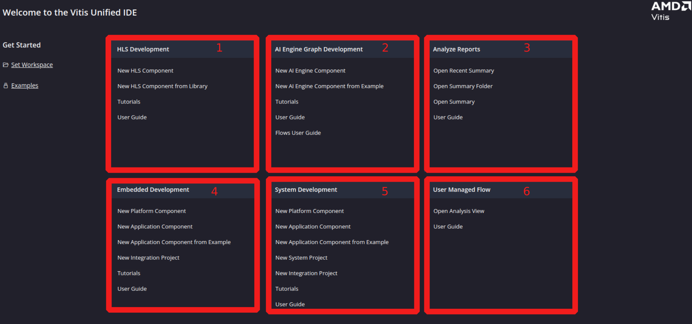{ #fig:vitisinit width="1000" }


Este componente contiene los siguientes datos necesarios para la construcción de una aplicación:

* **Gestión del Board Support Package (BSP):** El componente de plataforma genera automáticamente el BSP, que es una colección de controladores y bibliotecas específicas para los periféricos presentes en el diseño de hardware.
* **Definición de Dominios:** Permite configurar distintos "dominios" de ejecución. Un dominio define el procesador de destino (por ejemplo, un Cortex-A53 o un MicroBlaze) y el sistema operativo que se utilizará (como *standalone/baremetal*, FreeRTOS o Linux).
* **Enlace con el Hardware:** Al importar el archivo *.xsa*, la plataforma identifica los mapas de memoria, las interrupciones y las frecuencias de reloj, asegurando que el compilador de software esté perfectamente sincronizado con la configuración de la FPGA.

Agregue el nombre de la plataforma como se ve en la [](#fig:createplatform).
 
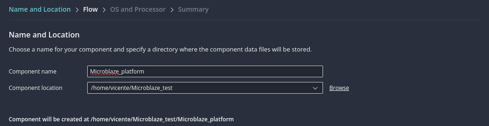{ #fig:createplatform width="1000" }

En la siguiente ventana mostrada en la [](#fig:choosexsa) se le pide el archivo de hardware (xsa). Se puede elegir entre diseños de hardware realizados por el usuario o con plataformas prediseñadas para ciertas placas. En este caso se hara uso del xsa previamente extraido del diagrama de bloques en la sección de [Diseño de Hardware](#diseño-de-hardware) por lo que marque *Hardware Design* y en *Browse* busque el archivo.

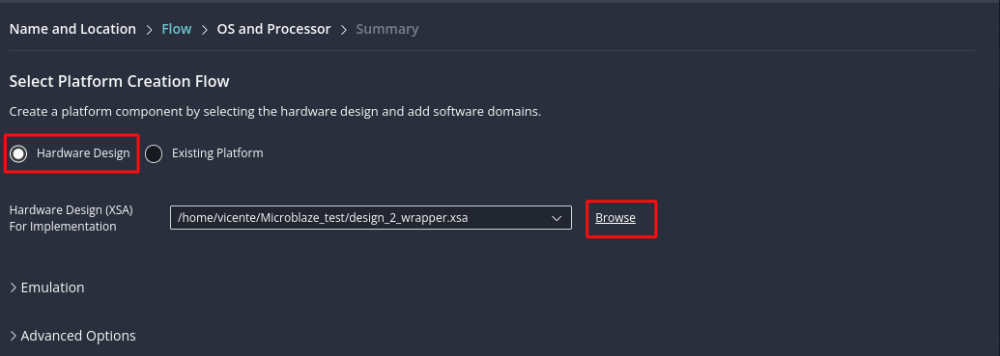{ #fig:choosexsa width="1000" }

Tras dar click a *Next* vera la ventana donde se indica que sistema operativo y procesador se hara uso durante el diseño. Estas decisiones de diseño se toman al momento de generar el diagrama de bloques, debido a que se realizó sin intención de que corra un sistema operativo, la unica opción disponible es "standalone", una aplicación baremetal.

Tras esto se le mostrara un resumen del de la plataforma a crear como se aprecia en la [](#fig:resumen), note que la advertencia "A domain with selected operating system and processor will be added to the platform. The platform can be modified later to add new domains or change settings." no corresponde un error sino que hace referencia al posible **dominio** en el procesador.

Un dominio en el flujo de AMD representa el contexto de ejecucion sobre la plataforma de hardware generada. Un dominio especifica :

- Sobre qué procesador corre el software.
- Que sistema operativo se ejecuta.
- Que BSP y que librerías estan disponibles para esta plataforma.
 
En este caso estamos usando un procesador MicroVlaze V, con un OS standalone (es decir que correremos una aplicación directamente sobre el procesador) y un BSP que soporte el manejo de UART.

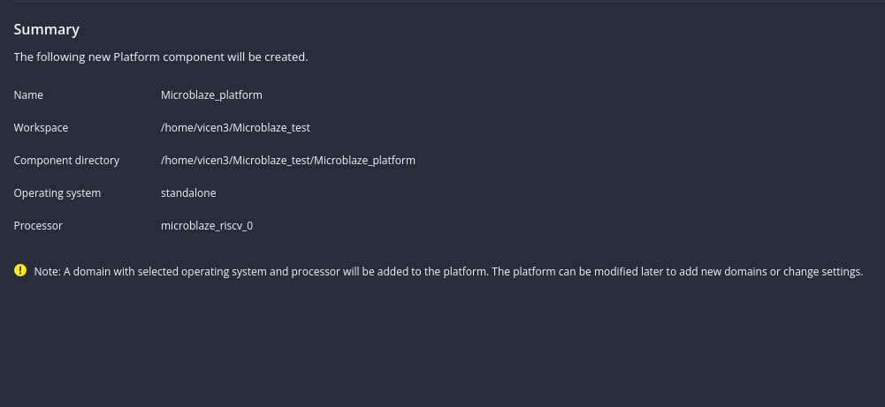{ #fig:resumen width="1000" }

---

En la pestaña *vitis-comp.json* mostrada en la [](#fig:bsp) aparece la configuración de la plataforma, donde se destacan dos pestañas:

* **Board Support Package**: En esta pestaña se puede ver un resumen de la plataforma generada, junto con las librerías disponibles para su inclusión en la aplicación, se sugiere al generar la plataforma por primera vez o al hacer cualquier cambio en la inclusión de librerías, dar click al botón *Regenerate BSP*.
También se tiene que en esta sección se pueden dar flags al compilador al hacer click en el procesador ( en este caso llamado **microblaze_riscv_0**).
* **standalone**: En esta pestaña se pueden asignar configuraciones y valores arbitrarios a las distintas IPs y al sistema generado, la cantidad de configuracion depende directamente del driver asociado a la IP.
 
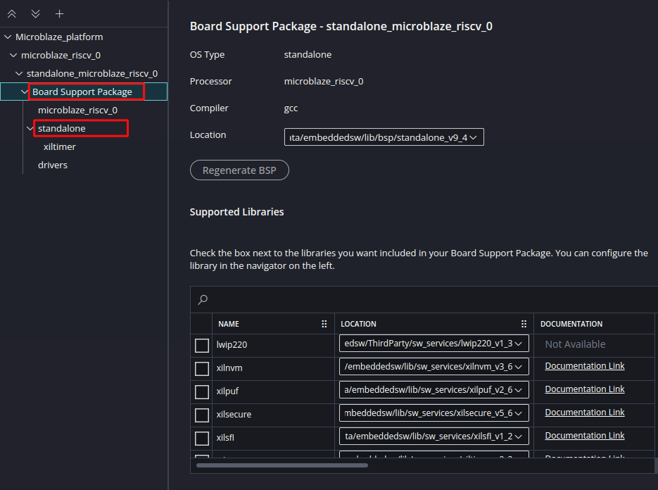{ #fig:bsp width="1000" }
 
Luego haga click en *Build* en el panel lateral de la izquierda para compilar el componente de plataforma como se ve en la [](#fig:build-button). Si todo salió bien, saldra un visto verde al lado del botón de *Build*, en caso contrario la consola mostrará un error y tendrá que volver a la etapa de Diseño de Hardware en Vivado.

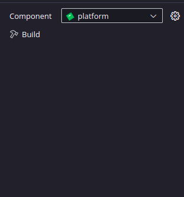{ #fig:build-button width="250" }

Ya teniendo la plataforma, se va a diseñar la aplicación, haga click en *File > New Component > Application*, en la Ventana emergente se le pedirá darle un nombre a la plataforma como se ve en la [](#fig:nombreaplication), el Componente de aplicación contiene el codigo ejecutable que se correrá.
 
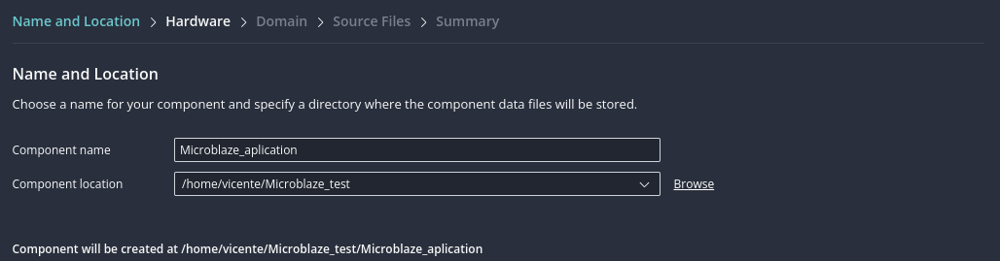{ #fig:nombreaplication width="1000" }

En la siguiente pestaña siguiente se le pedirá elegir la plataforma donde se ejecutará la aplicación como se ve en la [](#fig:chooseplatform) . Seleccione la plataforma que diseñó.

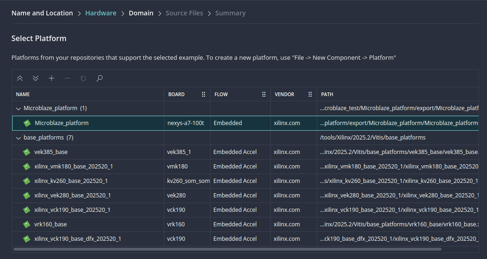{ #fig:chooseplatform width="1000" }

---

Continuando se le pedirá la elección de un dominio, debido a que se hará uso de un solo dominio (el MicroblazeV) continué con *Next*, tras lo cual se le pedirá el agregado de archivos. Continué pues se verán en mas detalle mas adelante. Tras ver el resumen y terminar el Wizard se le llevará a la ventana de configuración de la aplicación.

Como se aprecia en la [](#fig:aplicationstructure) la aplicación posee los siguientes archivos y carpetas:

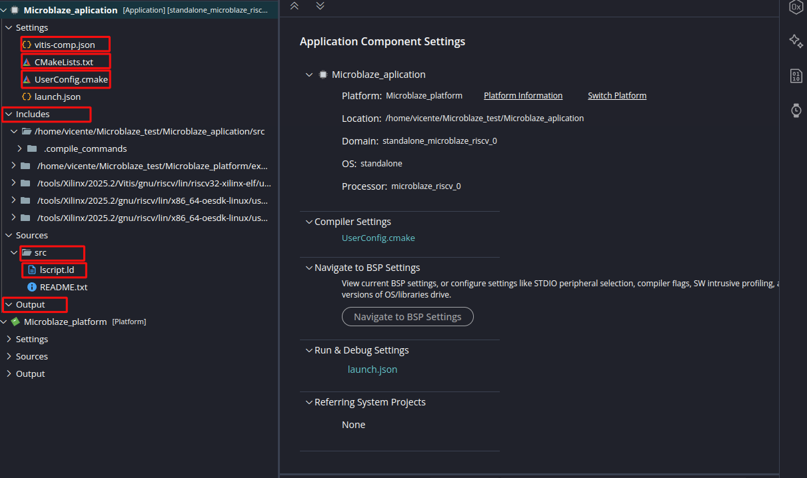{ #fig:aplicationstructure width="1000" }

* **vitis-comp.json**: Archivo de configuración general.
* **CMakeLists.txt**: Es el archivo de entrada para el sistema de construcción CMake. Define cómo se deben compilar los archivos de origen, qué bibliotecas se deben enlazar y las reglas generales para generar el ejecutable final.
* **UserConfig.cmake**: Script de configuración destinado a la intervención del usuario. Permite extender o modificar el proceso de compilación mediante la adición de banderas de optimización, macros de preprocesador o rutas de búsqueda personalizadas sin modificar el archivo raíz CMakeLists.txt.
* **Includes**: Directorio que incluye tanto los directorios de encabezado del sistema y controladores de los periféricos.
* **src**: Directorio de código fuente.
* **lscrpt.ld**: **Linker Script**. Define la distribución de las secciones de código y datos en las regiones de memoria física (DDR, BRAM, etc.) especificadas en el hardware. Controla la ubicación del stack, el heap y los puntos de entrada del programa, su manejo es relevante cuando se manejan aplicaciones mas complejas.
* **Output**: Directorio de artefactos de salida. Contiene los resultados del proceso de construcción, incluyendo archivos objeto, archivos de dependencias y el binario ejecutable final en formato ELF (Executable and Linkable Format).

Ya habiendo explorado la jerarquía de la aplicación, es momento de diseñar una. Pssara esto haga click derecho en *src* y vaya a *Import > Files*. Seleccione **app.c** de la carpeta **Ejemplo_1** del repositorio, la cual contiene el siguiente codigo:

```c
#include <stdio.h>
#include "xil_printf.h"
int main()
{
    print("Hello World\n\r");
    print("Me encanta ELO212!\n\r");
    return 0;
}
```

Las dos librerı́as que contiene son ”stdio.h” (standart input output) una librerı́a general para el manejo de entradas y
salidas y ”xil printf.h” una librerı́a propietaria de AMD que permite usar una versión reducida de la función printf(),
de manera que se puedan enviar datos a través de UART haciendo menor uso de la memoria interna.

Ya teniendo la aplicación en el sistema, abra su programa de comunicación serial de preferencia (en esta guía se hará uso de Hterm) y configure de acuerdo a los parametros mostrados en la [](#fig:UART_Config):

- BaudRate: 9600
- Paridad: No
- Ancho de dato: 8 Bits


Compile la aplicacion presionando el boton *Build* en el panel lateral como se ve en la [](#fig:aplicationstructure).

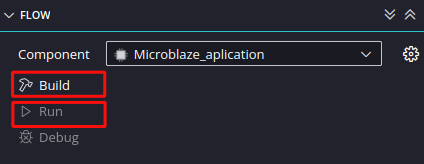{ #fig:aplicationstructure width="500" }


Esto generará el archivo Executable and Linkable Format (ELF), similar al bitstream, este es un archivo que sirve para programar, pero en vez de programar directamente la tarjeta, programa el procesador que se definió previamente dentro de esta. Esta estructurado en distintas secciones de manera que el linker de AMD lo entienda.


Al momento de compilar la aplicación, en la terminal se mostrara cuanto pesan las secciones mas pesadas del ELF como se puede apreciar en la [](#fig:Elf-size), en caso de que el tamaño de la aplicación supere al tamaño de la memoria disponible para el sistema, lanzara un error señalando la sección de mayor tamaño y no permitirá que el ejecutable se cargue a la placa.


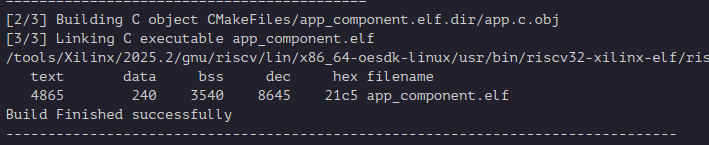{ #fig:Elf-size width="1000" }


Si compilo sin problemas haga click en Run para cargar la aplicación a la placa, si se corrió apropiadamente se verá en su programa serial el texto de la [](#fig:hterm).

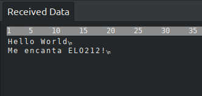{ #fig:hterm width="500" }


Con esto ya ha construido su primer sistema embebido basado en MicroBlaze V, recorriendo el flujo completo desde la descripción del hardware en Vivado hasta la ejecución de una aplicación sobre el procesador. Aunque el ejemplo desarrollado es sencillo, la infraestructura creada constituye la base sobre la que se construyen sistemas mucho más complejos. Dominar este flujo es uno de los pasos más importantes para el desarrollo sobre FPGA, ya que permite combinar la flexibilidad del software con el paralelismo y rendimiento del hardware reconfigurable. En las próximas guías se profundizará en estos conceptos, incorporando nuevos periféricos y mecanismos de interacción que permitirán explotar progresivamente todo el potencial de la plataforma.