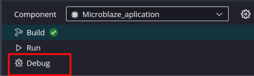
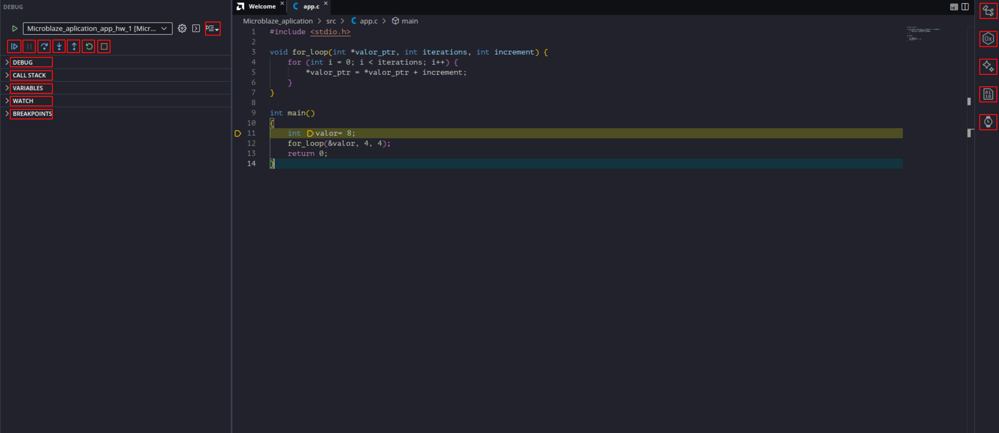
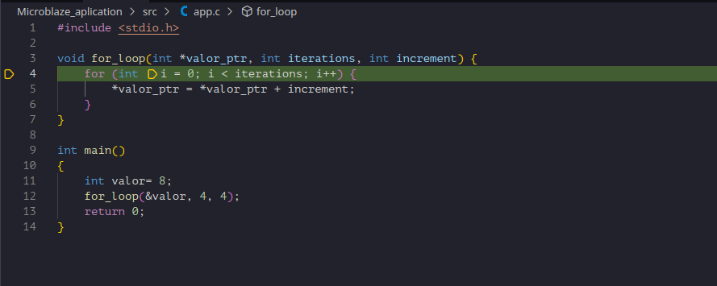
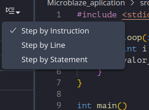
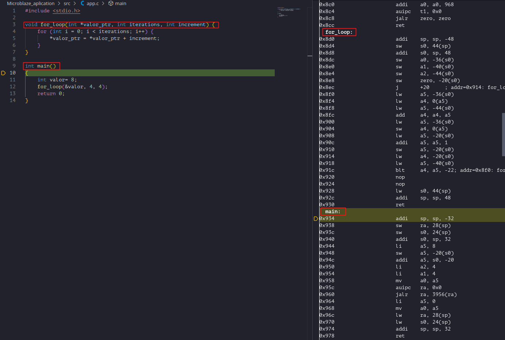
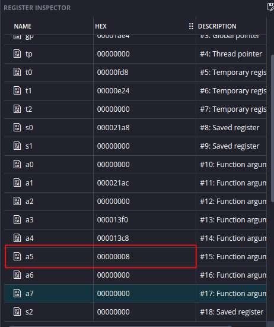

# Guía 2 : Uso de Depurador y perspectiva de Disassembly

## Objetivo 

En esta guía se espera que el lector logre aprender a hacer uso de la herramienta de depurado que ofrece Vitis para analizar el funcionamiento de su aplicación.

## Contexto


En el contexto de **firmware**, el término "depurado" se refiere a que el código ha pasado por un proceso de depuración, es decir la identificación, análisis y corrección de errores o comportamientos incorrectos.

Se tiene que para realizar el depurado sobre el procesador MicroBlaze V existe el modulo MicroBlaze V Debug Module (MDM) el cual actúa como una interfaz entre la herramienta de depurado de software de Vitis. Esta interfaz se conecta al puerto JTAG de las placas de AMD o con una interfaz AXI4-Lite mapeada en memoria. Para más información revisar [la documentación oficial](https://docs.amd.com/r/en-US/ug1629-microblaze-v-user-guide/Debug).

Esta funcionalidad de depurado se implementa de acuerdo a la definición oficial de [soporte de depurado externo RISC-V](https://riscv.org/wp-content/uploads/2024/12/riscv-debug-release.pdf).


## Diseño de Hardware

Debido a que el foco esta guía se encuentra en la herramienta de Depurado de Vitis,  se hará uso del mismo hardware diseñado en la [guía anterior](../../Ejemplo_1_Sistema_base/Ejemplo_1/#diseno-de-hardware).

## Diseño de Firmware


Abra Vitis, puede elegir un nuevo espacio de trabajo o hacer uso del de la guía previa. En este cree el componente de plataforma, luego cree un componente de aplicación.

En el componente de aplicación importe el archivo Ejemplo_2.c de la carpeta Ejemplo_2.

Analizando el código del archivo:

```c
#include <stdio.h>

void for_loop(int *valor_ptr, int iterations, int increment) {
    for (int i = 0; i < iterations; i++) {
        *valor_ptr = *valor_ptr + increment;
    }
}

int main()
{
    int valor= 8;
    for_loop(&valor, 4, 4);
    return 0;
}
```

Para familiarizarse con el uso del depurador y analizar la correspondencia entre código de alto nivel y código máquina, se desarrolló un programa simple en C que implementa un ciclo for dentro de una función independiente. Mediante la ejecución paso a paso en el depurador, es posible observar cómo el compilador traduce las instrucciones del lenguaje C a instrucciones ensamblador, así como analizar aspectos como el paso de parámetros por referencia, el acceso a memoria a través de punteros y la implementación de estructuras iterativas a nivel de procesador.


Para entrar al depurado, primero compile la aplicación haciendo click en **Build** en el panel lateral, luego presione **Debug** como se puede apreciar en la [](#fig:debug-side-menu ).

{ #fig:debug-side-menu width="500" }


Esto abrirá la perspectiva de Depurado vista en la [](#fig:debug-view).

{ #fig:debug-view width="1000" }


La perspectiva de depurado tiene una gran cantidad de funcionalidades, para poder analizarlas de manera mas eficiente, se separan en 3 categorías: 

- Funcionalidad de depurado: Estos son los botones con los que se ejecutan los pasos del depurado, los cuales de izquierda a derecha son:
    - **Continue:** Corre el programa hasta el siguiente Breakpoint o hasta su termino.
    - **Pause:** Pausa la ejecución del programa.
    - **Step Over:** Corre la siguiente linea de código, saltándose funciones internas.
    - **Step Into:** Corre la siguiente linea, si el código tiene una llamada a una función, el depurador saltará al interior de esta.
    - **Step Out of:** Si se encuentra en una función, el depurador saldrá de esta e ira a la linea posterior a su llamado.
    - **Restart:** Reinicia el procesador y la sesión de depurado.
    - **Stop:** Detiene la sesión de depurado actual.
    - **Stepping Granularity**: Permite decidir que tan grandes son los pasos del depurador, permite alternar entre: linea de código, declaración o instrucción.


- Configuración de análisis.
    - **Debug**: Permite seleccionar que dispositivo se esta depurando, útil para cuando se tiene mas de un núcleo.
    - **Call Stack**: Registra en que función esta actualmente el depurador y a donde debe regresar el programa cuando termine la función actual, útil para encontrar secuencias donde el programa se puede quedar colgado.
    - **Variables**:Tiene el valor actual de variables locales.
    - **Watch**: Permite añadir expresiones que se evalúan en base a los valores actuales de las variables
    - **Breakpoints**: Enumera los distintos Breakpoints en el código (para añadir un Breakpoint hay que hacer click a la izquierda de una dada linea de código).
- Herramientas de análisis.
    - **Outline**: Enumera las distintas funciones del código y su jerarquía.
    - **Memory inspector**: Permite leer valores de memoria, ya sea de la memoria interna del procesador o de memoria externa como BRAM o DDR3.
    - **HLS Directives**: Enumera las distintas directivas de High level Synthesis, no posee funcionalidad en el flujo embebido.
    - **Register Inspector**: Permite ver los valores actuales de los registros internos del procesador, especialmente útil cuando se depuran instrucciones a nivel de código Assembly.
    - **TCF Profiler** (Target Communication Framework): Herramienta de análisis de rendimiento integrada en Vitis que permite medir cuánto tiempo pasa el procesador en cada función o instrucción.


## Validación
### Primera prueba de depuración

Una vez analizada la herramienta, se realizará una primera prueba. Para iniciar la sesión de depurado presione el botón **Continue**,luego haga uso de Step Over sobre la primera línea y observe cómo cambia la pestaña Variables.

Luego, en la línea donde se realiza la llamada a la función for_loop, haga clic en Step Into, lo que llevará al depurador al interior de la función como se aprecia en la []( #fig:for-loop).

{ #fig:for-loop width="1000" }

A medida que continúe utilizando Step Over, podrá observar cómo el valor va iterando en la pestaña Variables.

### Perspectiva a nivel de  instrucciones

Para realizar un análisis de bajo nivel, Vitis permite depurar el código directamente en lenguaje Assembly. Para lograr una observación detallada del flujo de ejecución, es necesario cambiar la granularidad del depurador.

En la barra de herramientas, haga clic en el botón Stepping Granularity y seleccione la opción Step by instruction como se ve en [](#fig:instruction).

{ #fig:instruction width="500" }

Al activar este modo, se desplegará automáticamente la vista de Disassembly en el panel lateral derecho, como se observa en la [](#fig:disassembly), donde se pueden identificar las etiquetas de cada función y sus respectivas instrucciones.

{ #fig:disassembly width="1000" }

Con esta configuración, al utilizar el comando Step Over, el puntero de ejecución avanzará instrucción por instrucción en lugar de hacerlo entre líneas de código fuente C/C++.

Como ejemplo práctico, se sugiere avanzar hasta la instrucción:

```
li a5, 8
```

Esta instrucción carga el valor inmediato 8 en el registro a5. Una vez ejecutada dicha línea, puede verificar el cambio abriendo el Register Inspector en el panel lateral. Como se observa en la [](#fig:register-inspector), el valor se ha asignado correctamente al registro correspondiente, confirmando la ejecución exitosa de la operación a nivel de hardware.

{ #fig:register-inspector width="350" }


Con esto concluye la introducción al uso de las herramientas de depuración de Vitis. A partir de este punto, el lector ya cuenta con los conocimientos necesarios para ejecutar aplicaciones paso a paso, inspeccionar variables, analizar el flujo de llamadas entre funciones y observar la ejecución del procesador tanto a nivel de código fuente como de instrucciones ensamblador. Estas capacidades serán fundamentales en desarrollos de mayor complejidad, donde la depuración sistemática permite identificar errores, validar el funcionamiento del software y comprender en profundidad la interacción entre el firmware y la arquitectura del procesador. Se recomienda experimentar con programas propios, explorar las distintas vistas del depurador y utilizar estas herramientas de forma habitual durante el desarrollo, ya que constituyen una parte esencial del flujo de diseño de sistemas embebidos profesionales.