# Guía 3 : Uso de Perifericos e Interrupciones

## Objetivo

Esta guía ilustra dos mecanismos fundamentales mediante los cuales un procesador interactúa con los periféricos integrados al sistema: el esquema de memory-mapped I/O y el sistema de interrupciones. A través de ejercicios prácticos, se espera que aprenda a configurar periféricos mediante registros mapeados en memoria e implementar rutinas de servicio de interrupción (ISR) para atender eventos externos de manera eficiente.

## Contexto


### ¿Que es un Periférico?

En el contexto de sistemas digitales/embebidos, un periférico es cualquier módulo de hardware externo al procesador que le permite interactuar con el mundo exterior o realizar funciones especializadas que el procesador no ejecuta directamente.

Ejemplos:

- El periferico Uart que se uso en la sección previa para la comunicacion desde la placa al PC.
- Salida/Entrada de proposito general (GPIO): A través de entradas discretas como botones o salidas como leds se puede compartir información con el mundo real.

### Memory Mapped I/O


Desde el punto de vista del procesador, los periféricos del sistema conviven dentro de un
único espacio de direcciones plano. Este espacio —denominado mapa de memoria— asigna a cada recurso un rango de direcciones único, de modo que el procesador accede a todos ellos mediante las mismas instrucciones de carga y almacenamiento que utiliza para leer y escribir variables ordinarias. 


La técnica que permite incorporar este último tipo de región recibe el nombre de mapeo de periféricos en memoria `memory-mapped I/O`. En lugar de definir instrucciones dedicadas para el acceso a periféricos, los registros de control y de estado de cada bloque IP se exponen como direcciones del espacio de memoria del procesador. Una escritura sobre la dirección de un registro de control produce, internamente, una transacción sobre el bus AXI hacia el periférico, que altera su estado; análogamente, una lectura sobre un registro de estado retorna el valor actual de dicho
registro. Desde código C, el acceso se realiza mediante punteros: el desarrollador declara un puntero  a la dirección base del periférico y manipula sus campos como si fueran variables comunes en memoria.


### ¿Que es una interrupción?


Una interrupción es un evento asincrónico que temporalmente desvía al CPU de su flujo de ejecución normal para manejar una condición desencadenada por por un dispositivo externo, un temporizador o software como se ilustra en la [](#fig-diagrama-interrupt).


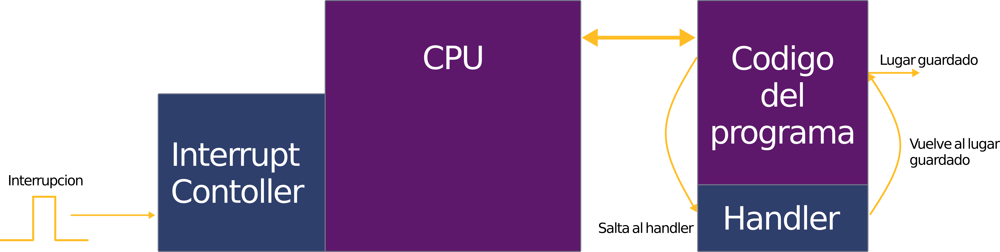{ #fig-diagrama-interrupt width="1000" }

Un sistema puede tener varias fuentes de interrupción, el controlador de interrupciones sigue la secuencia:

-  **Interrupción**: Se produce una interrupción, la cual puede ser originada por una fuente interna al sistema (como un temporizador o una excepción de software) o por un periférico externo.
- **Detección**: El controlador de interrupciones detecta la señal, identifica su fuente y determina su nivel de prioridad.
- **Priorización**: Si existen múltiples interrupciones pendientes, el controlador las gestiona siguiendo la jerarquía de importancia configurada en el hardware.
- **Despacho**: El controlador envía la interrupción con la prioridad más alta a la CPU para su procesamiento.
- **Manejo**: La dirección del *Program Counter* (PC) interrumpido se respalda en el registro `mepc`. La CPU actualiza los registros de estado (CSR), almacena la causa en el registro `mcause` y salta a la dirección indicada en el registro `mtvec` para ejecutar la rutina de servicio de interrupción (ISR).
- **Retorno**: Una vez finalizada la rutina, la CPU restaura el estado de ejecución previo, recupera el valor de `mepc` y continúa con la operación normal del programa.


En esta actividad se integraran los perifericos de GPIO, especificamente los conectados a los botones y los LED. Se mantendra el periferico de UART.


## Diseño de Hardware


En esta sección se realizara un proyecto desde cero. Abra Vivado y cree un nuevo diagrama de bloques. Importe la IP **Microblaze V** al diagrama de bloques y al momento de apretar **Run Block Automation** marque la casilla **Enable interupt controller** como se ve en la figura [](#fig-enable-interrupt).

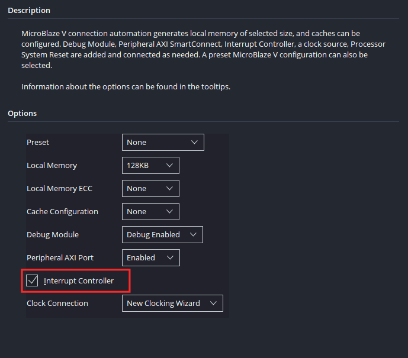{ #fig-enable-interrupt width="500" }

Esto hara que al momento de que se generen los bloques que componen el sistema base del procesador, se importen los bloques responsable del manejo de interrupciones como se ve en [](#fig-interrupt-on-bd) :

- "AXI Interrupt Controller": Bloque que colecciona multiples señales de interrupt de varios perifericos y las consolida en una sola señal que entrega al procesador, se encarga del arbitraje e identificacion de las señales.
- "Inline Concat": Concatena todas las señales de interrupcion para que el bloque AXI las reciba.

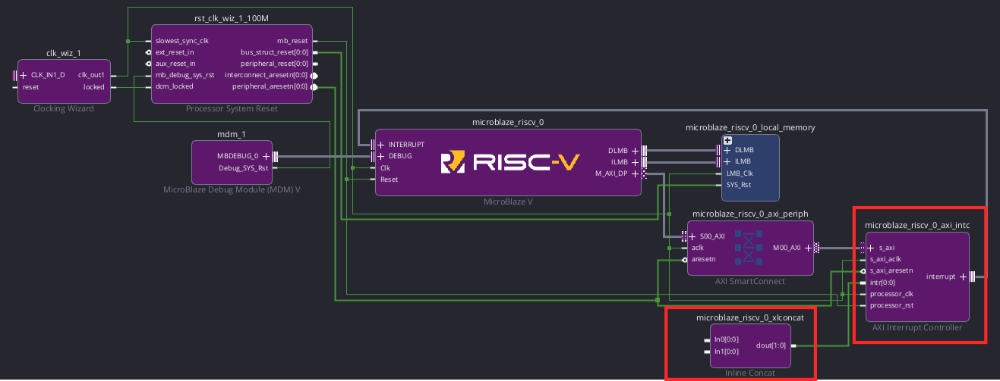{ #fig-interrupt-on-bd width="1000" }

Luego continue con el armado del sistema de acuerdo a lo visto en la Guía 1 ( Aqui pondre un hyperlink cuando suba la guía 1). La secuencia es:

- Configure la IP Clocking Wizard de manera que el clock y reset esten conectados a los pines de la placa.
- Corra **Run Connection Automation** seleccionando todas las conexiones.
- Importe **USB UART** desde el panel lateral.
- Corra **Run Connection Automation** seleccionando todas las conexiones.


Una vez este el diagrama de bloques igual al de la Guía 1, importe "5 Push Buttons" y "16 Leds" desde el panel lateral Board visto en la [](#fig-led-buttons).


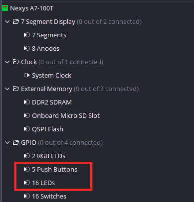{ #fig-led-buttons width="250" }

Tras regenerar el layout se debería ver como en la [](#fig-bd-botones-led).

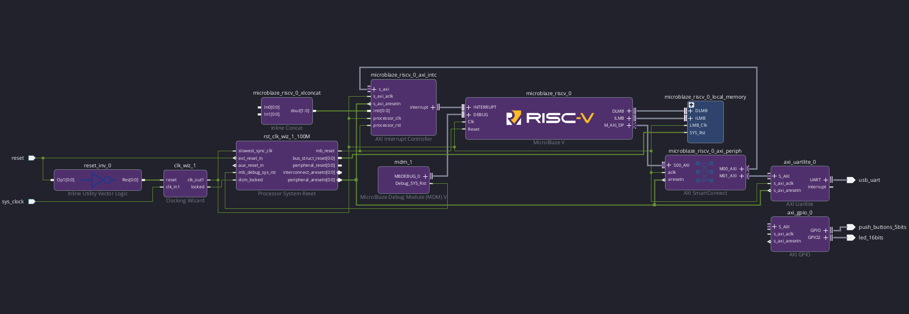{ #fig-bd-botones-led width="1000" }

Tras hacer click en  **Run Connection Automation** y conectar el periférico GPIO al sistema AXI, haga doble click sobre el periférico, en la ventana emergente seleccione **Enable Interrupt** como se ve en la [](#fig-gpio-config) para habilitar las interrupciones de GPIO . Note que los botones estan en GPIO y los leds en GPIO 2. Esto sera relevante más adelante.

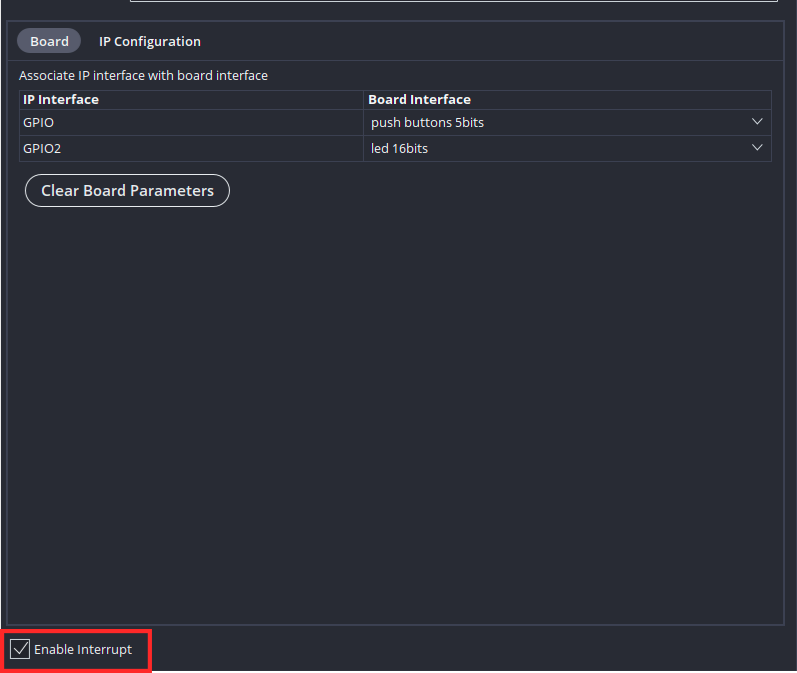{ #fig-gpio-config width="500" }

Ya teniendo salidas de interrupción, se realizaran las conexiones de estas al procesador. 

Conecte:

- **ip2intc_irpt** del bloque AXI GPIO al pin **In0** de Inline Concat.
- **interrupt** de AXI Uartlite al pin **In1** de Inline Concat.

Tras regenerar el Layout se debería ver como en la [](#fig-bd3-final).

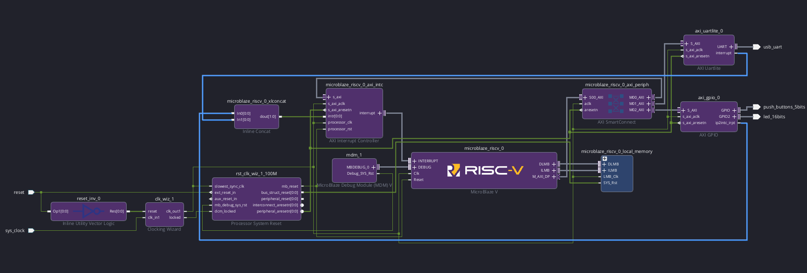{ #fig-bd3-final width="1000" }

Antes de continuar con el exportado de hardware se sugiere revisar la pestaña **Address editor**. Como se puede apreciar en la [](#fig-Adress-map), están los dos periféricos importados: Uart y GPIO junto con sus direcciones base y direcciones altas. Se tiene que al momento de hacer uso de estos perifericos en software, estas direcciones serán la clave para la comunicación entre los perifericos y el procesador de acuedo a lo comentado en la [sección previa](#memory-mapped-io). Note que ambos periféricos poseen un rango de memoria de 64KB, este es el estandár para IP's de AMD que no hacen un uso de memoria superior a 64 KB, aún si no necesariamente haran uso de este espacio.

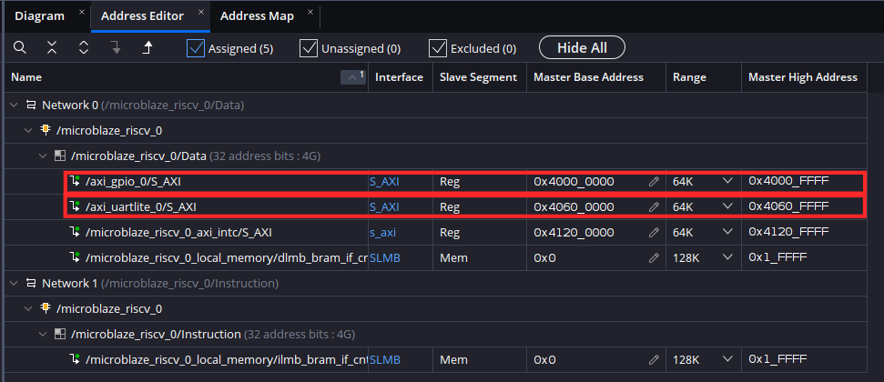{ #fig-Adress-map width="1000" }


Si se desea realizar una visualizacion gráfica del mapa de memoria, abra la pestaña Address Map y presione **Generate** de acuerdo a lo visto en la [](#fig-generate).


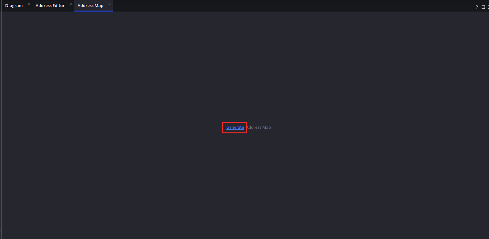{ #fig-generate width="1000" }


Esto generara el mapa de memoría para cada interfaz del procesador, debido a que la interfaz ILMB solo posee los datos de instrucciones, nos enfocaremos en la interfaz-0 (DMLB) la cual tiene una conexión AXI para el envio de datos entre periféricos.
En la [](#fig-Network-0) se aprecian:

- SLMB (0x0): Memoria interna del Microblaze V (fijada en 128 KB al momento de correr **Run block Automation**).
- AXI_gpio (0x4000_0000): Periferico GPIO.
- AXI_Uart_lite (0x4060_0000):  Periferico Uart.
- microblaze_axi_intc (0x4120_FFFF): Controlador de interrupciones.


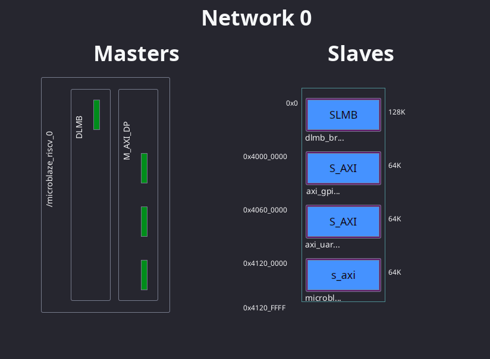{ #fig-Network-0 width="1000" }


Valide nuevamente su diseño y ejecute el proceso de generacion y extracción de hardware, el autor obtuvo la utilizacion de recursos vista en la [](#tbl-resources)

<div markdown="1" style="text-align: center;">

Table: Utilización de recursos {#tbl-resources}

| Proceso  | LUT | FF | BRAM      | 
| ------- | ----- | --------- | ---------------- |
| `Sintesis`   | 2911     | 2714        | 16     | 
| `Implementacion`  | 2603    | 2647    | 16         |

</div>

## Firmware

Abra Vitis, genere un componente de plataforma usando el hardware diseñado y un componente de aplicación. Importe Ejemplo_3.c de la carpeta Ejemplo_3 del repositorio.

Viendo el codigo:

```c
#include <stdio.h>
#include <xgpio.h>
#include "xparameters.h"
#include "xuartlite.h"
#include "xintc.h"
#include "xil_exception.h"
#include "xil_printf.h"

XIntc     IntcInstance;
XUartLite UartInstance;
XGpio     GpioInstance;

#define BUTTON_CHANNEL  1
#define LED_CHANNEL     2
#define BUTTON_IR_MASK  XGPIO_IR_CH1_MASK

void UartHandler(void *CallbackRef) {
    XUartLite *UartPtr = (XUartLite *)CallbackRef;
    u8 ReadBuffer[2] = {0};  // 1 char + null terminator

    unsigned int ReceivedCount = XUartLite_Recv(UartPtr, ReadBuffer, 1);
    if (ReceivedCount > 0) {
        xil_printf("Interrupcion de UART! Recibio: %s\r\n", ReadBuffer);
    }
    XIntc_Acknowledge(&IntcInstance, XPAR_FABRIC_AXI_UARTLITE_0_INTR);
}

void GpioHandler(void *CallbackRef) {
    XGpio *GpioPtr = (XGpio *)CallbackRef;

    XGpio_InterruptDisable(GpioPtr, BUTTON_IR_MASK);

    u32 buttonState = XGpio_DiscreteRead(GpioPtr, BUTTON_CHANNEL);
    XGpio_DiscreteWrite(GpioPtr, LED_CHANNEL, buttonState);

    if (buttonState != 0) {
        xil_printf("Boton presionado! Valor: 0x%X\r\n", buttonState);
    }

    XGpio_InterruptClear(GpioPtr, BUTTON_IR_MASK);
    XIntc_Acknowledge(&IntcInstance, XPAR_FABRIC_AXI_GPIO_0_INTR);
    XGpio_InterruptEnable(GpioPtr, BUTTON_IR_MASK);
}

int main() {
    int Status;
    // Inicializacion de los perifericos
    Status = XUartLite_Initialize(&UartInstance, XPAR_XUARTLITE_0_BASEADDR);
    if (Status != XST_SUCCESS) return XST_FAILURE;

    Status = XGpio_Initialize(&GpioInstance, XPAR_AXI_GPIO_0_BASEADDR);
    if (Status != XST_SUCCESS) return XST_FAILURE;

    // Channel 1 = botones (entradas), Channel 2 = LEDs (salidas)
    XGpio_SetDataDirection(&GpioInstance, BUTTON_CHANNEL, 0xFFFFFFFF);
    XGpio_SetDataDirection(&GpioInstance, LED_CHANNEL,    0x00000000);
    XGpio_InterruptClear(&GpioInstance, XGPIO_IR_CH1_MASK | XGPIO_IR_CH2_MASK);

    //Inicializacion del controlador de interrupciones
    Status = XIntc_Initialize(&IntcInstance, XPAR_XINTC_0_BASEADDR);
    if (Status != XST_SUCCESS) return XST_FAILURE;

    // Conexiones de interrupción al controlador
    Status = XIntc_Connect(&IntcInstance, XPAR_FABRIC_AXI_UARTLITE_0_INTR,
                           (XInterruptHandler)UartHandler, &UartInstance);
    if (Status != XST_SUCCESS) return XST_FAILURE;

    Status = XIntc_Connect(&IntcInstance, XPAR_FABRIC_AXI_GPIO_0_INTR,
                           (XInterruptHandler)GpioHandler, &GpioInstance);
    if (Status != XST_SUCCESS) return XST_FAILURE;

    // Habilita el controlador
    Status = XIntc_Start(&IntcInstance, XIN_REAL_MODE);
    if (Status != XST_SUCCESS) return XST_FAILURE;
    //Habilita las interrupciones de los dos perifericos dentro del controlador
    XIntc_Enable(&IntcInstance, XPAR_FABRIC_AXI_UARTLITE_0_INTR);
    XIntc_Enable(&IntcInstance, XPAR_FABRIC_AXI_GPIO_0_INTR);

    // Habilitacion  de excepciones (necesario para el uso de interrupciones en Risc-v)
    Xil_ExceptionInit();
    Xil_ExceptionRegisterHandler(XIL_EXCEPTION_ID_INT,
                                 (Xil_ExceptionHandler)XIntc_InterruptHandler,
                                 &IntcInstance);
    Xil_ExceptionEnable();

    // Habilita las interrupciones desde los perifericos de ambos perifericos
    XUartLite_EnableInterrupt(&UartInstance);
    XGpio_InterruptEnable(&GpioInstance, BUTTON_IR_MASK);
    XGpio_InterruptGlobalEnable(&GpioInstance);

    xil_printf("Presione un boton o mande un mensaje por la terminal.\r\n");

    while (1);
    return 0;
}
```


Primero nos fijaremos en las librerías de interes:

- **xgpio.h**:Librería que contiene funciones y definiciones asociadas a GPIO.
- **xuartlite.h**: Librería que contiene funciones y definiciones asociadas al periférico UART.
- **xintc.h** Librería que contiene funciones y definiciones asociadas al controlador de interrupciones.
- **xparameters.h** : Librería que contiene las definiciones asociadas al hardware descrito en Vivado, es en este archivo donde se encuentran las macros asociadas a direcciones base de los periféricos **XPAR_XUARTLITE_0_BASEADDR** en caso de UART y  **XPAR_AXI_GPIO_0_BASEADDR** en caso de GPIO.


A manera de ilustrar, haga click+ctrl sobre **xparameter.h** en el codigo, esto lo llevará al archivo. Nota: En linux el servidor slang tiende a fallar, en ese caso para visualizar el archivo vaya al panel lateral y dirijase la segunda carpeta de Includes del componente de aplicación.


Dirijase a la linea 34 donde verá las definiciones del periferico AXI GPIO.

```c
/* Definitions for peripheral AXI_GPIO_0 */
#define XPAR_AXI_GPIO_0_COMPATIBLE "xlnx,axi-gpio-2.0"
#define XPAR_AXI_GPIO_0_BASEADDR 0x40000000 // Direccion Base
#define XPAR_AXI_GPIO_0_HIGHADDR 0x4000ffff // Direccion Alta
#define XPAR_AXI_GPIO_0_INTERRUPT_PRESENT 0x1
#define XPAR_AXI_GPIO_0_IS_DUAL 0x1
#define XPAR_AXI_GPIO_0_INTERRUPTS 0x2000
#define XPAR_FABRIC_AXI_GPIO_0_INTR 0
#define XPAR_AXI_GPIO_0_INTERRUPT_PARENT 0x41200001
#define XPAR_AXI_GPIO_0_GPIO_WIDTH 0x5
```

Note que tanto la direccion base  (0x_4000_000) como la dirección alta  (0x4000_ffff) corresponden con las mostradas en la [](#fig-Adress-map).

Lo mismo es cierto para el periferico Uart visto en la linea 90.

```c
/* Definitions for peripheral AXI_UARTLITE_0 */
#define XPAR_AXI_UARTLITE_0_COMPATIBLE "xlnx,axi-uartlite-2.0"
#define XPAR_AXI_UARTLITE_0_BASEADDR 0x40600000 // Direccion Base
#define XPAR_AXI_UARTLITE_0_HIGHADDR 0x4060ffff // Direccion Alta
#define XPAR_AXI_UARTLITE_0_BAUDRATE 0x2580
#define XPAR_AXI_UARTLITE_0_USE_PARITY 0x0
#define XPAR_AXI_UARTLITE_0_ODD_PARITY 0x0
#define XPAR_AXI_UARTLITE_0_DATA_BITS 0x8
#define XPAR_AXI_UARTLITE_0_INTERRUPTS 0x1
#define XPAR_FABRIC_AXI_UARTLITE_0_INTR 1
#define XPAR_AXI_UARTLITE_0_INTERRUPT_PARENT 0x41200001

```

Luego volviendo al archivo Ejemplo_3.c se tienen las siguientes funciones handler segun lo comentado en  [la sección de contexto](#que-es-una-interrupcion).

- UartHandler: Función Handler de uart, se activa cuando la placa recibe un caracter a través de uart. Esta funcion reenvia el caracter recibido.
- GpioHandler: Funcion Handler de GPIO, se activa cuando se presiona uno de los botones de la placa. Al apretar un boton la funcion envia un aviso de botón presionado a través de Uart con el valor correspondiente a su pin GPIO y prende un led asociado a ese valor.


Analizando el codigo del main se tiene que se sigue la siguiente secuencia:

- Se inicializan perifericos de Uart y GPIO.
- Se fijan las direcciones de los GPIO, de manera que detecte los botones como entradas y los leds como salidas (1= Entrada 0 = Salida). Note que los canales vistos en la [](#fig-gpio-config) son usados para definir la direccion (BUTTON_CHANNEL=1 LED_CHANNEL=2).
- Se inicializa el controlador de interrupciones.
- Se entrega la informacion al controlador de interrupciones acerca de que función Handler corresponde a que periférico.
- Se habilita el controlador de interrupciones.
- Habilita la recepcion de interrupciones de los dos periféricos al controlador.
- Habilita excepciones (necesario para el uso de interrupciones en Risc-V).
- Habilita la salida de interrupciones desde los periféricos.
- Deja un bucle indefinido para que el programa se mantenga corriendo.


Haga click en **Build** para compilar la aplicación, debería dar la utilizacion de recursos vista en la [](#tbl-elf-size) dando un total aproximado de 18.6 KB. Note que esto es superior al minimo de memoria entregado por el Wizard de **Run Block Automation** (16 KB). 

<div markdown="1" style="text-align: center;">

Table: Tamaño del ELF {#tbl-elf-size}

| text  | data | bss | dec      |
| ------- | ----- | --------- | ---------------- |
|  14376  | 480     | 3792        | 18648     |

</div>

### Verificación

Conecte la placa, enciendala y programela haciendo click en **Run** desde el panel lateral. Luego pruebe mandando caracteres a través de su consola serial de preferencia o presionando los botones, debería comportarse como se ve en [](#fig-hterm-test).


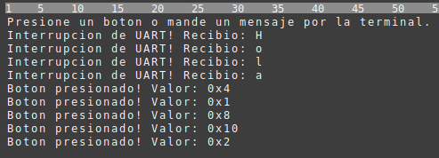{ #fig-hterm-test width="1000" }

Luego, otra manera de visualizar el comportamiento de las funciones handler es haciendo uso del depurador. Posicione breakpoints al inicio de cada funcion Handler como se ve en la [](#fig-breakpoints) e inicie la sesion de depurado haciendo click en **Debug**.


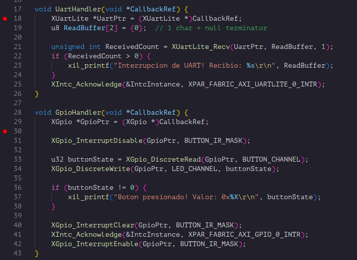{ #fig-breakpoints width="1000" }


Note que la Uart se gatilla tanto cuando termina una transmisión como cuando detecta la recepcion de datos de acuerdo a la [documentacion de AXU UART Lite](https://docs.amd.com/v/u/en-US/pg142-axi-uartlite). Esto implica que esta funcion se gatillará cuando:

- El programa envia el string "Presione un boton o mande un mensaje por la terminal.\r\n" antes de entrar al loop.
- Cuando se presiona un boton y se envia el mensaje correspondiente.
- Cuando detecta recepcion de datos.

Como la funcion handler chequea que los registros internos de la IP hayan recibido datos antes de enviar, esta no enviara datos fuera de cuando los recibe desde el PC.


Con esto han dado un paso fundamental: pasar de un procesador que solo ejecuta código en aislamiento a un sistema que percibe e interactúa con el mundo real. Lograron integrar periféricos heterogéneos —GPIO para entrada física desde botones y salida hacia LEDs, UART para comunicación serial— y orquestar todo a través de un controlador de interrupciones que permite al MicroBlaze responder de forma eficiente a eventos asíncronos sin desperdiciar ciclos en polling. Este patrón —periféricos sobre AXI, manejadores de interrupción y un procesador soft personalizado sobre FPGA— es la base sobre la que se construyen sistemas embebidos reales: desde controladores industriales hasta instrumentación científica. A partir de aquí, agregar nuevos periféricos (timers, ADCs, sensores I²C/SPI, aceleradores propios en hardware) es solo cuestión de aplicar la misma metodología que acaban de dominar. El hardware ya no es una caja negra: es una plataforma maleable que ustedes pueden moldear a la medida del problema que quieran resolver.


{ #fig width="1000" }
