# Guía 4 : Encapsulado e integración de Periféricos diseñados con HDL

## Objetivo

Durante esta guía se espera que el lector aprenda a encapsular módulos previamente diseñados de tal manera que encajen en el sistema AXI del Microblaze V.

## Contexto

### Periféricos diseñados en HDL

Aunque el catálogo de IPs que ofrece Vivado es amplio, no siempre cubre las necesidades específicas de un proyecto. Por ello es común desarrollar módulos propios a nivel de transferencia de registros (RTL) usando lenguajes de descripción de hardware como Verilog o VHDL, y luego empaquetarlos como IPs. Esta posibilidad de extender el hardware con módulos a medida es donde mejor se aprovecha un procesador embebido en la FPGA: mientras el procesador se encarga de las tareas de control, puede delegar las operaciones más exigentes a módulos especializados.

En el caso de esta guía se va a sintetiza un modulo con un solo propósito, específicamente un **Adder Tree** un modulo cuya función consiste en realizar la suma de varios operandos de manera paralela como se puede visualizar en la [](#fig-adder_tree_diagram). Esta topología es usualmente usada en algoritmos de aprendizaje de maquinas, siendo la etapa donde se realiza la suma de todos los pesos.

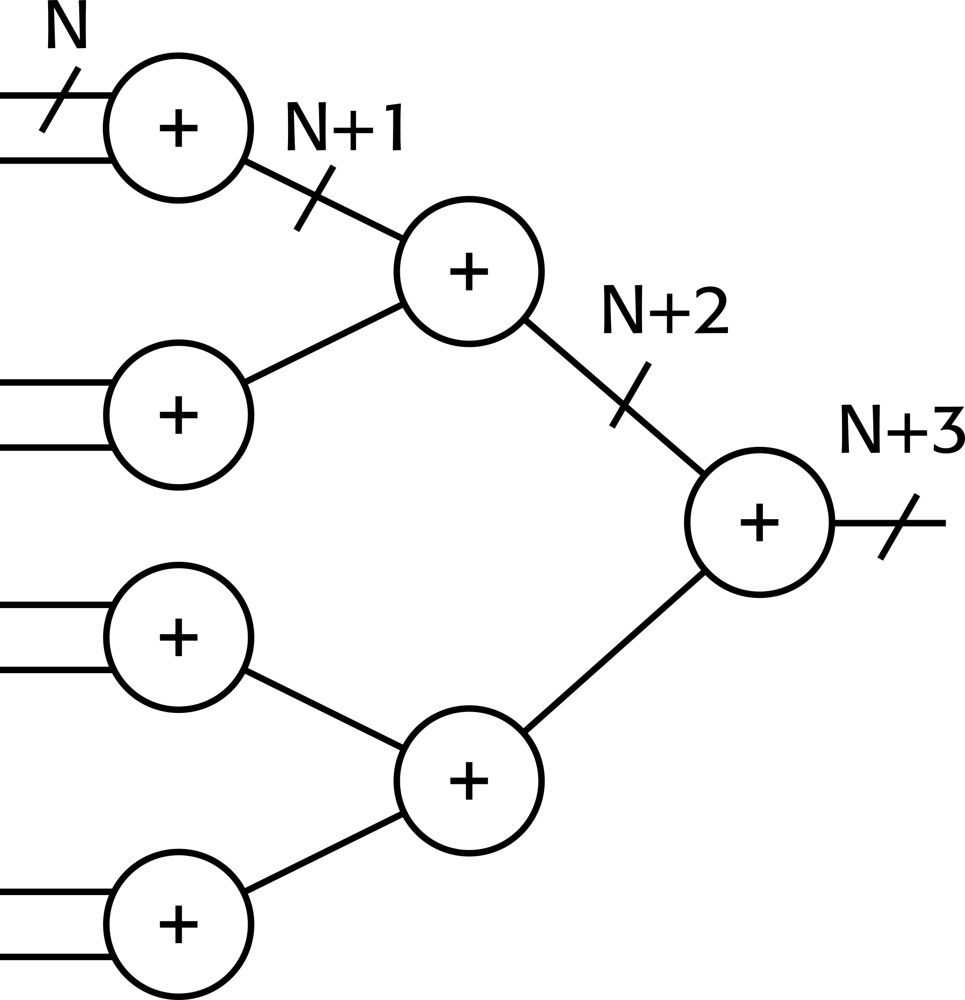{ #fig-adder_tree_diagram width="500" }


En este caso se hará uso de un adder tree de 8 entradas con 16 bits de ancho.

### AXI
Advanced eXtensible Interface (AXI) es un protocolo de interfaz definido por ARM como parte de la especificación AMBA (Advanced Microcontroller Bus Architecture). En el ecosistema de AMD se utiliza la versión AXI4, que se presenta en tres modalidades:

- AXI4 (Full AXI4): orientado a comunicaciones mapeadas en memoria de alto desempeño, con soporte para transacciones en ráfaga (burst).
- AXI4-Lite: variante simplificada para módulos de bajo throughput, típicamente escrituras y lecturas de registros de estado y control.
- AXI4-Stream: pensado para flujos de datos a alta velocidad, sin direccionamiento ni respuesta de confirmación.

Un módulo AXI realiza sus transacciones a través de canales. Un canal es una colección independiente de señales AXI acompañada de un par de señales de handshake (VALID/READY) que confirman la validez de cada transferencia.
El protocolo define cinco canales básicos, ilustrados en la [](#fig-cliente_maestro ):


{ #fig-cliente_maestro width="500" }


Dos canales para transacciones de lectura:

- Read Address (AR): el maestro indica la dirección a leer.
- Read Data (R): el cliente devuelve el dato solicitado.

Tres canales para transacciones de escritura:

- Write Address (AW): el maestro indica la dirección de destino.
- Write Data (W): el maestro envía el dato a escribir.
- Write Response (B): el cliente confirma el resultado de la escritura.


La comunicación a través de estos canales sigue una jerarquía Maestro–Cliente. El maestro es el módulo que inicia las transacciones: emite las direcciones de lectura o escritura y decide qué datos enviar y cuándo. El cliente es el módulo que responde a esas solicitudes: entrega el dato pedido, recibe el dato escrito, o reporta el estado de la operación. Un caso típico es un procesador (maestro) accediendo a un módulo de memoria o a un periférico (cliente) mapeado en su espacio de direcciones.


Esta jerarquía es por interfaz, no por dispositivo: un mismo módulo puede exponer una interfaz maestra hacia ciertos componentes y una interfaz cliente hacia otros. Cuando coexisten varios maestros y clientes en el sistema, un AXI Interconnect se encarga de arbitrar y enrutar las transacciones entre ellos.

Si desea ver mas en detalle el protocolo, amd ofrece tutoriales acerca del uso básico de AXI en el siguiente [enlace](https://adaptivesupport.amd.com/s/topic/0TO2E000000YNxCWAW/axi-basics-series?language=en_US&tabset-50c42=2).

## Diseño de Hardware

### Empaquetado de la IP

**NOTA**: En esta guía el nombre de los módulos y rutas importa, por lo que se recomienda que haga uso de los nombres propuestos por la guía o sea consistente con los nombres con estos, esto incluye:

- El nombre del Proyecto.
- Nombre de la IP.
- Nombre del xsa generado.


Comience creando un nuevo proyecto en Vivado, nombre el proyecto **adder_tree_rtl**. El autor de esta guía guardo su proyecto en el directorio:

```
/home/vicen3/hardware/adder_tree_rtl
```

Una vez creado haga click en **Tools** en la barra de menús y luego en **Create and Package New IP...** En la ventana emergente haga click en **Next** y luego seleccione la opción **Create a new AXI4 peripheral como se muestra en [](#fig-selección-ip).


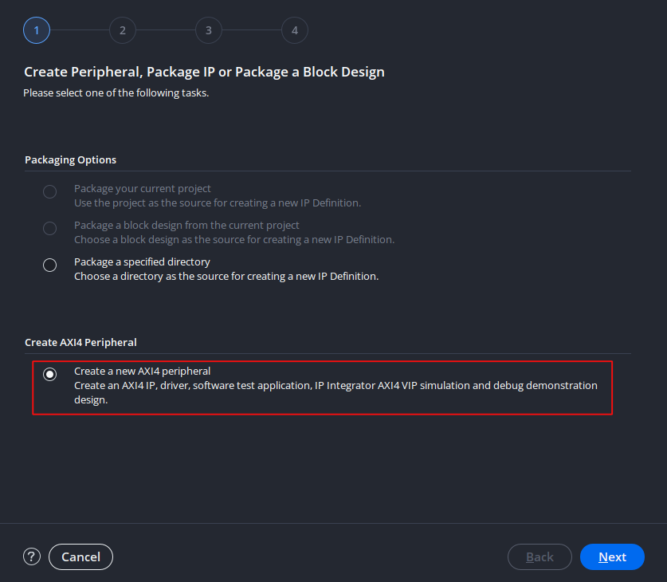{ #fig-selección-ip width="500" }


Luego continue haciendo click en **Next**, en esta ventana se le asigna un nombre a la IP a generar, como se ve en la [](#fig-nombre-ip). En esta guía se le da el nombre de **adder_tree_rtl**. Note que por defecto el creador de IP's genera una carpeta llamada ip_repo para guardar futuros diseños en una sola carpeta, mantenga esta carpeta.

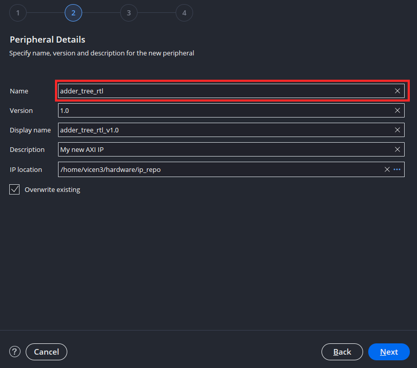{ #fig-nombre-ip width="500" }

Nuevamente seleccióne **Next** la cual lo lleva a la ventana de interfaces como se ve en [](#fig-interfaz-ip). En esta se tienen las siguientes configuraciones:

- **Nombre de la interfaz**: Nombre del puerto AXI a generar.
- **Tipo de interfaz**: Se elije el tipo de interfaz dependiendo del uso que se le vaya a dar al modulo, se puede elegir entre AXI4 Full, Streaming o Lite. En este caso se hara uso de una interfaz **Lite** debido a que la IP a encapsular tiene fines didácticos y no busca maximizar el throughput.
- Modo de interfaz: Permite definir si la interfaz posee modalidad de cliente, maestro o mixta. En este caso se hará uso de **Slave** (termino obsoleto usado para referirse a cliente) puesto que el procesador va a controlar la IP y esta no ejercerá control sobre otras.
- **Ancho de Datos**: Tamaño de los registros asociados a AXI, el tamaño mínimo es de 32 bits, se puede aumentar para aplicaciones especificas, pero en este caso se mantendra en 32.
- **Tamaño de memoria**: El espacio de memoria accesible, el wizard fija el espacio a 64 bytes como mínimo.
- **Numero de registros**: Cantidad de registros internos asociados a la IP. En este caso se tienen ocho entradas de 16 bits (Los operandos) y una salida de 22 bits (El resultado). Como el tamaño mínimo de cada registro es de 32 bits, en cada registro se guardaran 2 operandos y en un registro adicional la salida, dándonos un total de **5 Registros**.


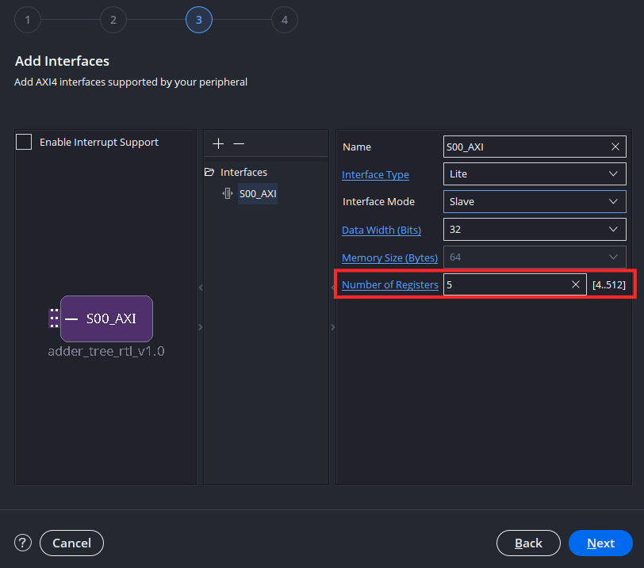{ #fig-interfaz-ip width="500" }

Luego en la siguiente ventana emergente ilustrada en la [](#fig-edit-ip) se selecciona Edit IP para poder añadir el contenido funcional al bloque. Presionar este botón abrirá un nuevo proyecto en Vivado, asociado exclusivamente al bloque.

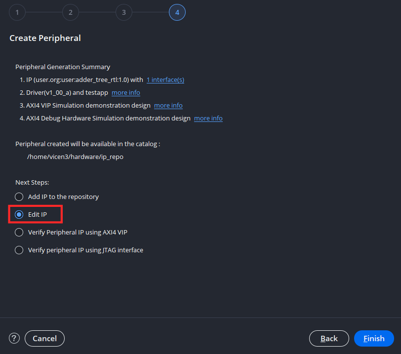{ #fig-edit-ip width="500" }

En este nuevo proyecto se encuentra el empaquetador de IP's visto en [](#fig-ip-package). Esta ventana sirve para:

- Identificación: Aquí se realiza la documentación preliminar de la IP, quien es el autor, a que organización pertenece, la función de la ip etc.
- Compatibilidad: Realiza empaquetado para el flujo de aceleración de aplicaciones de Vitis. El detalle lo puede encontrar en el siguiente [manual](https://docs.amd.com/v/u/en-US/ug1393-vitis-application-acceleration).
- File Groups: En esta pestaña se realiza la configuración acerca de que archivos de descripción conforman a la IP.
- Parámetros de personalización: En esta pestaña se configura que parámetros podrá cambiar el usuario al momento de importar la IP a su sistema.
- Adressing and Memory: Configura el mapa de memoria interno de la IP.
- Personalización de interfaz de usuario: Configura como se ve la IP dentro del diagrama de bloques.
- Revisar y empaquetar: Revisa que la IP se encuentre en orden y  realiza el empaquetado de nuevo.


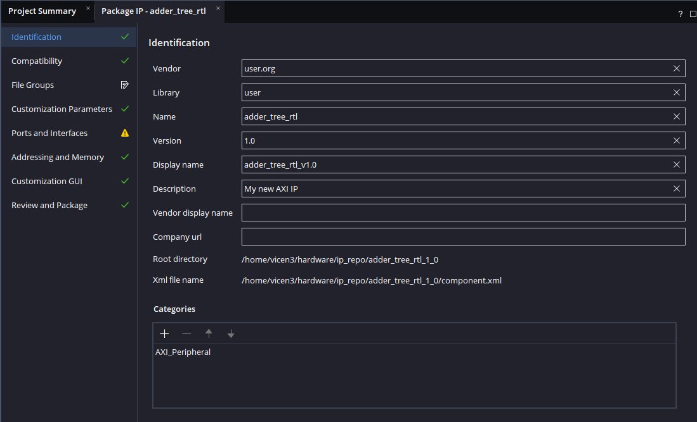{ #fig-ip-package width="500" }

Añada los archivos fuente **comb_adder_tree.sv** y **adder_tree_wrapper.sv** de la carpeta Ejemplo_4. Estos poseen la descripción del modulo del adder tree y una envoltura para aplanar las entradas, esto es debido a que los módulos AXI generados por Vivado están descritos en Verilog, un lenguaje de descripción de hardware que no permite el uso de arreglos bidimensionales como puertos en los módulos.

Tras impotar los módulos, abra el archivo **adder_tree_slave_v1_0_S00_AXI**, este archivo posee una plantilla de AXI, con todas las señales necesarias para su integración en el esquema de interconexiones al procesador.

Sin ir a mayor detalle en el código se tiene que este posee 4 bloques principales:
- Una maquina de estados para la implementación transacciones de escritura en el bloque.
- lógica de mapeo de memoria para las escrituras.
- Una maquina de estados para la implementación de transacciones de lectura en el bloque.
- Un espacio para lógica de usuario donde se instancian los módulos diseñados.


Ahora integraremos el modulo en esta plantilla AXI, para esto diríjase a la linea 102 y agregue la declaración de los cables que conectan las entradas y salidas del adder tree al AXI, siendo este el cable de los operandos i_data_flat y el cable de la salida o_data.  Note que ten este snipet de código la herramienta generó tambien los 5 registros que se definieron en la [](#fig-interfaz-ip) denominados **slv_regN** donde N corresponde al numero del registro.

``` verilog linenums="102"
	//----------------------------------------------
	//-- Signals for user logic register space example
	//------------------------------------------------
	//-- Number of Slave Registers 5
	reg [C_S_AXI_DATA_WIDTH-1:0]	slv_reg0;
	reg [C_S_AXI_DATA_WIDTH-1:0]	slv_reg1;
	reg [C_S_AXI_DATA_WIDTH-1:0]	slv_reg2;
	reg [C_S_AXI_DATA_WIDTH-1:0]	slv_reg3;
	reg [C_S_AXI_DATA_WIDTH-1:0]	slv_reg4;
	integer	 byte_index;
    wire [127:0] i_data_flat; // Señales de usuario 
	wire [20:0] o_data;
```

En esta guía se hará uso de el registro 4 para la salida, para acomodar el sistema AXI se tiene que el valor de un registro no puede cambiar mientras haya una transacción activa. Debido a esto, se hará que el registro 4 se actualice al valor actual de la salida del adder tree siempre y cuando no haya una transacción. Diríjase al bloque que implementa la lógica de escritura en los registros en la linea 255. Agregue las dos lineas señaladas en el snippet de código. Note que estas lineas se encuentran en la opción por defecto cuando la señal de escritura S_AXI_WVALID se encuentra en bajo.


``` verilog linenums="255"
default : begin
	                      slv_reg0 <= slv_reg0;
	                      slv_reg1 <= slv_reg1;
	                      slv_reg2 <= slv_reg2;
	                      slv_reg3 <= slv_reg3;
	                      slv_reg4 <= slv_reg4;
	                    end
	        endcase
            end else begin // Añadir else
			slv_reg4<=o_data; // Mapeo a la salida
	      end
	  end
	end 
```


Finalmente en el espacio de lógica de usuario se van a concatenar los 4 registros, de manera que el modulo los vea como una entrada única de 128 bits y se realiza la instanciación del adder tree.


``` verilog linenums="318"
// Add user logic here
    assign i_data_flat = {slv_reg0,slv_reg1,slv_reg2,slv_reg3};
	
	adder_tree_wrapper # (
	.N(8),
	.DATA_WIDTH(16)
	)
	adder_tree_wrapper_inst (
	.i_data_flat(i_data_flat),
	.o_data(o_data)
	);
// User logic ends

```

Si realizo el importado de forma correcta debería haberse reordenado la jerarquía de archivos como se ve en la [](#fig-archivos-adder-tree).

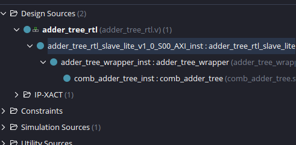{ #fig-archivos-adder-tree width="400" }


Para una visualización mas clara de la integración se tiene el diagrama de la [](#fig-slacve-axi) donde se han omitido todas las señales correspondientes a las interfaz de AXI.

{ #fig-slacve-axi width="1000" }


Una vez realizados los cambios, vuelva a la pestaña Package IP - adder_tree_rtl y en el menú lateral Packaging Steps, seleccióne File Groups. Haga click en Merge changes from File Groups Wizard, ubicado en la barra superior para actualizar la cantidad de archivos hdl asociados a la IP como se ve en  [](#fig-grupos-de-archivo).

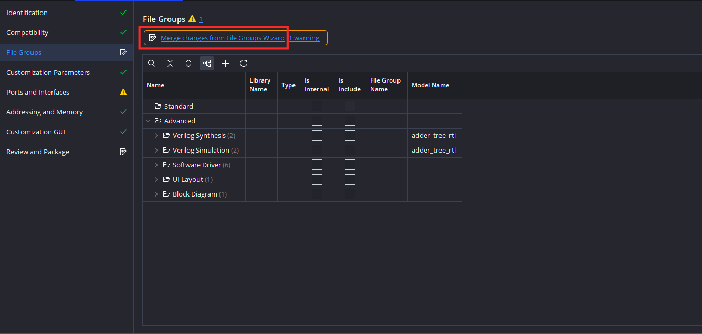{ #fig-grupos-de-archivo width="500" }


Note que ahora al expandir **Verilog Synthesis** están 4 archivos, entre los que se incluyen los dos archivos añadidos al proyecto como se ve en [](#fig-archivo-incluido).

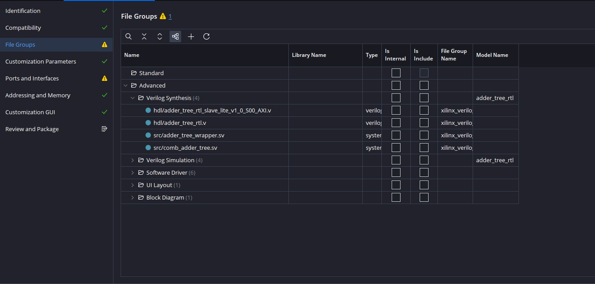{ #fig-archivo-incluido width="500" }


En este momento deberia ver dos simbolos de advertencia, uno en **File Groups** y otro en **Ports and Interfaces**.  El de el grupo de archivos es que no se ha diseñado una guia de uso para la IP, mientras que el de puertos e interfaces hace referencia a que no se ha definido una frecuencia mínima y maxima para el reloj de la IP. Ambas advertencias no impiden la finalización del proyecto y se escapan del foco de este por lo que no se verán en detalle.


Para re empaquetar la ip para que se pueda importar al diagrama de bloques haga click en **Review and Package**, luego haga click en **IP has been modified** para confirmar que se hicieron cambios en la IP como se ve en la [](#fig-empaquetado). Luego haga click en **Re-Package IP** para finalizar el proceso de empaquetado.


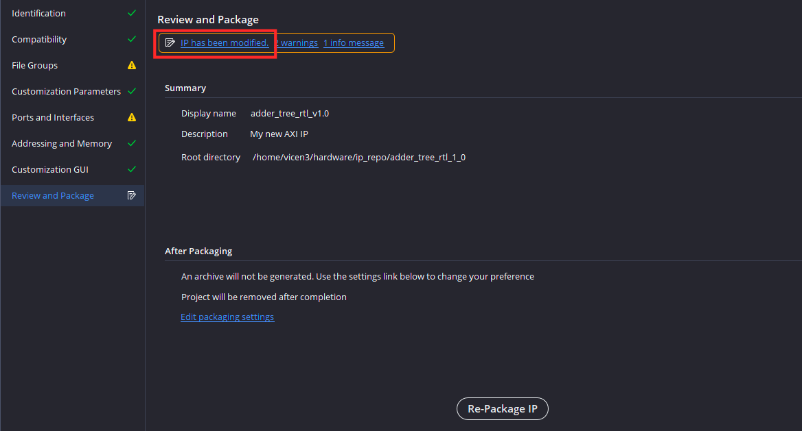{ #fig-empaquetado width="1000" }

Tras empaquetar la IP Vivado cerrará el proyecto de la IP y volvera al proyecto original.

### Diseño del Sistema

Cree un nuevo diagrama de bloques y repita la secuencia vista en la primera guía para generar el sistema base del Microblaze con 128 KB de memoria y el periférico de Uart. Debería verse como en la [](#fig-base).


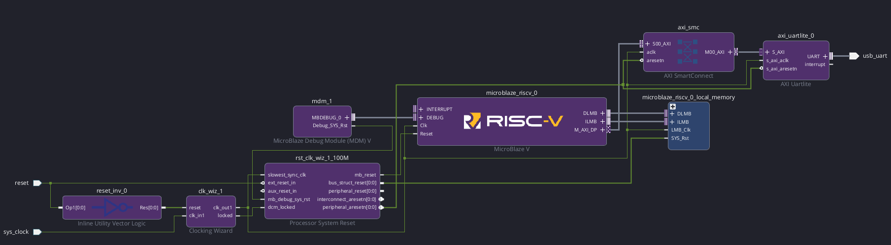{ #fig-base width="1000" }


Luego añada el adder tree a su diagrama usando **Add IP**:

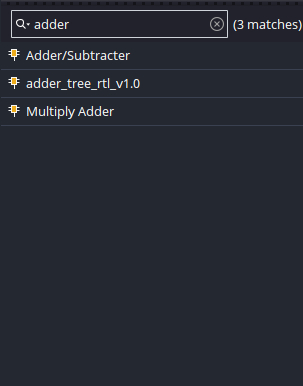{ #fig width="200" }

Luego haga click en **Run Connection Automation** e integre el adder tree al sistema debería quedar como la []()

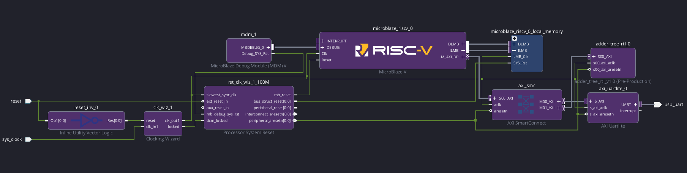{ #fig-adder_tree_bd width="1000" }

Teniendo ya el periférico integrado, revise en address editor que se integro correctamente como se ve en la []()

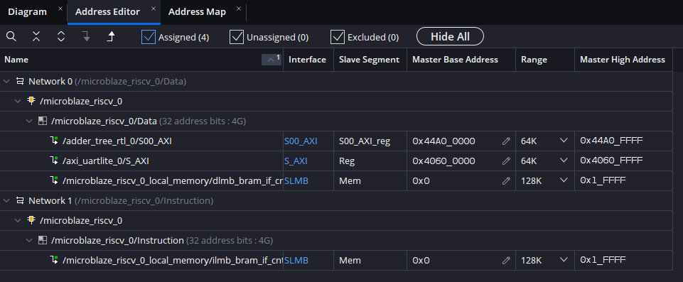{ #fig-address_editor width="1000" }

Valide nuevamente su diseño y ejecute la sintesís,la implementación y extracción de bitsream. El autor obtuvo la utilización de recursos vista en la [](#tbl-resources)

<div markdown="1" style="text-align: center;">

Table: Utilización de recursos {#tbl-resources}

| Proceso  | LUT | FF | BRAM      |
| ------- | ----- | --------- | ---------------- |
| `Sintesis`   | 2654     | 2292        | 32     |
| `implementación`  | 2393    | 2224    | 32         |

</div>

Luego continue al exportado de hardware, tome nota del nombre que elige, como se ve en la []() en esta guía se hara el uso de adder_tree_rtl.xsa.

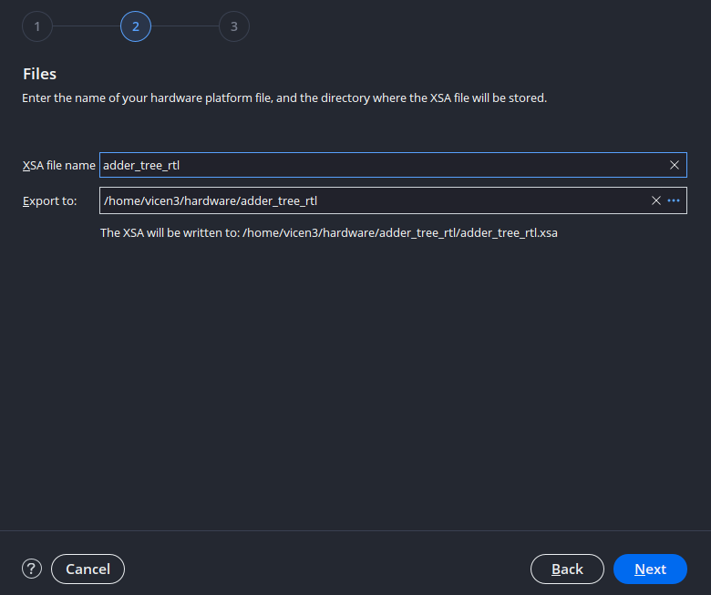{ #fig-xsa_name width="1000" }


Una vez exportado el hardware **NO CIERRE VIVADO**.

### Creación de los drivers

Si va a la carpeta `/ip_repo/adder_tree_rtl_v1_0` en su explorador de archivos, (la ruta donde se creo la IP vista en la [](#fig-nombre-ip)) encontrará los archivos que definen la IP. En este caso nos fijaremos en la carpeta **drivers**, la cual contiene los archivos necesarios para el manejo de la IP desde software.

En esta carpeta encontrará nuevamente el nombre de la IP. Esto se debe a que una sola IP puede encapsular varias otras IP's, cada una con su respectivo driver. Dentro de la carpeta src encontrará los archivos :

- **adder_tree_rtl.c**: Archivo fuente que define la implementación de las funciónes de la IP. Por defecto se encuentra vacio.
- **adder_tree_rtl.h**: Archivo encabezado que declara los prototipos de las funciónes de la IP, tambien posee las macros que definen el espacio de memoria de los registros.
- **adder_tree_rtl_selftest.c**: Archivo que define la función usada para verificar que la ip se encuentra correctamente conectada al sistema axi a través de varias escrituras sobre los registros y su posterior lectura de estos para corroborar que la escritura se realizo correctamente.
- **Makefile**: Archivo Makefile que sirve para manejar y automatizar el proceso de convertir el código fuente en un programa ejecutable.


```
adder_tree_rtl_1_0
├── ...
└── drivers
    └── adder_tree_rtl_v1_0
        ├── data
        └── src
			├── Makefile
			├── adder_tree_rtl_selftest.h
			├── adder_tree_rtl.h
			└──	adder_tree_rtl.c
```

Sin embargo se tiene que estos drivers no son inmediatamente reconocidos por Vitis Unified IDE, puesto que maneja la metadata del driver de manera distinta a como lo hacia Vitis Classic. En Vitis Classic los drivers se extraian de manera automatica desde el xsa usando la API HSI. En Vitis Unified cada driver tiene que tener un archivo YAML/CMAKE con las definiciónes de hardware.

Sin embargo AMD ofrece un script para resolver esta incompatibilidad, el archivo tcl **create_driver.tcl**. Para más información de esta utilidad y como esta solucióna las incompatibilidades visitar el siguiente [enlace](https://adaptivesupport.amd.com/s/article/Creating-an-SDT-enabled-baremetal-driver-template-for-Vitis-Unified-IDE?language=en_US).

Para hacer uso de este script vuelva a Vivado y dirijase la consola tcl en la parte inferior de la pantalla vista en la [](#fig-consola-tcl). 

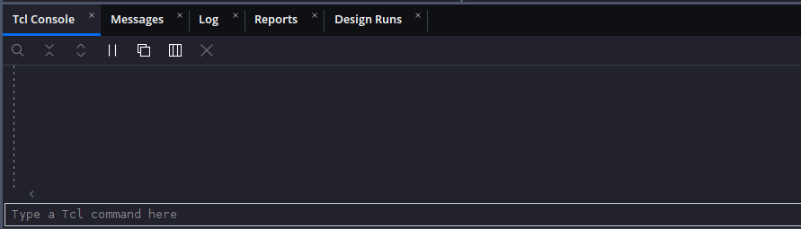{ #fig-consola-tcl width="1000" }

Luego en esta se correra el script, este no ejecuta ninguna función directamente, solo define las funciónes para su uso en el proyecto.

Para correr el script tiene dos opciónes:

- Poner el script donde se ejecuta Vivado en sus sistema. Para encontrar donde se ejecuta Vivado en su sistema puede hacer uso de comandos linux usuales para navegación de archivos, en particular sirve **pwd** que identifica donde se encuentra actualmente la consola:

```
>pwd
/home/vicen3
```
En este caso basta con poner el archivo tcl en la locación señalada y posteriormente correrlo haciendo uso del comando source.

```
source create_driver.tcl
```

- La otra opción es hacer uso de la ruta absoluta para correr el archivo, como ejemplo:

```
source /home/vicen3/Desktop/Ejemplo_4/create_driver.tcl
```

Si lo corrio correctamente la consola no mostrará un error.

Ya estándo definidas las funciónes necesarias para generar el driver, se ejecutara el siguiente comando:

```
create_driver -xsa /dirección/de/xsa/adder_tree_rtl.xsa -ip_name nombre_ip -driver_src /dirección/carpeta/src -repo /dirección/carpeta/de/driver
```

Este comando:

- Lee el archivo XSA donde se encuentran las definiciónes de todos los módulos que componen el sistema.
- Identifica la IP de la cual se quiere generar drivers.
- Revisa los archivs .h y .c asociados a la IP
- Genera los archivos YAML y CMAKE en una nueva carpeta en la dirección señalada en la carpeta -repo, note que en esta carpeta se copiarán tambien los archivos .h y .c para tener un driver unificado.

En caso de no recordar el nombre de la IP generada puede correr el comando create_driver para identificar las IP's del xsa con la flag -get_ip_names

```
>create_driver -xsa /home/vicen3/hardware/adder_tree_rtl/adder_tree_rtl.xsa -get_ip_names
Info: IP Names on microblaze_riscv_0 in XSA are:
lmb_bram_if_cntlr lmb_bram_if_cntlr axi_uartlite adder_tree_rtl
```

A manera de ejemplo el auto de esta guía uso el siguiente comando con direcciónes absolutas:

```
create_driver -xsa /home/vicen3/hardware/adder_tree_rtl/adder_tree_rtl.xsa -ip_name adder_tree_rtl -driver_src /home/vicen3/hardware/ip_repo/adder_tree_rtl_1_0/drivers/adder_tree_rtl_v1_0/src -repo /home/vicen3/hardware/ip_repo/adder_tree_rtl_1_0/drivers
```


Si ejecutó el comando sin inconvenientes deberia ver algo similar en la consola TCL:

```
Info: Finding VLNV for IP below:
* adder_tree_rtl
Info: /home/vicen3/hardware/ip_repo/adder_tree_rtl_1_0/drivers/XilinxProcessorIPLib/drivers/adder_tree_rtl_v1_0/data/adder_tree_rtl.yaml created
Info: dummy /home/vicen3/hardware/ip_repo/adder_tree_rtl_1_0/drivers/XilinxProcessorIPLib/drivers/adder_tree_rtl_v1_0/src/xadder_tree_rtl_g.c is generated
Info: Importing source files from /home/vicen3/hardware/ip_repo/adder_tree_rtl_1_0/drivers/adder_tree_rtl_v1_0/src to /home/vicen3/hardware/ip_repo/adder_tree_rtl_1_0/drivers/XilinxProcessorIPLib/drivers/adder_tree_rtl_v1_0/src
Info: Ignoring /home/vicen3/hardware/ip_repo/adder_tree_rtl_1_0/drivers/adder_tree_rtl_v1_0/src/adder_tree_rtl_selftest.c as this is a selftest source file
Info: /home/vicen3/hardware/ip_repo/adder_tree_rtl_1_0/drivers/XilinxProcessorIPLib/drivers/adder_tree_rtl_v1_0/src/CMakeLists.txt generated
```

Con esto se ha creado la carpeta XilinxProcessorIPLib en la dirección señalada en la flag -repo. Similar a ip_repo, esta es una carpeta donde se espera se guarden drivers de varios perifericos, la carpeta tiene la siguiente estructura:


```
XilinxProcessorIPLib
└── drivers
    └── adder_tree_rtl_v1_0
        ├── data
		|	└── adder_tree_rtl.yaml
		├── examples
		|	└── adder_tree_rtl_selftest.c
        └── src
			├── CMakeLists.txt
			├── xadder_tree_rtl_g.c
			├── adder_tree_rtl.h
			└──	adder_tree_rtl.c
```


Note que se crearon los siguientes archivos
- adder_tree_rtl.yaml y CMakeLists.txt : Archivos necesarios para que Vitis Unified reconozca el driver.
- xadder_tree_rtl_g.c : Archivo que define la tabla de configuración de la IP de manera que sepa en que hardware se encuentra instanciada. Si abre el archivo verá que esta vacio, esto es debido a que este archivo es manejado directamente por el Board Support Package, regenerando sus contenidos con cada instancia de hardware. 


Con esto ya puede cerrar Vivado.


## Firmware

Abra Vitis y defina el workspace.


Antes de crear la aplicación, se añadiran los drivers generados a los repositorios de software a los que puede acceder . Para esto dirijase a **Vitis>Embedded SW Repositories...**.
En la ventana emergente en la sección **Local Repositories (available to the current workspace)** haga click en "+" para agregar la carpeta XilinxProcessorIPLib como se ve en la [](#fig-sw-repo).

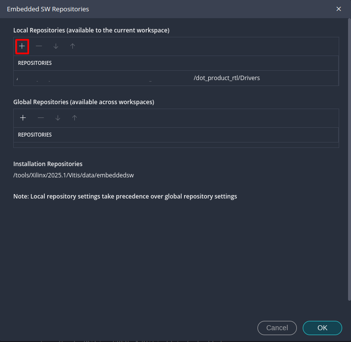{ #fig-sw-repo width="1000" }

Se agregan estos drivers antes de generar el componente de plataforma de manera que se incluya dentro del BSP. En caso contrario será necesario regenerar el BSP despues de crear el componente de plataforma.

Genere el componente de plataforma. Tras generarlo dirijase al archivo de configuración vitis-comp.json y vaya al apartado **drivers**. como se ve en la [](#fig-drivers-bsp) se encuentra el driver recién generado dentro del BSP.


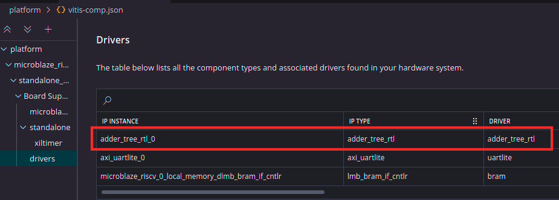{ #fig-drivers-bsp width="1000" }

Continue creando el componente de aplicación. 

Agregue el archivo Ejemplo_4.c de la carpeta Ejemplo_4, el cual posee el siguiente código:

```c
//Libreria del periferico generada con el con los comandos descritos en el script "create_driver.tcl"
#include "adder_tree_rtl.h"

#include <stdio.h>
#include "xil_printf.h"
#include "xparameters.h"
#include "xil_io.h"


int main() {
    xil_printf("--- Prueba Adder Tree descrito en RTL ---\r\n");

    // Entradas de 16 bits
    uint16_t input[8] = {10, 20, 30, 40, 50, 60, 70, 80};

    // Como los registros son de 32 bits, se guardan dos entradas en cada uno
    uint32_t reg0_val = ((uint32_t)input[1] << 16) | input[0];
    uint32_t reg1_val = ((uint32_t)input[3] << 16) | input[2];
    uint32_t reg2_val = ((uint32_t)input[5] << 16) | input[4];
    uint32_t reg3_val = ((uint32_t)input[7] << 16) | input[6];

    // Escritura de entradas
    ADDER_TREE_RTL_mWriteReg(XPAR_ADDER_TREE_RTL_0_BASEADDR, ADDER_TREE_RTL_S00_AXI_SLV_REG0_OFFSET, reg0_val);
    ADDER_TREE_RTL_mWriteReg(XPAR_ADDER_TREE_RTL_0_BASEADDR, ADDER_TREE_RTL_S00_AXI_SLV_REG1_OFFSET, reg1_val);
    ADDER_TREE_RTL_mWriteReg(XPAR_ADDER_TREE_RTL_0_BASEADDR, ADDER_TREE_RTL_S00_AXI_SLV_REG2_OFFSET, reg2_val);
    ADDER_TREE_RTL_mWriteReg(XPAR_ADDER_TREE_RTL_0_BASEADDR, ADDER_TREE_RTL_S00_AXI_SLV_REG3_OFFSET, reg3_val);

    // Lectura de salida
    int total_sum = ADDER_TREE_RTL_mReadReg(XPAR_ADDER_TREE_RTL_0_BASEADDR, ADDER_TREE_RTL_S00_AXI_SLV_REG4_OFFSET);
    xil_printf("Resultado obtenido de la IP: %d\r\n", total_sum);

    return 0;
}
```


El primer encabezado **adder_tree_rtl.h** es la librería asociada a la IP, importado sin hacer uso de una ruta absoluto debido a que Vitis lo reconoce ya como un driver del sistema.
**NOTA**: El nombre de este encabezado va a diferir del suyo si hizo uso de un nombre distinto para la IP, lo mismo es cierto para las funciónes y los offsets de direcciónes de memoria.

Al hacer ctrl+click sobre este encabezado lo llevará a su definición, donde se encuentran los prototipos de las 3 funciónes predeterminadas que incluye cada driver de un periférico encapsulado en AXI:

- ADDER_TREE_RTL_mWriteReg: Usada para escribir sobre los registros.
- ADDER_TREE_RTL_mReadReg: Usada para leer los registros.
- ADDER_TREE_RTL_Reg_SelfTest: Usada para probar si la lectura/escritura sobre los registros funcióna correctamente.


Volviendo al archivo principal, se tiene que se sigue la siguiente secuencia:

- Se definen 8 entradas de 16 bits.  
- Se concatenan para que entren en los 4 registros de 32 bits a través de desplazamiento de bits.
- Se escribe en los registros de entrada.
- Se lee el registro de salida.
- Se realiza el envio del valor obtenido a través de Uart.


Compile la aplicación haciendo click en **Build**, al autor le dieron el siguiente tamaño del ELF.


<div markdown="1" style="text-align: center;">

Table: Tamaño del ELF {#tbl-elf-size}

| text  | data | bss | dec      |
| ------- | ----- | --------- | ---------------- |
|  7896  | 240     | 3544        | 11680     |

</div>


Luego para probar la aplicación, conecte la placa y configure su terminal serial de preferencia en 9600 Baud, Stop bit de 1 y sin paridad. Acto seguido corra la aplicación, debería dar un resultado similar al de la [](#fig-resultado-hterm)

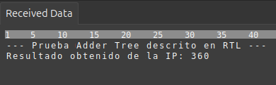{ #fig-resultado-hterm width="500" }

Con esta guía ha cerrado el ciclo completo de co-diseño hardware–software sobre FPGA: tomó una descripción RTL propia, la encapsuló como periférico AXI4-Lite, la integró en un sistema basado en Microblaze V, generó los drivers compatibles con Vitis Unified IDE y, finalmente, controló el bloque desde un programa en C. Más allá del adder tree usado como ejemplo, lo verdaderamente valioso es la metodología que ahora maneja: cualquier módulo que pueda describir en Verilog o VHDL puede convertirse en un periférico accesible desde el procesador a través de un puñado de registros mapeados en memoria. Desde aquí se abre un abanico amplio de posibilidades, ya sea diseñar aceleradores para algoritmos de procesamiento de señales, etapas aritméticas para inferencia de redes neuronales, controladores para sensores fuera del catálogo de IPs, o cualquier bloque a medida que su aplicación requiera. Esta capacidad de combinar lógica programable con un procesador embebido en una misma plataforma es precisamente lo que distingue a las FPGAs modernas como dispositivos de cómputo heterogéneo, y ahora cuenta con las herramientas para sacarle provecho.