# Guía 5: Diseño de Periféricos con High Level Synthesis

## Contexto

### ¿Que es High Level Synthesis?

High-Level Synthesis (HLS) es el proceso de transformar la descripción de un diseño desde un nivel de abstracción alto hacia una descripción a nivel de transferencia de registros (RTL). AMD Vitis™ HLS implementa este proceso a partir de funciones escritas en C/C++, generando la descripción RTL que posteriormente se integra en Vivado™ para su implementación en FPGA como se aprecia en el diagrama de la [](#fig-vitis-HL).

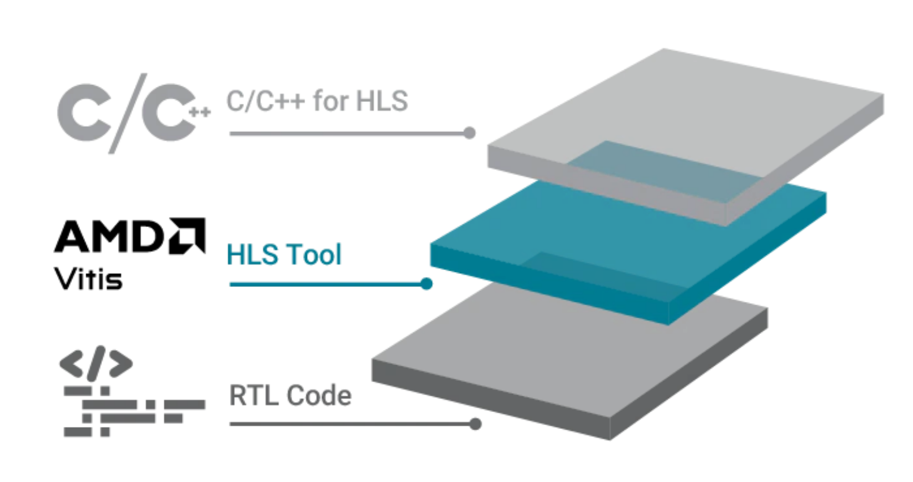{ #fig-vitis-HLS width="500" }

### Flujo de Vitis HLS

Note que para generar un módulo a nivel de RTL sintetizable  a partir de archivos C/C++, Vitis identifica ciertos aspectos claves en el código, entre los cuales destacan

- **Función Top**: Esta es la función que envolverá a otras funciones, manteniendo la misma jerarquía a la del un modulo de alto nivel que instancia a otros, esto se puede apreciar mas claramente cuando se exportan los archivos RTL, donde Vitis da la opción de que se genere un módulo sintetizable por cada función.
- **Bucles**: Vitis HLS sintetiza los bucles de forma secuencial de manera predeterminada. Es decir, genera un espacio de memoria en hardware donde realiza las iteraciones del bucle una instancia a la vez y en cada iteracion guarda el resultado.
- **Arreglos**: Vitis los implementa dependiendo de como son accedidos, si son grandes y no se acceden varios datos al mismo tiempo, son implementados con Block RAM, en caso de que se accedan varios datos al mismo tiempo, o sean de menor tamaño, se implementan a través de registros.

Una vez la herramienta identifica estos aspectos, estos sirven como insumos directos para la síntesis como se puede apreciar en la [](#fig-vitis-flujo).

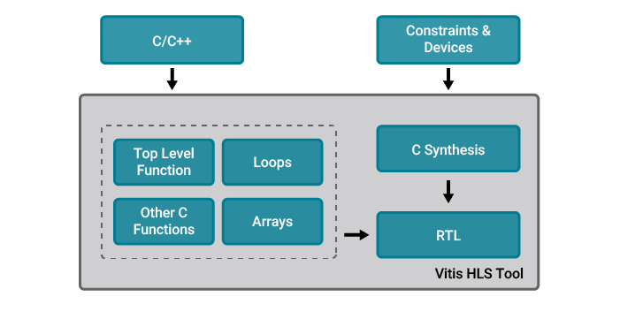{ #fig-vitis-flujo width="500" }

Por ultimo se tiene que mediante el uso de directivas en Vitis HLS, es posible optimizar y ajustar los resultados de la sı́ntesis de hardware para una misma descripción en C, permitiendo explorar diferentes implementaciones de un mismo código fuente.

### Pragmas en Vitis HLS

Los pragmas son directivas que guían al compilador HLS en la transformación del código C/C++ a RTL. No alteran el resultado funcional del algoritmo, pero sí controlan cómo este se implementa en hardware: la organización de los recursos, la forma de los bucles, las interfaces hacia el exterior y el grado de paralelismo. Su importancia es central porque la misma descripción en C puede sintetizarse en arquitecturas radicalmente distintas según los pragmas aplicados.

### Loop unrolling

El loop unrolling es una transformación que replica el cuerpo del bucle en hardware tantas veces como iteraciones tenga su rango. En lugar de ejecutar las iteraciones secuencialmente sobre una única instancia de la lógica aritmética, todas las iteraciones se materializan como hardware separado y se ejecutan en paralelo dentro del mismo ciclo de reloj. 

## Diseño de Hardware

### Creación del Proyecto HLS

Abra Vitis y elija un espacio de trabajo, en el menu de inicio presione **New HLS Component**  como se ve en la [](#fig-new-HLS) para crear un nuevo componente de HLS.

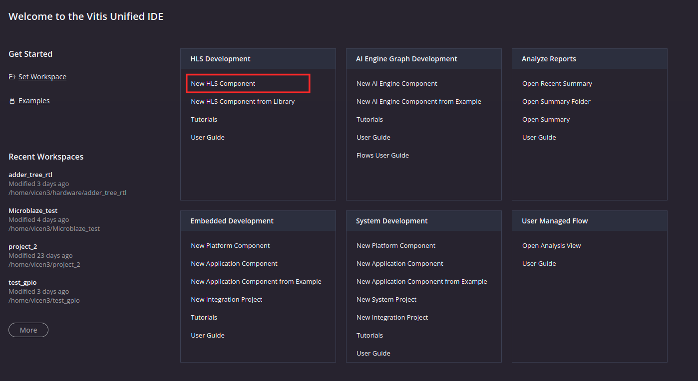{ #fig-new-HLS width="1000" }

Esto abrirá una ventana emergente donde podrá crear el componente HLS, empezando por asignarle un nombre. En el caso de esta guía se usa el nombre **Adder_tree_HLS** como se ve en la [](#fig-nombre-proyecto).

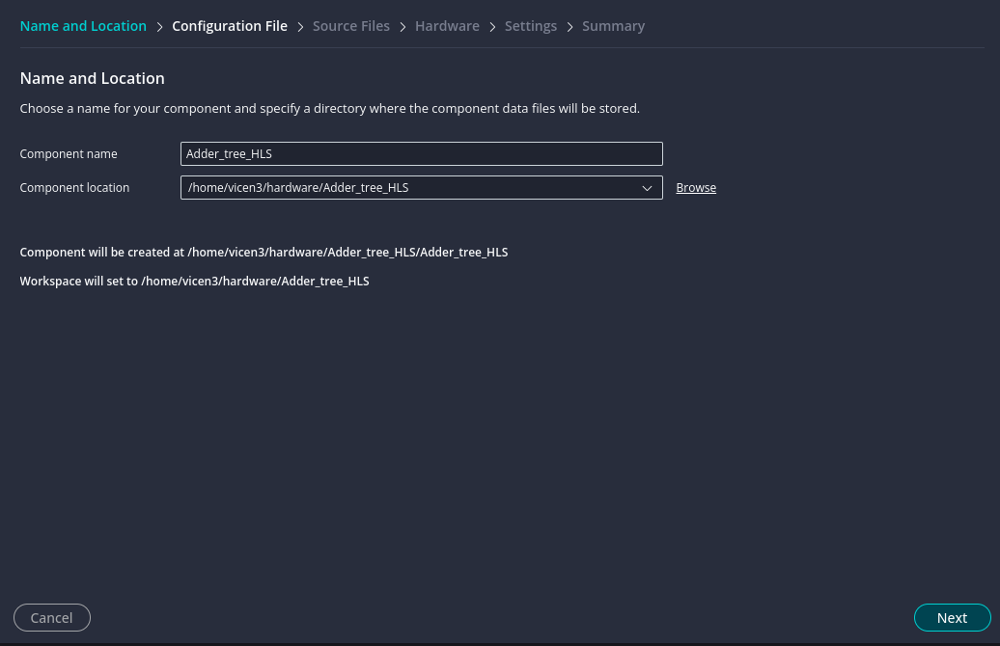{ #fig-nombre-proyecto width="1000" }

Tras hacer click en *Next*, se elije el archivo de configuración HLS, este contiene todos los datos de la configuración del proyecto. Su funcion es automatizar la creacion de proyectos HLS, debido a que en esta guía se realizaran las configuraciones de forma manual, seleccione *Empty File* como se ve en la [](#fig-config-hls).

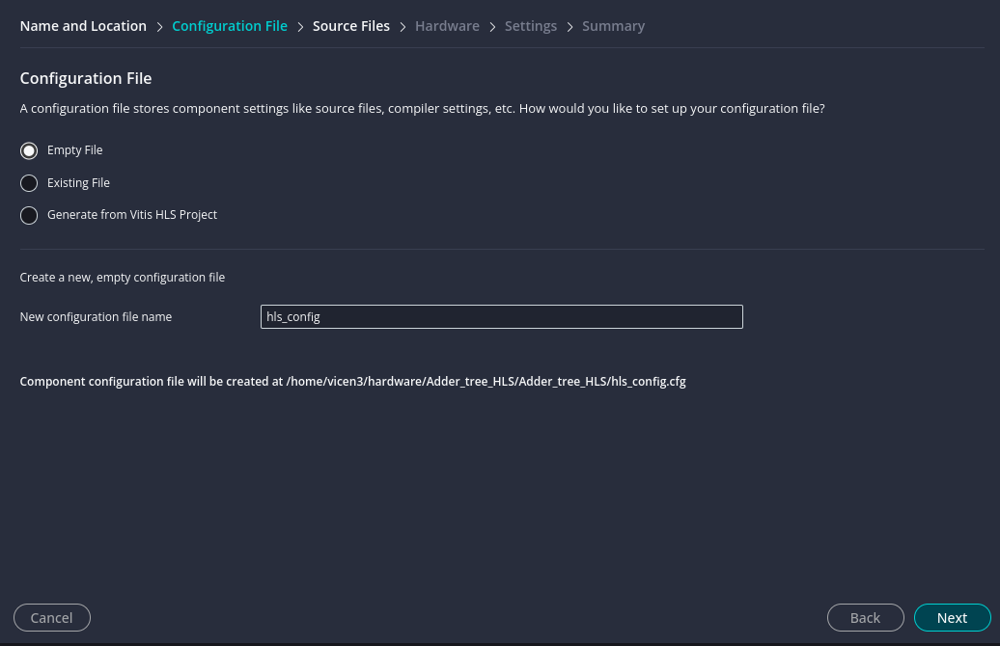{ #fig-config-hls width="1000" }

En la siguiente ventana se definen los archivos fuente del componente, también en este paso se definen las configuraciones del compilador para cada archivo fuente como se ve en la [](#fig-sources-vitis). En esta guía los archivos fuente se añadirán en un paso posterior para mostrar ambas maneras de añadir archivos.

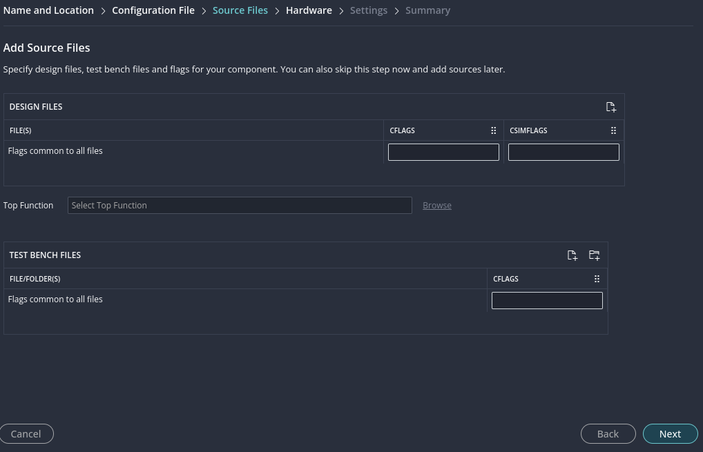{ #fig-sources-vitis width="1000" }

Luego en el siguiente paso se define el chip FPGA a usar en la síntesis de C a RTL. Esta información le sirve a Vitis para poder realizar estimaciones del uso de recursos y la latencia del modulo generado. En esta ventana escriba el nombre del chip de la placa a usar, en el caso de esta guía es "xc7a100tcsg324-1" como se ve en la [](#fig-Vitis-hardware).

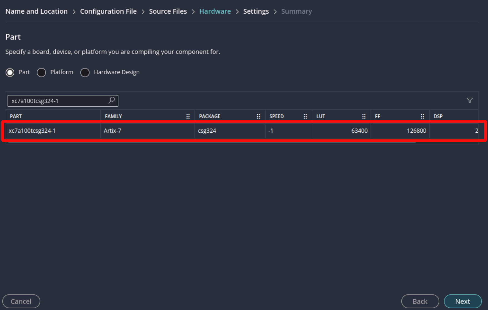{ #fig-Vitis-hardware width="1000" }


Continuando con la ultima pestaña de configuración, esta define:

- **Frecuencia de reloj objetivo**: Frecuencia objetivo para el modulo diseñado, por defecto es 100 MHZ.
- **Margen de Frecuencia de reloj**: Maxima variacion permitida en la frecuencia de reloj.
- **Flujo objetivo**: Define para que flujo se diseña la herramienta.
    - **Vivado**: Produce una IP empaquetada para su uso dentro del diagrama de bloques de Vivado con otras IP's.
    - **Vitis**: Produce un archivo *Xilins Object* (.xo). Un kernel que se conecta al flujo de aceleración de Vitis y es llamado directamente desde el PC a través de Vitis sin necesidad de incluir un procesador en el sistema.
- **Formato de exportado**: Especifica el formato de exportado del componente, puede ser en RTL, un archivo xo o el ip_catalog que agiliza la inclusión al diagrama de bloques de Vivado.

En este caso se mantendrán las configuraciones predeterminadas vistas en la [](#fig-settings).


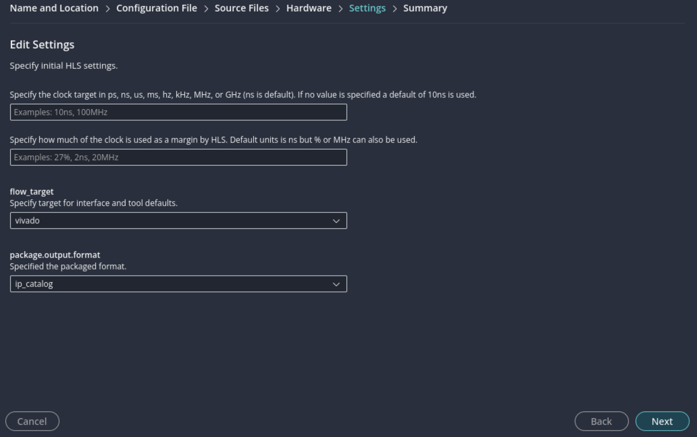{ #fig-settings width="1000" }

Finalmente se expone un resumen de las configuraciones elegidas como se ve en la [](#fig-resumen).

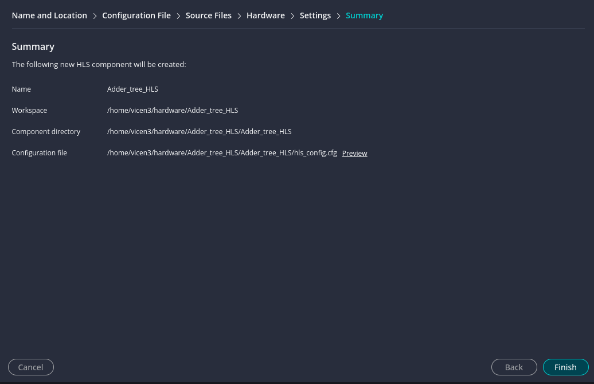{ #fig-resumen width="1000" }

Ya habiendo creado el componente de HLS, agregue los archivos fuente haciendo click derecho en la carpeta Sources y seleccione *Add Source File* como se ve en [](). Agregue el archivo **hls_main.cpp** y el encabezado **hls_config.h** de la carpeta Ejemplo_5 .


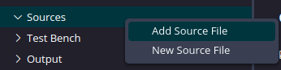{ #fig-add-sources width="500" }

Este archivo tiene el siguiente código:

```c
#include "hls_config.h"

template <int S, int P>
void adder_tree_logic(int *o_data, int i_data[N]) {

    int data[P][S + 1];
    for (int stage = 0; stage <= S; stage++) {
        //#pragma HLS UNROLL 
        int ST_OUT_NUM = P >> stage;
        for (int adder = 0; adder < ST_OUT_NUM; adder++) {
          //  #pragma HLS UNROLL
            if (stage == 0) {
                data[adder][stage] = (adder < N) ? i_data[adder] : 0;
            } else {
                data[adder][stage] = data[adder * 2][stage - 1] + data[adder * 2 + 1][stage - 1];
            }
        }
    }
    *o_data = data[0][S];
}

// Top-level function for Synthesis
void adder_tree(int *o_data, int i_data[N]) {
    #pragma HLS INTERFACE mode=s_axilite port=i_data
    #pragma HLS INTERFACE mode=s_axilite port=o_data
    #pragma HLS INTERFACE mode=s_axilite port=return

    adder_tree_logic<STAGES, POW2_N>(o_data, i_data);
}
```

El código define dos funciones. La primera, *adder_tree_logic*, implementa el módulo adder tree como una plantilla parametrizada. Su lógica se construye mediante dos bucles for anidados: el bucle externo recorre las etapas del árbol, mientras que el bucle interno realiza las sumas correspondientes a cada etapa. La segunda función, adder_tree, instancia la plantilla anterior y fija la estructura concreta del módulo y la cantidad de entradas. Las constantes N, STAGES y POW2_N están definidas en el archivo de encabezado * hls_config.h*.

```c
#ifndef HLS_CONFIG
#define HLS_CONFIG

#define N 8
#define POW2_N 8 // Next power of 2
#define STAGES 3 // log2(8)

// Prototype must match the synthesized instance
void adder_tree(int *o_data, int i_data[N]);

#endif
```


En el código del adder tree se emplean dos familias de pragmas:

- ***HLS INTERFACE*** — Define el protocolo de comunicación de cada puerto del módulo. En este caso, se utiliza el modo s_axilite para los argumentos i_data, o_data y el retorno, lo que expone el acelerador como un periférico AXI-Lite controlable desde un procesador.
- ***HLS UNROLL*** — Aplica loop unrolling a los dos bucles for anidados de adder_tree_logic.

Note que los pragma ***HLS UNROLL*** están comentados por defecto.

### Simulación en C

Previo a enfocarse en la síntesis, primero hay que verificar que el algoritmo obtiene el resultado esperado. Para esto primero se realizan pruebas a nivel de software, para esto se hace uso de un vector de pruebas, un vector de resultados esperados y un archivo de prueba que instancia la función a probar. Haga click derecho en la carpeta *Test Bench* y presione en *Add Test Bench File* para añadir archivos de prueba como se ve en la [](#fig-testbench-file). Agruegue los archivos *golden_Inputs.dat*, *golden_Reference.dat* y *testbench.cpp* de la carpeta Ejemplo_5.

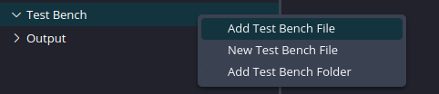{ #fig-testbench-file width="1000" }

Los archivos .dat tienen los vectores de referencia, mientras que el archivo testbench contiene el codigo para correr la prueba:


```c
#include <iostream>
#include <fstream>
#include <cmath>
#include <string>
#include "hls_config.h"

constexpr float REL_TOL = 2.0f;
constexpr int TRIALS = 10;


int main() {
    std::cout << "Running C++ simulation!" << std::endl;

    int testResult = 0;
    std::ifstream idata("golden_Inputs.dat");
	std::ifstream rdata("golden_Reference.dat");

    if (!rdata.is_open()) {
        std::cerr << "Error reading golden_Reference file!" << std::endl;
        return 1;
    }

	if (!idata.is_open()) {
        std::cerr << "Error reading golden_Inputs file!" << std::endl;
        return 1;
    }

    int output;
    int input[N];

    float buffer;
    float adder_tree_rel_err = 0.0f;

    for (int i = 0; i < TRIALS; ++i) {
        float temp = 0.0f;

        // Read vector input
        for (int j = 0; j < N; ++j) {
            idata >> temp;
            input[j] = static_cast<uint32_t>(temp);
        }

        // Read reference output
        rdata >> temp;
        buffer = temp;

        // Call HLS function
       
        adder_tree(&output, input);

        adder_tree_rel_err = 100.0f * std::fabs((output - buffer) / buffer);

        std::cout << "TRIAL: " << i
                  << ",\t Expected: " << buffer
                  << "\tGot: " << output
                  << " Err: " << adder_tree_rel_err << "%\n";

        if (adder_tree_rel_err > REL_TOL) {
            std::cout << "Adder Tree error exceeds tolerance!" << std::endl;
            ++testResult;
        }
    }

    rdata.close();
	idata.close();

    std::cout << "*******************************************\n";
    if (testResult) {
        std::cout << "*\t \t  FAIL \n";
    } else {
        std::cout << "*\t \t  PASS \n";
    }
    std::cout << "*******************************************\n";

    return testResult;
}
```


El comportamiento del testbench se controla mediante dos constantes:

- **TRIALS **(10): Número de vectores de prueba a evaluar. En cada iteración, se leen N valores enteros desde golden_Inputs.dat hacia el arreglo input[] y un valor de referencia desde golden_Reference.dat hacia buffer.
- **REL_TOL** (2.0) : Tolerancia máxima admisible para el error relativo porcentual entre la salida del módulo y el valor de referencia.

En cada iteración, el *testbench* invoca `adder_tree(&output, input)` y calcula el error relativo respecto al valor de salida esperado.

Si *adder_tree_rel_err*​ supera `REL_TOL` en alguna iteración, se incrementa el contador `testResult`. Al finalizar las `TRIALS` iteraciones, el *testbench* imprime `PASS` por consola si `testResult == 0`, o `FAIL` en caso contrario; este mismo valor se retorna desde `main` para que el entorno de simulación pueda detectar la falla automáticamente.

Para correr la simulación, haga click en **Run** en el panel lateral *C Simulation* como se ve en la [](#fig-run-c-sim).

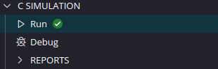{ #fig-run-c-sim width="250" }

Esto lanzara la ventana emergente vista en la []( #fig-sim-op) donde se pueden definir varios parametros para el compilador de codigo C al momento de simular. Mantenga las opciones predeterminadas.

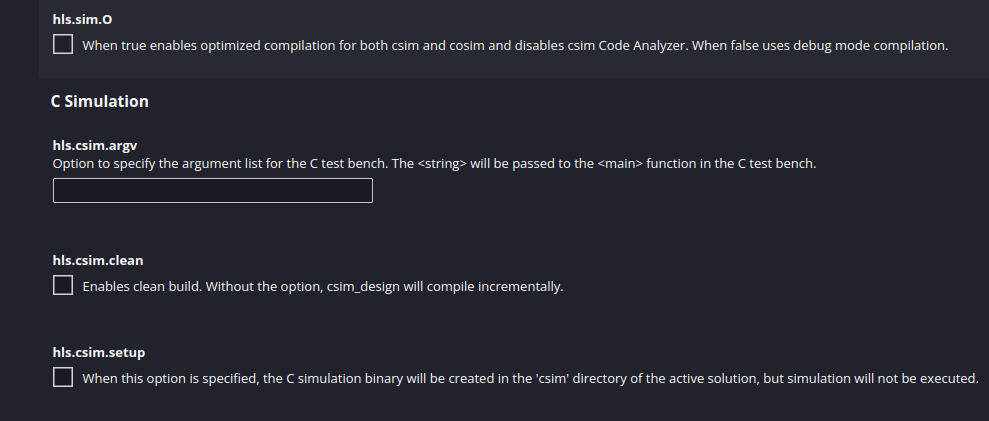{ #fig-sim-op width="1000" }


Si salio de manera adecuada se debería ver a traves de la consola el resultado de la prueba [](#fig-pass).

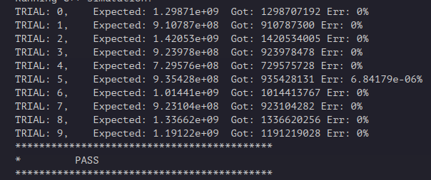{ #fig-pass width="500" }

En este punto se tiene el algoritmo en software funcionando de manera esperada.

### Síntesis de C a RTL

Para generar un modulo RTL, primero hay que elegir que función del codigo fuente sera sintetizada, para esto vaya al panel lateral, en *Settings* expanda el menu y presione *hls_config.cfg* como se ve en la [](#fig-config-hls).

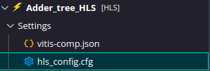{ #fig-config-hls width="500" }

Esto abrirá el menú de configuraciones HLS, dirijase a la sección *C Synthesis Sources* y haga click en *Browse* de la subsección *hls.syn.top* como se ve en la [](#fig-synth-config).

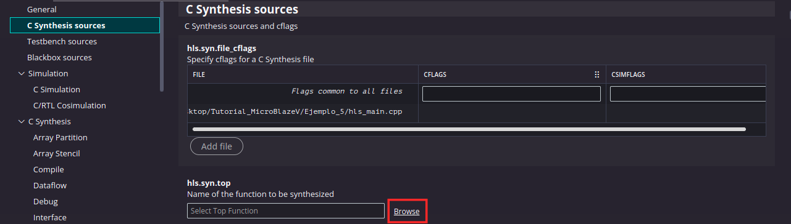{ #fig-synth-config width="1000" }

En la ventana emergente apareceran todas las funciones existentes en los archivos fuente (*adder_tree_logic* aparece dos veces debido a la definicion y su instanciación en la funcion *adder_tree*) como se ve en la [](#fig-top-function). Seleccione *adder_tree*.


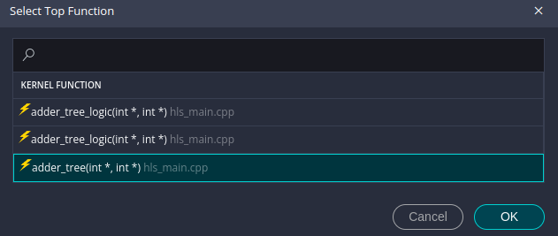{ #fig-top-function width="1000" }

Una vez definida la funcion a sintetizar, se puede correr la síntesis haciendo click en el botón *Run* del menu lateral *C Synthesis* como se ve en la [](#fig-Vitis_synth_run).

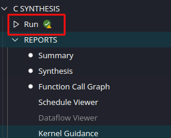{ #fig-Vitis_synth_run width="500" }


Una vez ejecutada la síntesis, Vitis HLS reporta el estado en la consola; si ocurre algún error, este se indica explícitamente con su naturaleza y ubicación. Para acceder al reporte de resultados, presionar el botón  *Synthesis* del panel lateral, como se muestra en la [](#fig-Ver_reporte). 

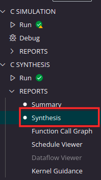{ #fig-Ver_reporte width="500" }


Al sintetizar el módulo con los pragmas HLS UNROLL comentados, Vitis HLS produce el reporte de la [](#fig-Reporte_no_pragma). El compilador conserva los bucles for como construcciones secuenciales y los reporta bajo el identificador VITIS_LOOP_8_1. Este bucle ejecuta cada suma de forma serializada: en cada ciclo se calcula un único dato, se escribe en su registro intermedio, y solo entonces se procede a la siguiente iteración. Esta serialización se traduce en una latencia total de 500 ns. El consumo de recursos es  374 FFs y 488 LUTs, sin uso de BRAM ni DSP.

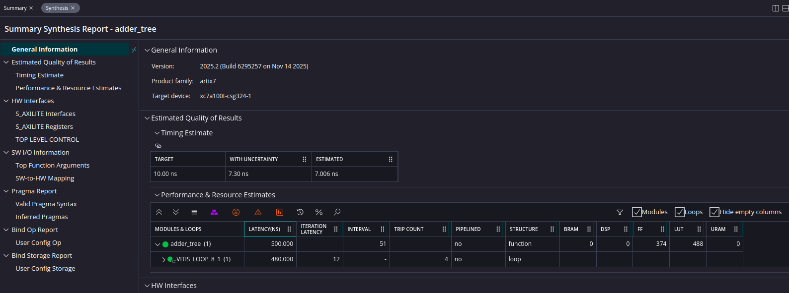{ #fig-Reporte_no_pragma width="1000" }


Para realizar una comparación con el uso de los pragmas, vuelva al archivo fuente y descomente ambos pragmas como se ve en la [](#fig-Pragmas-uncomment). Luego corra de nuevo la sintesis.

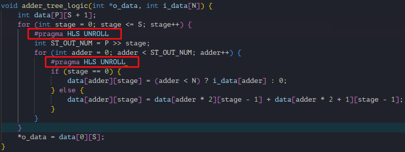{ #fig-Pragmas-uncomment width="1000" }


Al habilitar los pragmas HLS UNROLL y resintetizar, se obtiene el reporte de la [](#fig-Reporte_post_pragma). La diferencia más visible es que el bucle VITIS_LOOP_8_1 ya no aparece en la jerarquía: Vitis HLS replicó la lógica de suma de cada iteración y la integró dentro del cuerpo de la función adder_tree. La latencia total cae de 500 ns a 90 ns.
Este desempeño se obtiene a costa de un aumento  de recursos lógicos: 420 FFs  y 505 LUTs.

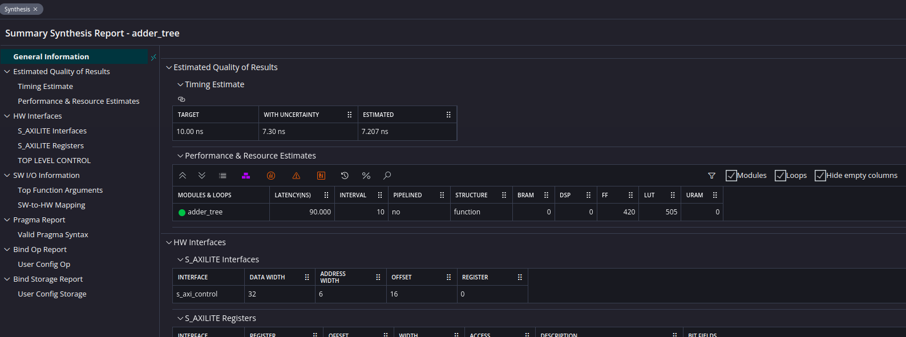{ #fig-Reporte_post_pragma width="1000" }


### Cosimulación 

Finalmente queda verificar que el modulo sintetizado tiene un comportamiento homologo al algoritmo diseñado en C.Para esto se hace uso de la herramienta de cosimulacion de vitis, esta corre la simulacion en C, guarda los resultados y despues abre una instancia de vivado para simular el rtl generado con los mismos vectores de referencia.

Para iniciar la cosimulación vaya al menu lateral y presione el boton *Run* de la sección C/RTL COSIMULATION vista en la [](#fig-cosim-button).

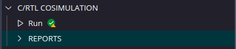{ #fig-cosim-button width="500" }

Esto nuevamente lanzara una ventana emergente con opciones avanzadas para la cosimulación como se ve en [](#fig-cosim-options). Mantenga las opciones predeterminadas y presione *Run*.

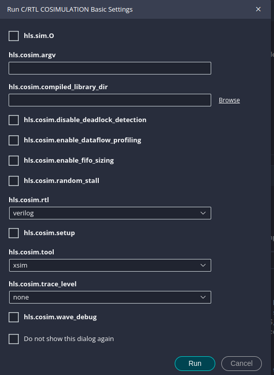{ #fig-cosim-options width="500" }


Finalmente aparecera en la consola el resultado del testbench, mostrando primero el resultado en software y despues en RTL.


### Exportado de la IP

Una vez validado el modulo generado a nivel de RTL, solo falta empaquetar el modulo en un bloque IP para que pueda ser usado en Vivado.

En el menú lateral *IP Package* visto en la [](#fig-Vitis_package_menu) presione *Run*.

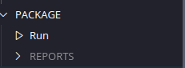{ #fig-Vitis_package_menu width="500" }


Esto lanzara una ventana emergente con opciones para la configuracion del empaquetado como se ve en la [](#fig-Vitis_package_cfg).Se sugiere asignar el nombre **Adder_tree_hls_ip** en el campo *hls.package.output.file* que define el nombre del archivo (no necesariamente de la IP).


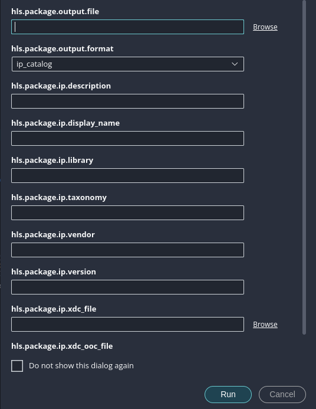{ #fig-Vitis_package_cfg width="500" }

Al exportar la IP se generan:

- Generación de Archivos RTL: Se consolidan los archivos Verilog o VHDL finales.
- Scripts de Control: Se incluyen los archivos de restricciones (.xdc) y scripts Tcl necesarios para la integración.
- Documentación: Se genera automáticamente un reporte de recursos y latencia que acompañará al bloque.

Al finalizar el proceso, el IP aparecerá en la carpeta del componente HLS bajo el nombre *Adder_tree_hls_ip.zip*.Descomprima esta arthivo con su programa de preferencia.Al descomprimirlo podra observar que posee varias capetas, con toda la información necesaria para que sea reconocida como una IP en el catalogo de Vivado, cabe destacar que el empaquetado incluye drivers de software sin necesidad de intervención del usuario.


### Integración de Periférico HLS

Abra Vivado y cree un nuevo proyecto eligiendo la placa "Nexys A7 100T" en la sección Boards, como se ha hecho en secciones previas.

Antes de poder integrar la IP generada a un sistema, hay que añadir la carpeta donde esta se encuentra a los repositorios de bloques IP's a Vivado. Para esto dirijase a Tools>Settings como se ve en la [](#fig-Tool_settings).

{ #fig-Tool_settings width="1000" }

En el panel emergente mostrado en la [](#fig-IP_REP) dirijase al botón IP>Repository, seguido de esto haga click en el signo + para añadir la carpeta donde guardó el bloque IP.

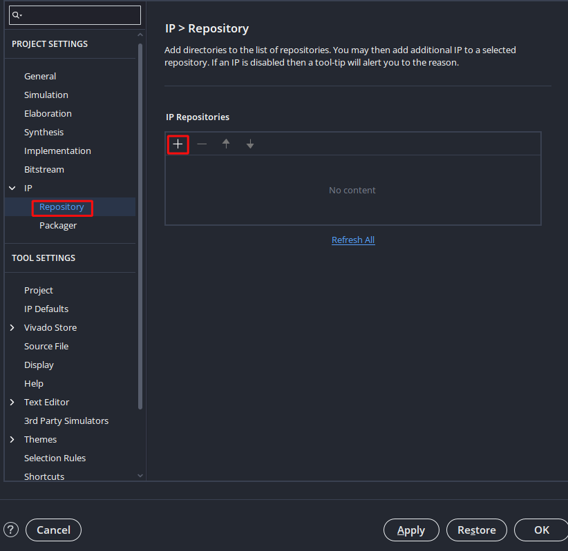{ #fig-IP_REP width="1000" }

Si no han ocurrido inconvenientes la IP debería aparecer la IP dentro de la carpeta como se ve en la [](#fig-Ip_folder). Note que el nombre de la IP corresponde al nombre de la función en software y no al nombre de la carpeta exportada.

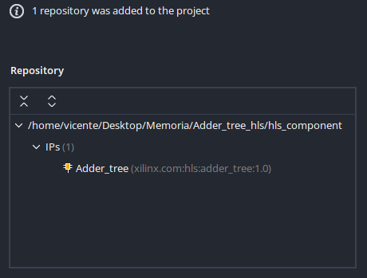{ #fig-Ip_folder width="1000" }

Cierre la ventana emergente y cree un nuevo diagrama de bloques. En este genere el sistema base de MicroBlaze V con periférico de Uart diseñado en la [seccion 1](../../Ejemplo_1_Sistema_base/Ejemplo_1/#diseno-de-hardware) como se ve en la [](#figbd_no_adder_tree).


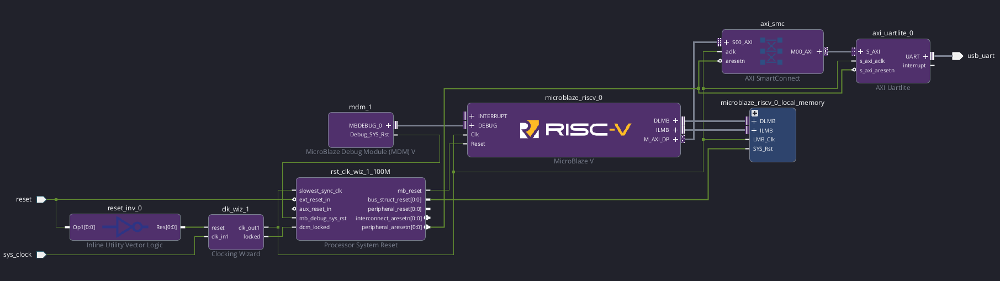{ #figbd_no_adder_tree width="1000" }

Luego al buscar una IP para agregar al bloque, debería aparecer la IP diseñada en el listado como se ve en la [](#fig-Ip_on_list).

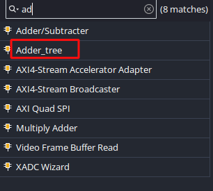{ #fig-Ip_on_list width="400" }

Esto agregará la IP al diagrama, como se puede apreciar en la [](#fig-IP_Adder_tree_on_bd). Note que esta IP posee una interfaz AXI debido a que Vitis realiza el encapsulado automaticamente (A diferencia del modulo diseñado en RTL de la [sección 4](../../Ejemplo_4_Verilog/Ejemplo_4/)). Tambien se tiene que posee un pin de interrupcion, sin embargo este no es funcional debido a que no se le asigno una funcionalidad al momento de hacer la síntesis de C a RTL.

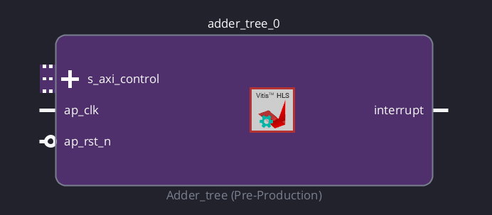{ #fig-IP_Adder_tree_on_bd width="1000" }


Luego presione el botón *Run Connection Automation* para integrar la IP al diagrama de bloques, debería quedar como en la [](#fig-bd_with_adder_Tree).

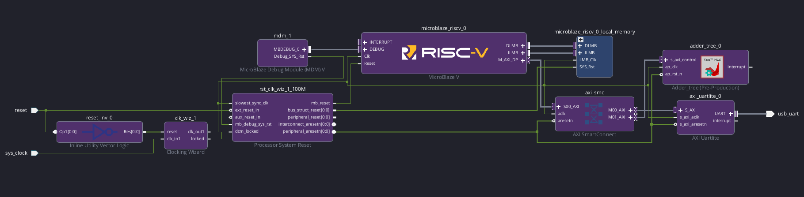{ #fig-bd_with_adder_Tree width="1000" }

Tras validar el diagrama de bloques, genere los productos de salida y genere la envoltura en hdl.

Despues de correr la síntesis y la implementación, el autor obtuvo la utilizacion de recursos vista en la [](#tbl-resources-global).

<div markdown="1" style="text-align: center;">

Table: Utilización de recursos {#tbl-resources-global}

| Proceso  | LUT | FF | BRAM      | 
| ------- | ----- | --------- | ---------------- |
| `Sintesis`   | 2772     | 2483        | 32     | 
| `Implementacion`  | 2486    | 2415    | 32         |

</div>


## Diseño de Firmware

Vuelva a Vitis. Puede generar un nuevo workspace o mantener el que uso previamente, los componentes de plataforma, aplicacion y HLS se encuentran separados por carpetas dentro del workspace.

Genere un componente de plataforma usando el archivo xsa diseñado en la sección anterior, acto seguido genere un componente de aplicación.

Note que en el panel lateral, en la carpeta *Includes* del componente de aplicación, se encuentra la subcarpeta ".../standalone_microblaze_riscv_0/include" donde están los encabezados de los drivers de cada uno de los periféricos del sistema. En esta carpeta se encuentra el driver de la IP diseñada con el nombre "xadder_tree.h" como se ve en la [](#fig-includes-adder-tree). La x antes del nombre del encabezado viene de Xillinx. 


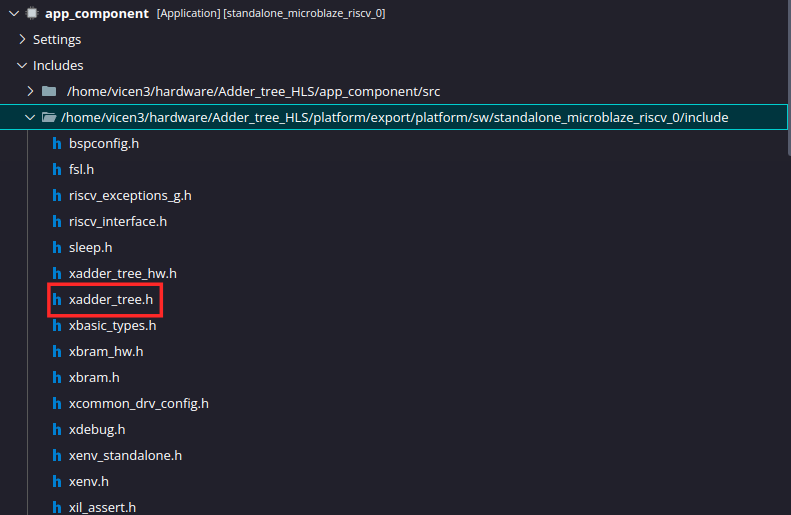{ #fig-includes-adder-tree width="1000" }


En el componente de aplicacion importe el archivo fuente "Ejemplo_5.c" de la carpeta "Ejemplo_5" el cual contiene el codigo:

```c
#include "xadder_tree.h"
#include <stdio.h>
#include "xil_printf.h"
#include "xparameters.h"


int main() {
    int status;
    xil_printf("--- HLS Adder tree Test ---\r\n");

    // Inicializa IP
    XAdder_tree hls_inst;
    XAdder_tree_Config *tree_config = XAdder_tree_LookupConfig(XPAR_XADDER_TREE_0_BASEADDR);
    status = XAdder_tree_CfgInitialize(&hls_inst, tree_config);
    if (status != XST_SUCCESS) {
        xil_printf("ERROR: Inicializacion fallada\r\n");
        return XST_FAILURE;
    }

    // Datos de entrada
    int input[8] ={10,20,30,40,50,60,70,80};
    // Escribir datos
    XAdder_tree_Write_i_data_Words(&hls_inst, 0, (word_type*)input, 8);

    
    // Manda señal de inicio al periferico
    XAdder_tree_Start(&hls_inst);
    //Esperar a recibir resultado
    while (!XAdder_tree_IsDone(&hls_inst));

    // Leer resultado
    int result = XAdder_tree_Get_o_data(&hls_inst);
    xil_printf("Resultado obtenido de la IP: %d\r\n", result);
    return 0;
}
```

Note que el programa incluye el encabezado del driver del adder tree.


Este programa sigue la siguiente secuencia:

- Se inicializa el periferico.
- Se escriben los datos de entrada en la IP.
- Se gatilla la IP para obtener el resultado.
- Se imprime el resultado a través de Uart.


Compile la aplicación haciendo click en  **Build**. En el caso del autor, se obtuvo un ELF con un tamaño de 12.8 KB como se ve en la [](#tbl-elf-size).


<div markdown="1" style="text-align: center;">

Table: Tamaño del ELF {#tbl-elf-size}

| text  | data | bss | dec      |
| ------- | ----- | --------- | ---------------- |
|  9040  | 276     | 3552        | 12868     |

</div>

## Verificación


Ya teniendo el archivo ELF abra su programa de comunicación serial de preferencia (en esta guía se hará uso de Hterm) y configure de acuerdo a los parametros:

- BaudRate: 9600
- Paridad: No
- Ancho de dato: 8 Bits


Luego conecte la placa a su computador, enciendala y conecte su programa  de comunicacion serial al canal apropiado (Generalmente /dev/ttyUSB0 en Linux y COM4 en Windows).


Finalmente corra la aplicacion haciendo click en *Run* en el panel lateral del componente de aplicación. En su terminal serial debería ver el resultado de la suma de los 8 datos de entrada como se ve en la [](#fig-hterm-results )


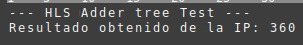{ #fig-hterm-results width="1000" }


Con esta sección se completa el flujo de diseño desde una descripción algorítmica en C/C++ hasta su ejecución como periférico controlado por software embebido sobre el procesador MicroBlaze V. Más allá del ejemplo particular del adder tree, lo relevante es haber recorrido el camino que conecta dos niveles de abstracción que tradicionalmente se mantienen separados: el del programador y el del diseñador de hardware. La capacidad de modificar una única directiva como HLS UNROLL y observar cómo se transforman la latencia y el uso de recursos del módulo abre un espacio de exploración de arquitecturas que resultaría impracticable mediante la escritura manual de RTL. A partir de este punto, cualquier algoritmo expresable en C deja de ser una pieza exclusivamente de software para convertirse en una candidata legítima a acelerador en hardware, y la decisión entre ejecutarlo sobre el procesador o materializarlo como periférico dedicado pasa a depender de los compromisos de desempeño, área y consumo que el diseñador esté dispuesto a asumir. Con las herramientas vistas en esta guía, esa decisión deja de ser una limitación técnica y se convierte en una elección de diseño.