# Guía 6 : Uso de memoria Externa

## Contexto 

Si bien el Wizard de creación de Microblaze permite hasta 128 KB de memoria, esto  puede resultar insuficiente para aplicaciones mas complejas o que hagan uso de periféricos que necesiten un uso de memoria mayor. Para remediar esta problematica se hace uso de la **Memoria externa** de la placa, su nombre nace de que se encuentra fuera del circuito integrado de la FPGA, como se puede apreciar en la ()[#fig-DDR2-on-board].

El cicuito integrado es el Micron MT47H64M16HR-25, este chip corresponde a una memoria DDR2 con una capacidad de 128 MB (3 ordenes de magnitud mas grande que la memoria interna), para mas detalles tecnicos revisar la documentación en el siguiente [enlace](https://octopart.com/datasheet/micron/MT47H64M16HR-25:H). 


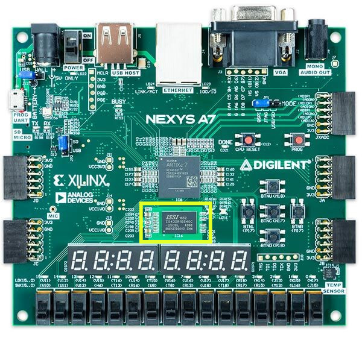{ #fig-DDR2-on-board width="500" }


En esta sección se hara uso de datos en un formato de **punto fijo** para justificar la cantidad de espacio usado.


## Diseño de hardware

### Diseño de IP Producto Punto

En esta seccion haremos uso de High Level Synthesis para generar una IP que calcula el producto punto de dos vectores que almacenan datos con parte fraccional. Esta operacion consiste en multiplicar dato a dato y realizar la suma de cada resultado, para esto usaremos nuevamente adder tree en conjunto a una nueva funcion que realiza la multiplicacion de estos datos teniendo en cuenta los valores fraccionales.

Para poder uso de los valores fraccionales se usa **Punto fijo** el cual es una forma de representar datos de tal manera que donde se posicione, este tendra a la izquierda la parte entera y a la derecha la parte fraccional.


Abra Vitis, fije un workspace y genere un componente de HLS con el nombre fixed_point_ip siguiendo el procedimiento visto en la seccion anterior, tras lo cual importe los archivos hls_config.h y hls_main.cpp.


Fijandonos en  hls_config.h:

```c

#ifndef HLS_CONFIG

#define HLS_CONFIG

#include <ap_fixed.h>

/* Vector length */
#define N 5
#define DESIGN_W 16
#define DESIGN_I 4


/* Data type */
typedef ap_fixed<DESIGN_W, DESIGN_I, AP_RND_CONV, AP_SAT> data_t;
typedef ap_fixed<2*DESIGN_W, 2*DESIGN_I, AP_RND_CONV, AP_SAT> res_data_t;

void hls_pp(res_data_t *pp, data_t x[N], data_t y[N]);

#endif

```

Se tiene que se incluye la librería "ap_fixed.h", esta es la libreria responsable del manejo de punto fijo en el hardware, mediante ella se pueden definir nuevos tipos de datos como se aprecia en la definicion de los datos "data_t" y "res_data_t".

En la definicion de estos:
- El primer parametro indica el ancho total de bits de tipo definido, en este ejemplo son 16 bits.
- El segundo parametro indica la cantidad de bits destinados a la parte entera, en este ejemplo son 4 bits (3 bits si se consideran datos con signo).
- AP_RND_CONV (Redondeo convergente): Cuando el resultado tiene mas bits de los que podrian caber en el dato, redondea al entero par mas cercano.
- AP_SAT : Si el valor se sale del rango esperado, en vez de dar la vuelta  se fija en el valor minimo o maximo dependiendo de la operacion.

Se tiene que se usa el doble de ancho en res_data_t porque al momento de multiplicar dos numeros de N bits, el producto puede necesitar hasta 2*N bits.

Se puede apreciar los valores minimos y maximos de los tipos de dato definido para este ejemplo en la [](#tbl-datos).

<div markdown="1" style="text-align: center;">

Table: Valores minimos y maximos {#tbl-datos}

| tipo de dato  | Minimo | Maximo |
| ------- | ----- | --------- |
| `data_t`   | -4     | 3.9997559        |
| `res_data_t`  | -32    | 32    |

</div>


Luego observando el archivo hls_main.cpp:


```c

#include "hls_config.h"
template <int STAGES, int POW2_INPUTS>
void adder_tree (res_data_t *o_data, res_data_t *i_data)
{
	res_data_t data[POW2_INPUTS][STAGES];

	for (int stage = 0; stage <= STAGES; stage++)
	{
		int ST_OUT_NUM = POW2_INPUTS >> stage;
		for (int adder = 0; adder < ST_OUT_NUM; adder++)
		{
			if (stage == 0)
			{
				if (adder < N)
				{
					data[adder][stage] = i_data[adder];
				}
				else
				{
					data[adder][stage] = 0;
				}
			}
			else
			{
				data[adder][stage] = data[adder*2][stage-1] + data[adder*2+1][stage-1];
			}
		}
	}

	*o_data = data[0][STAGES];
}


void hls_pp(res_data_t *pp, data_t x[N], data_t y[N])
{
#pragma HLS INTERFACE mode=s_axilite port=x
#pragma HLS INTERFACE mode=s_axilite port=y
#pragma HLS INTERFACE mode=s_axilite port=pp
#pragma HLS INTERFACE mode=s_axilite port=return //indica que tenga pines de control, ya que es un void (la funcion), si fuera de algun tipo distinto de void habria un puerto fisico

	res_data_t res[N];


	MainLoop: for (int i = 0; i < N; ++i)
	{
		#pragma HLS UNROLL
		res[i] = x[i]*y[i];
	}


	adder_tree<3, 8>(pp, res); // <ceil(log(N)),2**ceil(log(N))>

}

```

Se puede apreciar que se hacen uso de los tipos de dato previamente definidos para definir las entradas, estas son multiplicadas elemento a elemento en el bucle principal "MainLoop" tras lo cual se suman todos los datos.


Luego para comprobar que el diseño se encuentra funcionando de manera correcta, agregue a la carpeta Testbench los archivos testbench.cpp, golden_inputs.dat y golden_reference.dat para la simulación/cosimulación.


Continue con el proceso de simulación, sintesis y cosimulacion como se mostró en la sección previa. Al momento de realizar la sintesís de C compruebe que su utilizacion de recursos coincida con los vistos en la [](#fig-hls-resources).


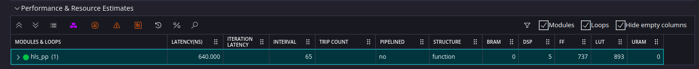{ #fig-hls-resources width="1000" }

Finalmente realice el encapsulado de la IP y cierre Vitis.

### Memoria Externa

Abra Vivado, cree un nuevo proyecto y genere un nuevo diagrama de bloques.

Desde el panel lateral **Board** arrastre **DDR2 SDRAM** como se puede apreciar en la [](#fig-ddr-side-panel).

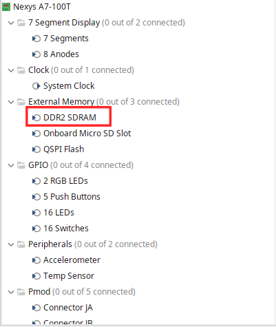{ #fig-ddr-side-panel width="300" }

Esto importará la IP **Memory Interface Generator (MIG 7 Series)** al diagrama de bloques como se ve en la [](#fig-mig-on-bd). Esta IP automatiza la generacion de interfaces de memoria para FPGA's de la Serie 7 (Kintex-7,Virtex-7 y el caso del chip de esta placa: Artyx-7). El uso de memoria externa de manera manual resulta sumamente complejo debido a que posee complejidades temporales de alta presicion durante las transiciones, haciendo uso de multiples relojes de distintas frecuencias para alcanzar la velocidad  necesaria para leer multiples direcciones de memoria en un solo ciclo de reloj del sistema. Debido a esto la IP posee acceso directo a los recursos de generacion de reloj de la placa (Mixed-Mode Clock Manager y Phase-Locked Loop). (Aqui quiero discutir como decir que la ip puede o no funcionar si se usan estas capacidades y directamente da errores de timing internos)

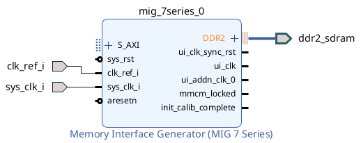{ #fig-mig-on-bd width="500" }


Hay una problematica con el MIG creado por la automatizacion de Vivado.

MIG requiere un reloj de referencia de 200 MHZ (como se puede apreciar en la [documentación de la IP](https://docs.amd.com/r/en-US/ug586_7Series_MIS/IDELAY-Reference-Clock?tocId=nJXWeiGvSLT1gJwwSLLFwg)). Vivado asume que existe un pin que posee un reloj con esta frecuencia, pero este no es el caso por lo que se generará este reloj con la IP Clock Wizard. 


Prosiga borrando los dos pines de reloj que se generaron al momento de importar la IP: "clk_ref_i" y "sys_clk_i" como se aprecia en la [](#fig-mig-no-clk ).

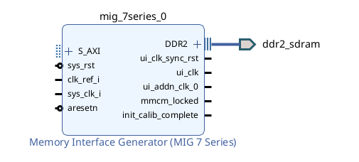{ #fig-mig-no-clk width="500" }

Luego haga doble click sobre la IP para configurarla, en la ventana emergente mantenga seleccionado "Create Design" (puesto que vamos a eliminar la generación de reloj de la IP) como se aprecia en la [](#fig-create-mig). Presione **Next**.

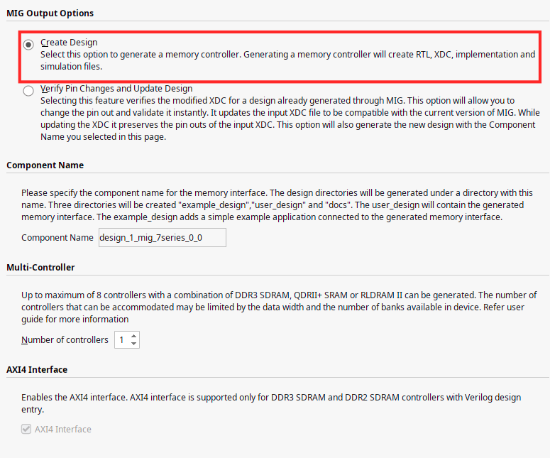{ #fig-create-mig width="1000" }


Luego se pasa a la pestaña de diseño de pines vista en la figura [](#fig-pin-design), donde se revisa que el chip de la fpga sea compatible con el pinout deseado para la interfaz del chip de memoria. 
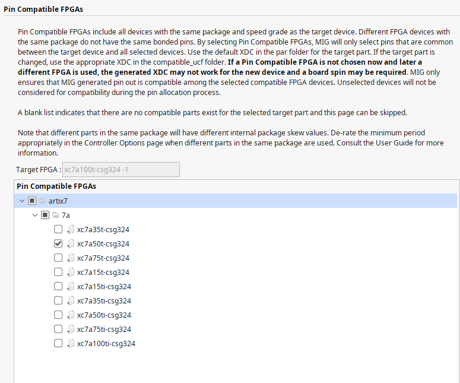{ #fig-pin-design width="1000" }

En la siguiente pestaña se puede elegir el tipo de memoria, se puede elegir entre DDR2 y DDR3, debido a que el chip de memoria usado es DDR 2, mantenga el valor predeterminado visto en la [](#fig-ddr2-or-ddr3)

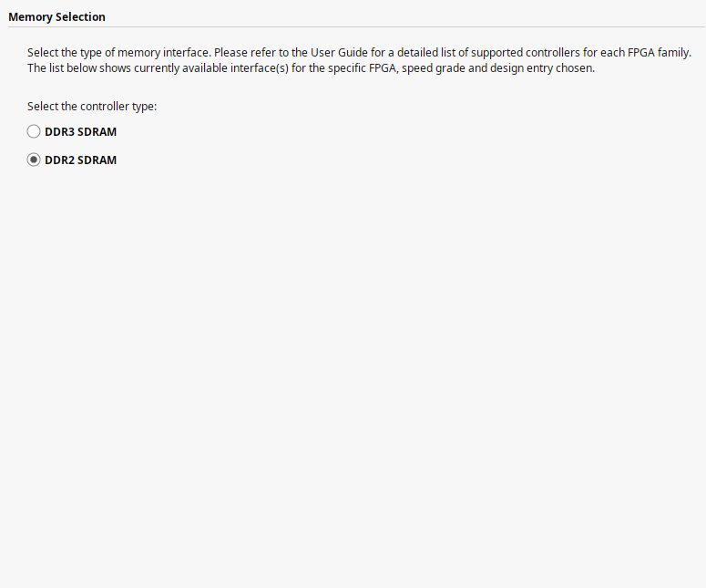{ #fig-ddr2-or-ddr3 width="1000" }

Continuando con la siguiente pestaña, estas son las primeras opciones para el controlador, se puede elegir el reloj con el que se hace acceso a la memoria, los anchos de dato y cambiar el chip de memoria i fuera el caso. Mantenga opciones predeterminadas.

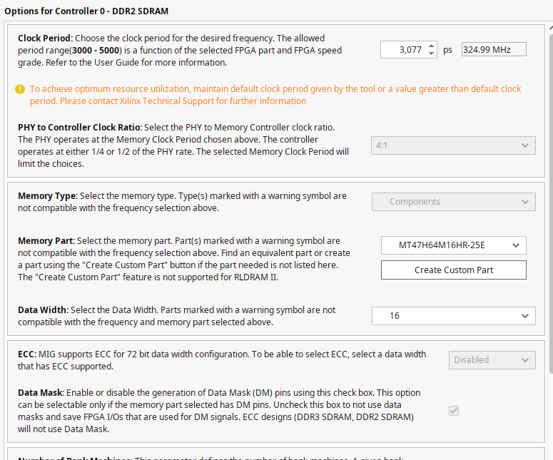{ #fig width="1000" }

En la siguiente pestaña se aprecian las opciones de AXI, mantenga opciones predeterminadas nuevamente, no hay necesidad de cambiarlas a menos que se realice una aplicacion especifica.

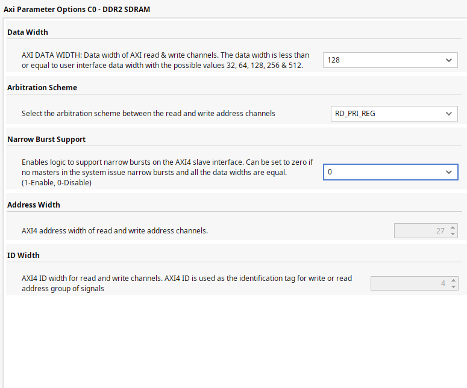{ #fig width="1000" }

En la siguiente pestaña se ven las opciones de memoria, en este caso se va a dejar desmarcado el cuadro **Select Additional Clocks (if required)** puesto que el reloj de referencia de 200 MHZ sera generado en un bloque aparte.
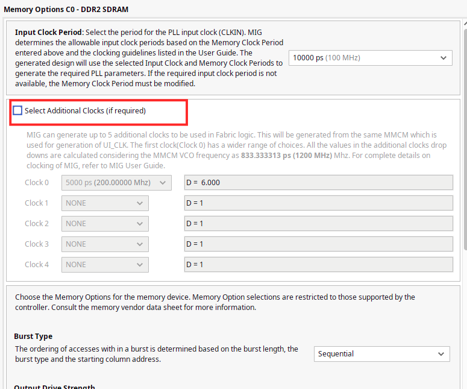{ #fig width="1000" }

 
Luego en las opciones de reloj se va seleccionar el cuadro de System clock y se dejara en **No Buffer** esto es debido a que se hara uso de un reloj generado en clock wizard y no el reloj del sistema.

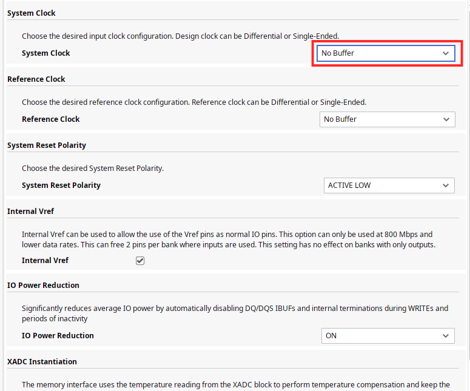{ #fig width="1000" }

La siguiente configuracion es la impedancia de los bancos de memoria de alto rango, se les da esta denominacion porque poseen un rango de voltaje mayor (1.2V-3.3V). Se le tiene que asignar un valor de impedancia especifico al chip de memoria, puesto que al recibi señales de alta velocidad, una impedancia de entrada erronea puede causar reflexiones en la señal, las cuales pueden dar el paso a datos corruptos.
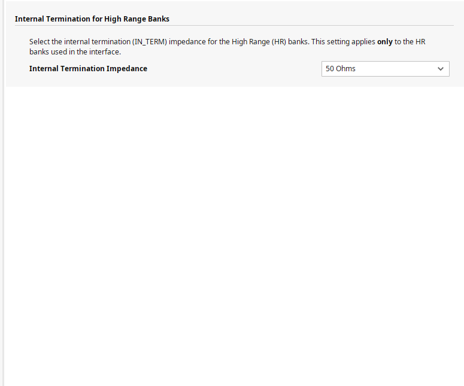{ #fig width="1000" }

En la siguiente pestaña se pregunta si se desea generaran un nuevo pin-out. Mantenga el pinout existente y continue.


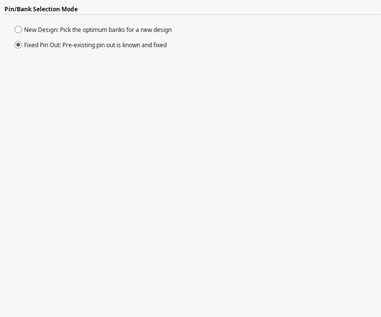{ #fig width="1000" }

En la siguiente pestaña se ilustra la selección de pines. Para continuar tiene que hacer click en **Validate** para asegurar que este todo mapeado sin errores.
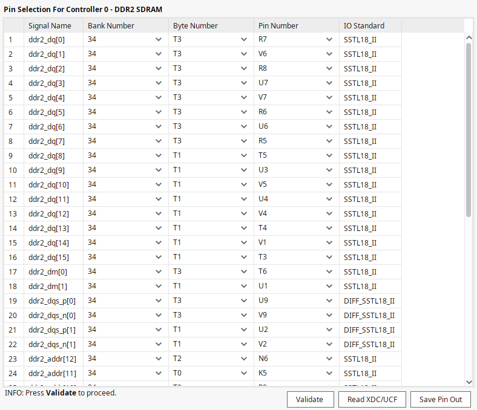{ #fig width="1000" }


En la siguente pestaña se puede seleccionar puertos para los pines, dejaremos los valores predeterminados puesto que estos se mapearan a través de la herramienta **Run Connnection automation** del diagrama de bloques.

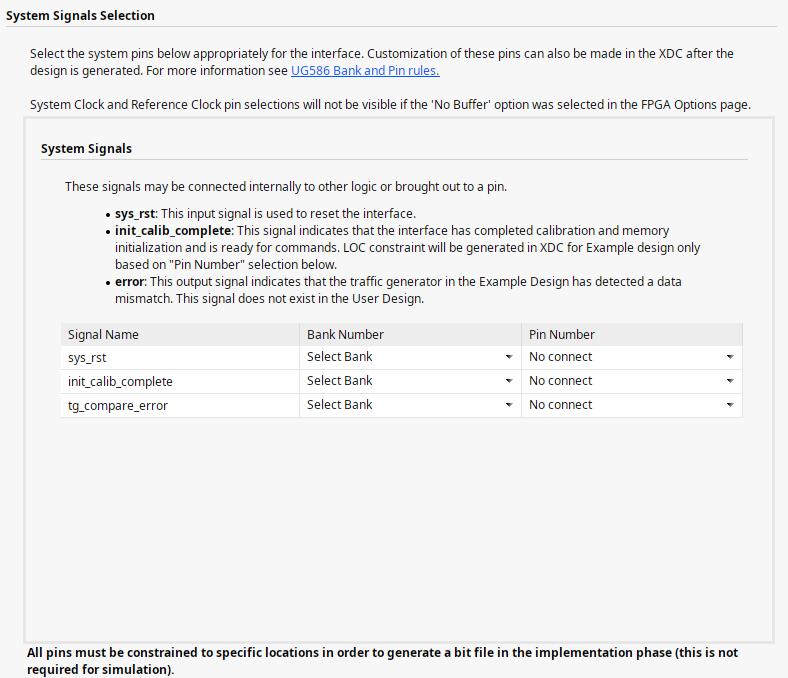{ #fig width="1000" }


Continuando sale un resumen del diseño de la interfaz diseñada.

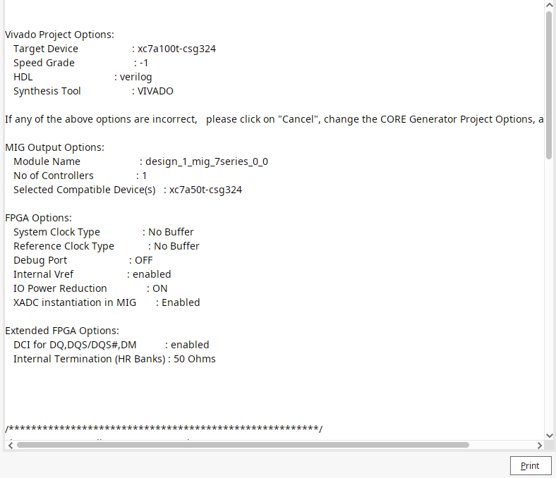{ #fig width="1000" }

Luego un acuerdo de terminos y condiciones para el uso de la intefaz diseñada:

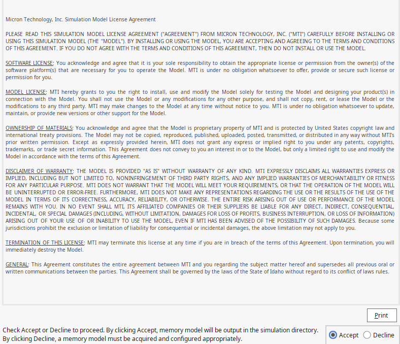{ #fig width="1000" }


En la siguiente Pestaña sale un enlace a la guia de usuario de diseño de PCBs que hacen uso del MIG.
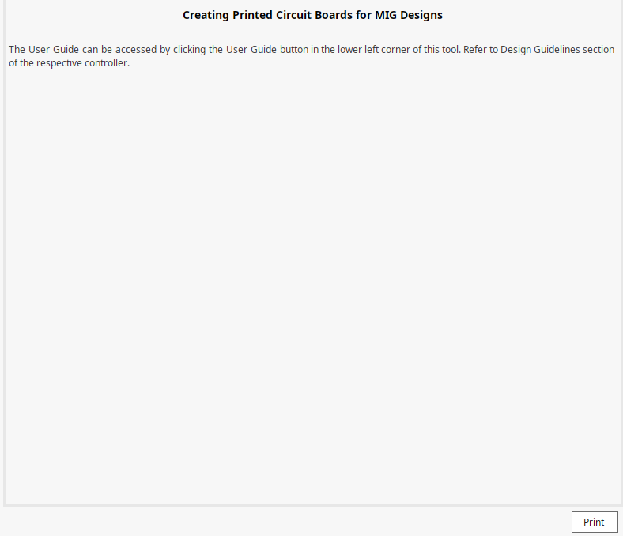{ #fig width="1000" }

Finalmente salen notas para la finalizacion del diseño e informacion del diseño de la interfaz MIG.

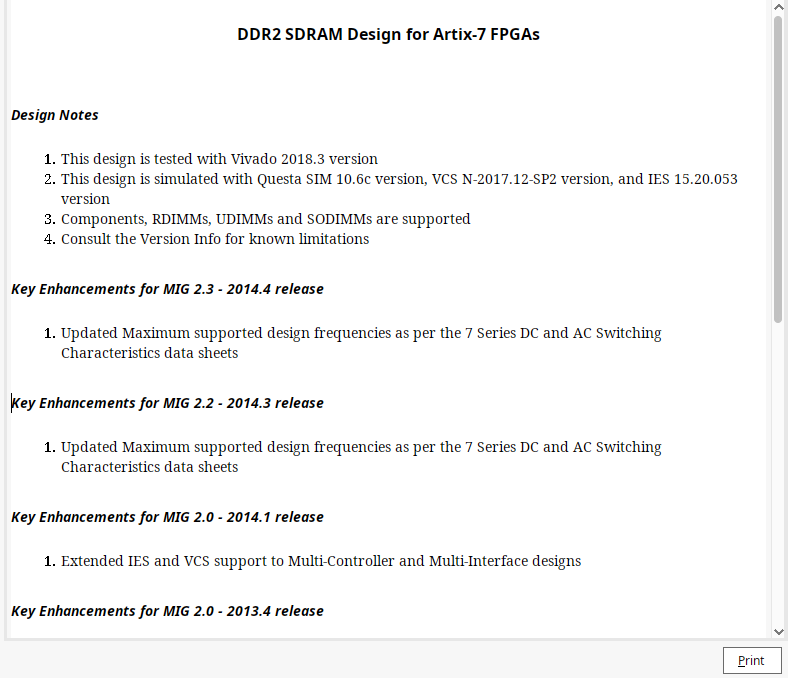{ #fig width="1000" }


Agregue a su diagrama de bloques la ip "Clocking Wizard" vista en la [](#fig-clock-wiz) donde se generaran los relojes a usar

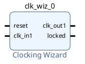{ #fig-clock-wiz width="250" }

Haga doble click sobre esta para configurarla, en la pestaña **Board** Cambie CLK_IN1 a "sys clock"  y EXT_RESET_IN a "reset" para mapear estos pines a los puertos físicos de la placa.

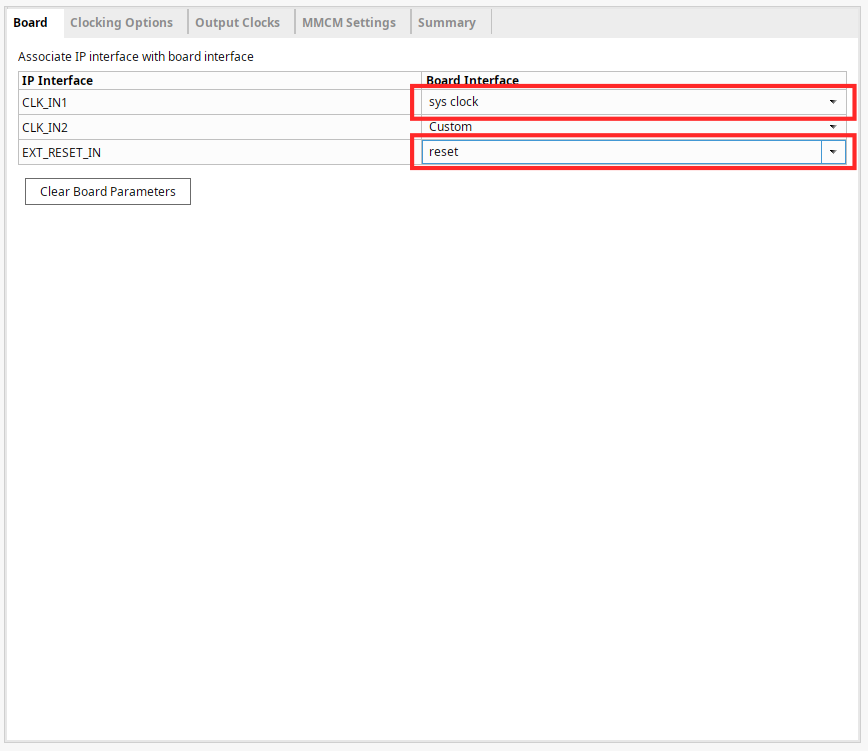{ #fig width="1000" }

Luego en la pestaña **Output Clocks** habilite el segundo reloj "clk_out2" y fije su frecuencia en 200 MHz, este reloj servira como el reloj de referencia para el MIG. Luego presione "OK".

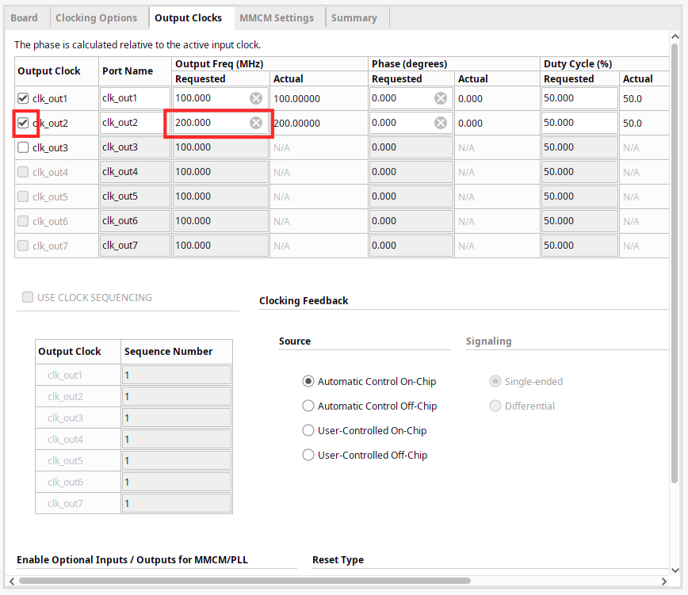{ #fig width="1000" }

Volviendo al diagrama de bloques presione **Run Connection Automation**, marque todas las opciones. Antes de aplicar las conexiones vaya al puerto clk_ref_in de mig_7_series_0 y fije la fuente de reloj al clk_out2 (el reloj de 200 MHz que se genero en el paso anterior).

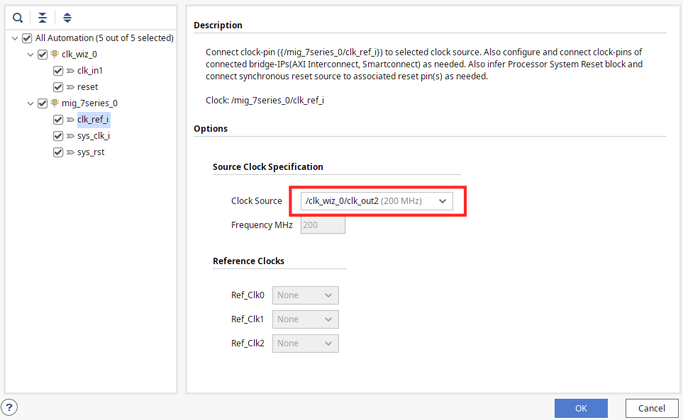{ #fig width="1000" }

Su diagrama de bloques debería verse como el de la figura [](#fig-mig-wiz-bd) tras apretar el boton de **Regenerate Layout**.

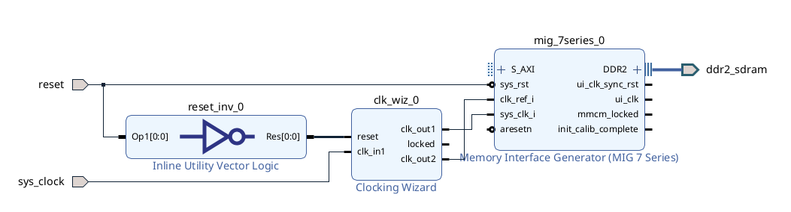{ #fig-mig-wiz-bd width="1000" }


## Integración al procesador

Importe el procesador Microblaze V al diagrama de bloques como se ve en la [](#fig-Microblaze_ddr_bd).

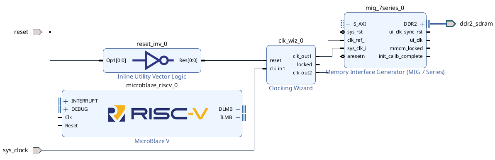{ #fig-Microblaze_ddr_bd width="1000" }

Luego corra **Run block automation** fijandose en que la conexion de reloj sea la proveniente del clock wizard como se ve en la [](#fig-microblaze-clk-config).

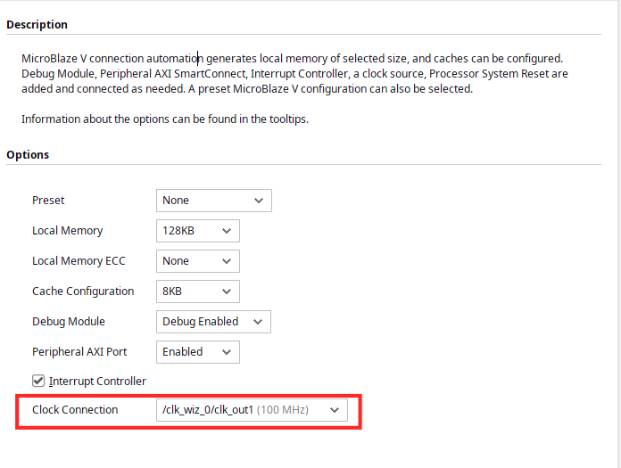{ #fig-microblaze-clk-config width="1000" }

Se deberia ver como la [](#fig-connection_automation_microblaze), note que el MIG aun no esta conectado a ninguna a interfaz AXI.

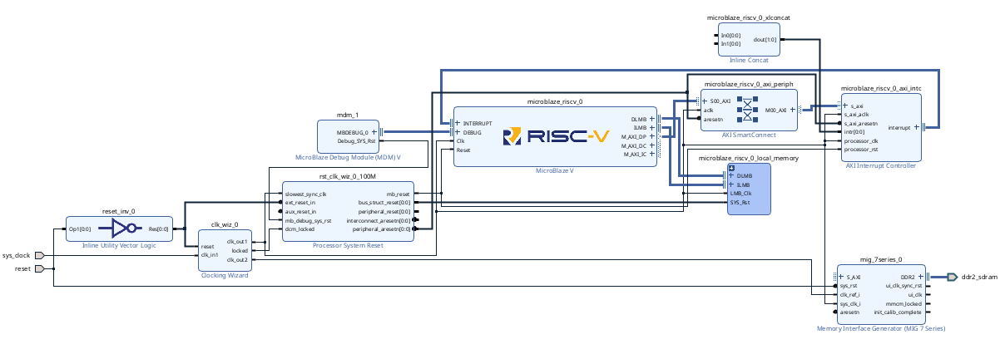{ #fig-connection_automation_microblaze width="1000" }

Debido a la naturaleza del MIG, no funciona de manera correcta al compartir una interfaz AXI con los otros perifericos del Microblaze V. Debido a esto se le generara una interfaz AXI dedicada. Importe la IP "AXI Interconnect" vista en la [](#fig-axi-interconnect). 

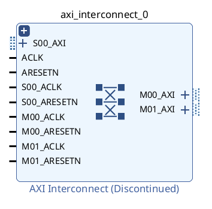{ #fig-axi-interconnect width="250" }

Haga doble click para configurarla de tal manera que tenga 2 interfaces cliente y una maestra como se ve  en la [](#fig-interfaces-AXI).

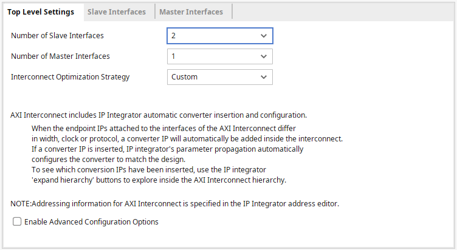{ #fig-interfaces-AXI width="1000" }

Luego de esto haga las siguientes conexiones antes de correr **Run Connection automation**:
- M_AXI_DC del Microblaze V al  S00_AXI de AXI interconnect.
- M_AXI_IC del Microblaze V al  S01_AXI de AXI interconnect.
- M00_AXI de AXI interconnect a S_AXI del MIG.

Luego de correr la automatizacion de conexión y realice la siguiente conexión del Reset de memoria:
- M00_ARESETN de AXI Interconnect a aresetn de MIG.

Se debería ver como en la [](#fig-reset-mig).
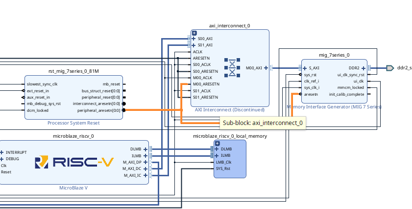{ #fig-reset-mig width="1000" }

Luego agregue la uart como se vio en secciones previas, deberia quedar como la [](#fig-bd-mig-uart).
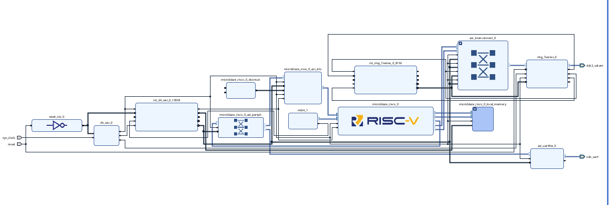{ #fig-bd-mig-uart width="1000" }

Luego dirijase a la pestaña Address Editor, fijese que hay 2 secciones de memoria sin asignar, ambas son la memoria externa vista desde las dos interfaces del Microblaze. Para asignarlas aprete el boton señalado en la figura [](#fig-memory-map-1).

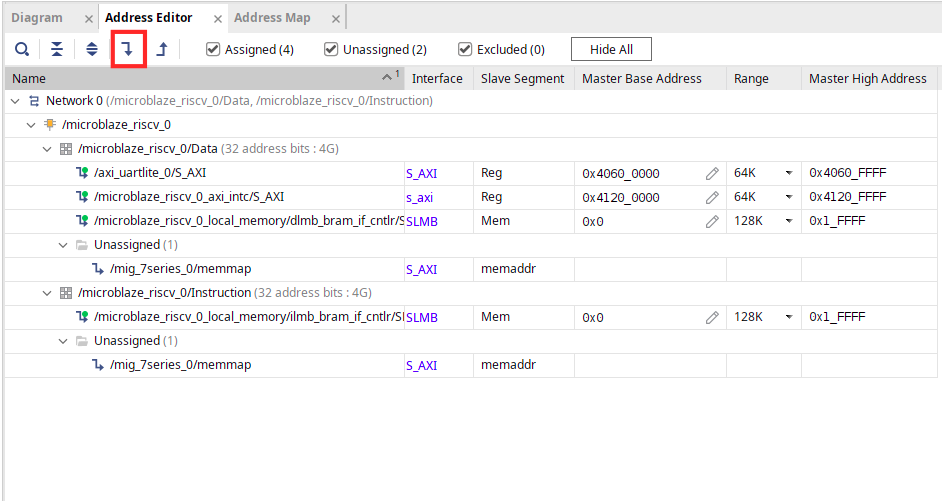{ #fig-memory-map-1 width="1000" }

Deberia verse como en la [](#fig-memory-map-2).

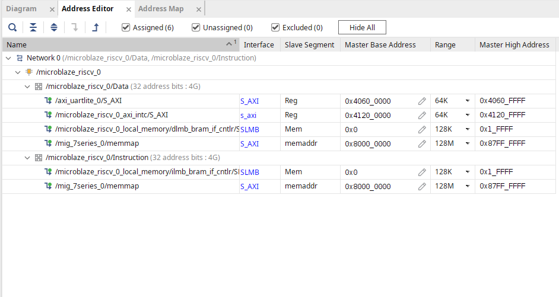{ #fig-memory-map-2 width="1000" }

Luego repita el proceso visto en las secciones previas para agregar la IP al repositorio de IP's usadas en el diseño. Integre hls_pp al diagrama de bloques como se ve en la [](#fig-hls-pp).

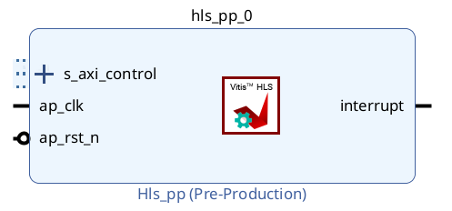{ #fig-hls-pp width="1000" }

Antes de correr automatización de diseño haga doble click sobre el bloque AXI SmartConnect y agregue una interfaz maestra  como se ve en la [](#fig-slave-interfaces) para que la conexion automatica no la ponga en el interconnect del MIG-

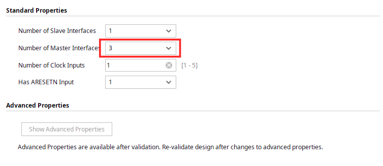{ #fig-slave-interfaces width="1000" }

Deberia verse como en la [](#fig-axi-to-hls).

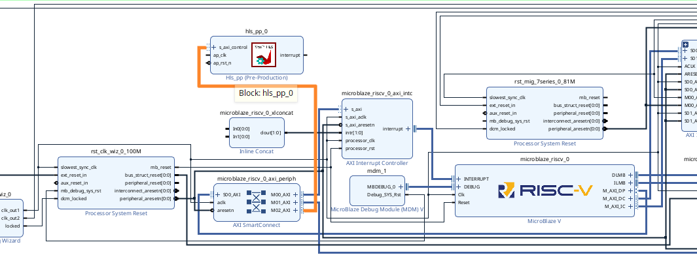{ #fig-axi-to-hls width="1000" }

Luego corra **Run connection automation**  y conecte los interrupts de UART y del periférico HLS al bloque Inline Concat.


Si en este momento apreta el boton validar diagrama de bloques, le saltara un error diciendo que hay direcciones de memoria no mapeadas. Esto es debido a que el periferico HLS no ha sido mapeado a una direccion en memoria para su acceso, para esto repita el proceso visto previamente (tambien visto en la [](#fig-mapa-3) y la [](#fig-mapa-4)).


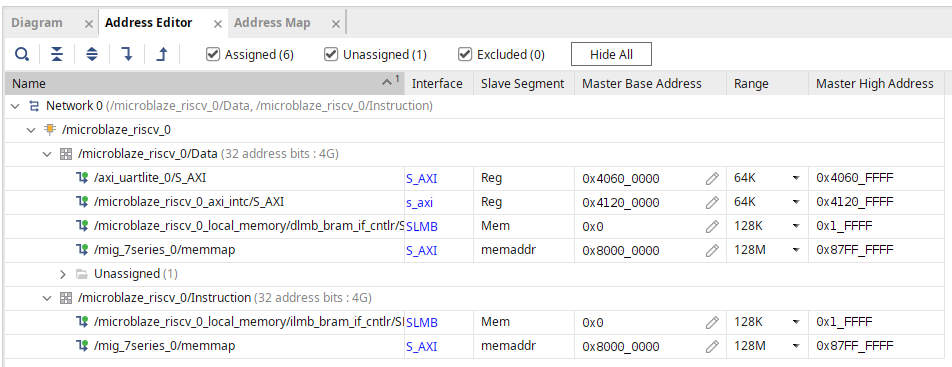{ #fig-mapa-3 width="1000" }


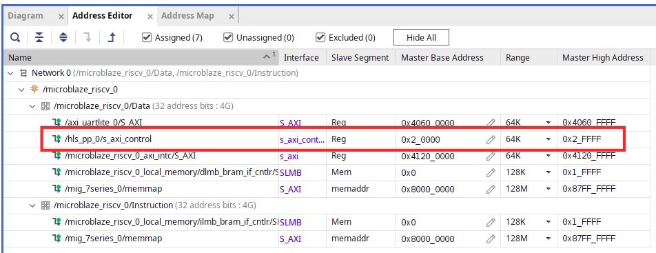{ #fig-mapa-4 width="1000" }


Valide nuevamente su diseño y ejecute el proceso de extracción de hardware, al autor obtuvo la utilizacion de recursos vista en la [](#tbl-resources)

<div markdown="1" style="text-align: center;">

Table: Utilización de recursos {#tbl-resources}

| Proceso  | LUT | FF | BRAM      | DSP |
| ------- | ----- | --------- | ---------------- |---------------- |
| `Sintesis`   | 10077     | 10095        | 40     | 1|
| `Implementacion`  | 8980    | 9704    | 40         |1 |

</div>


## Firmware

Abra Vitis, fije el workspace, cree el componente de plataforma y aplicacion igual que en secciones anteriores.

Importe el archivo app.cpp de la carpeta Ejemplo_6:

```cpp
#include "xparameters.h"
#include "xil_exception.h"
#include <iomanip>
#include <iostream>
#include <xil_types.h>
#include <xstatus.h>
#include "xinterrupt_wrap.h"

#include "ap_fixed.h"
#include "xil_cache.h"
#include "xhls_pp.h"

#define N           5
#define DESIGN_W    16
#define DESIGN_I    4
#define N_TESTS     100

typedef ap_fixed<DESIGN_W, DESIGN_I, AP_RND_CONV, AP_SAT> fixed_t;
typedef ap_fixed<2*DESIGN_W, 2*DESIGN_I, AP_RND_CONV, AP_SAT> fixed_res_t;

uint16_t get_bits(fixed_t val) {
	return (uint16_t)val.range();
}

int main()
{
	int status;
	XHls_pp hls_pp;
	XHls_pp_Config *hls_config = XHls_pp_LookupConfig(XPAR_HLS_PP_0_BASEADDR);
	XHls_pp_CfgInitialize(&hls_pp,hls_config);
	fixed_t vec_a[N];
	fixed_t vec_b[N];
	
	u32 packed_a[3];
	u32 packed_b[3];
	
	std::cout << "Running! ..." << std::endl;
	
	while (true) {
		// Recibir datos
		float temp;
		for (int i = 0; i < N; i++) { if (!(std::cin >> temp)) return 0; vec_a[i] = temp; }
		for (int i = 0; i < N; i++) { if (!(std::cin >> temp)) return 0; vec_b[i] = temp; }
		
		// Empaquetado
		// Debido a que los registros son de 32 bits y las palabras a escribir son de 16 bits, se tiene que realizar manejo de estas
		// Based on: Word n: bit [15:0] - x[2n], bit [31:16] - x[2n+1]
		
		// Word 0: x[0] and x[1]
		packed_a[0] = (uint32_t)get_bits(vec_a[0]) | ((uint32_t)get_bits(vec_a[1]) << 16);
		packed_b[0] = (uint32_t)get_bits(vec_b[0]) | ((uint32_t)get_bits(vec_b[1]) << 16);
		
		// Word 1: x[2] and x[3]
		packed_a[1] = (uint32_t)get_bits(vec_a[2]) | ((uint32_t)get_bits(vec_a[3]) << 16);
		packed_b[1] = (uint32_t)get_bits(vec_b[2]) | ((uint32_t)get_bits(vec_b[3]) << 16);
		// Word 2: x[4]
		packed_a[2] = (uint32_t)get_bits(vec_a[4]);
		packed_b[2] = (uint32_t)get_bits(vec_b[4]);
		// 3. Write to Hardware
		// We only write 3 words because the address space for 'x' is 0x20 to 0x2F (16 bytes)
		XHls_pp_Write_x_Words(&hls_pp, 0, (word_type *)packed_a, 3);
		XHls_pp_Write_y_Words(&hls_pp, 0, (word_type *)packed_b, 3);
		
		// Ejecucion
		XHls_pp_Start(&hls_pp);
		while (!XHls_pp_IsDone(&hls_pp));
		
		// Leer Resultado
		u32 result_int = XHls_pp_Get_pp(&hls_pp);
		fixed_res_t result_fixed;
		result_fixed = *((fixed_res_t *) &result_int);
		
		std::cout << "Resultado: " << std::fixed<< std::setprecision(10) << result_fixed.to_float() << std::endl;
		
	}
	
	return 0;
}

```


Se hará un leve analisis del codigo.

Fijandonos en las librerias de interés:
- iomanip y iostream: Se hace uso de estas librerias para manipular los datos de salida a través de uart para que esten con el formato correcto (teniendo en cuenta la parte fraccional y entera)
- ap_fixed.h : Se tiene que en esta libreria se encuentran las definiciones de los datos de punto fijo, esta libreria al contener tanto datos de descripcion de hardware como de software es particularmente pesada.
- xhls_pp.h: Driver del periferico de HLS.


En cuanto al funcionamiento del codigo, se tiene que este recibe 10 datos de 16 bits a través de UART, tras lo cual realiza una manipulacion sobre estos debido a que la interfaz de AXI maneja datos de 32 bits, tras lo cual realiza el envio a la IP y espera el resultado antes de mandarlo.

Ahora nos fijaremos en el archivo ld_script de la carpeta sources, este define donde se guardan todas las secciones de codigo producidas en el compilado de la aplicación, junto al tamaño del heap y el stack. Como se puede apreciar en la [](#fig-ld-script) existe tanto la region de memoria interna de microblaze V  (los 128 kb) como la del MIG (128 MB) la aplicacion de manera predeterminada mapea todo a la sección mas grande para evitar que el tamaño de la aplicación sea un impedimento. Antes de continuar, debido a que estamos haciendo uso de librerias de impresion por consola (bastante costosas en termino de memoria dinamica) se aumentara el tamaño del heap y el stack a los valores vistos en la [](#fig-ld-script). Si estos valores no se cambiaran, la aplicacion lanzaria una excepcion al momento de imprimir el resultado.

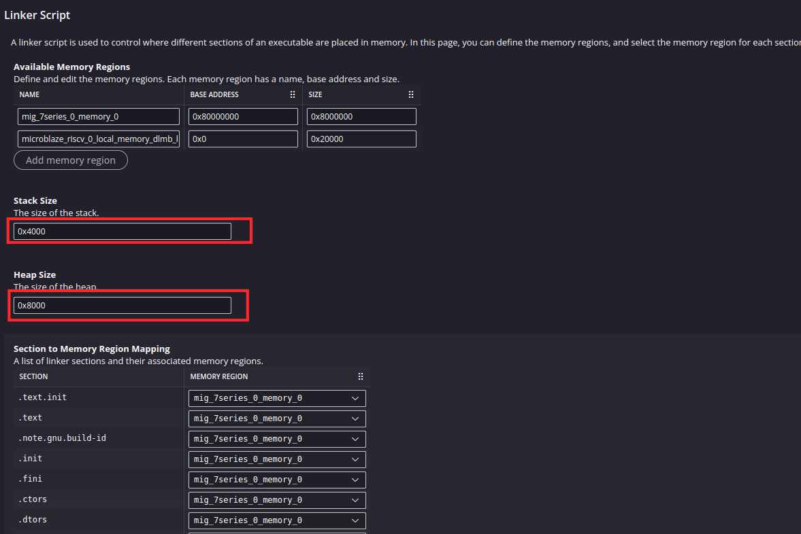{ #fig-ld-script width="1000" }


Luego si vuelve al codigo e intenta compilar la aplicación, se encontrara con un error de la forma:

```
[ERROR] /home/vicen3/hardware/Uso_memoria_externa/app_component/src/dot_product_hls_main.cpp:10:10: fatal error: ap_fixed.h: No such file or directory
    10 | #include "ap_fixed.h"
       |          ^~~~~~~~~~~~
 compilation terminated.
```
Esto es debido a que esta libreria no fue diseñada directamente con el proposito de su uso en software, por lo que hay que añadirla manualmente. Para esto dirijase al panel lateral visto en la
[](#fig-cmake) y haga click en UserConfig.cmake.

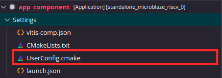{ #fig-cmake width="500" }

Vaya al apartado **Includes** y haga click en add items, lo cual permite añadir un directorio con encabezados, puede hacer uso del boton **browse** o escribir la dirección directamente. En este caso añadiremos la carpeta de includes del propio Vitis, la cual en Linux se encuentra generalmente en /tools/Xilinx/2025.x/Vitis/include.

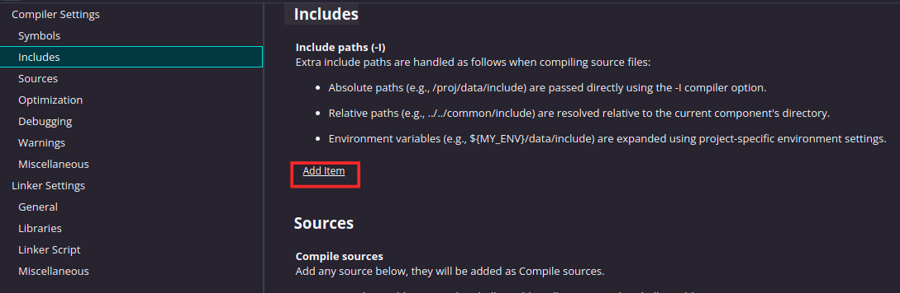{ #fig width="1000" }

Una vez añadido compile la aplicación, esta debería compilar sin problemas con el tamaño del ELF mostrado en la consola similar al de la [](#tbl-elf-size). Siendo el tamaño total ~717 KB, alrededor de 6 veces la capacidad de memoria interna del procesador sin el MIG.

<div markdown="1" style="text-align: center;">

Table: Tamaño del ELF {#tbl-elf-size}

| text  | data | bss | dec      |
| ------- | ----- | --------- | ---------------- |
|  651193  | 9741     | 56088        | 717022     |

</div>


## Verificación

Para verificar que el sistema se diseño con exito, se hara uso de un script de python que generara datos y la respuesta esperada, enviará los datos a través de UART, recibe el resultado y  compara con el resultado obtenido en el host. 

El script de manera predeterminada realiza 100 pruebas, para hacer mas o menos pruebas basta con cambiar el parametro N dentro del script.

Para correr el ejemplo tiene que abrir el archivo serial_host.py y renombrar la variable 

```python
PORT = "/dev/ttyUSB1" 
```
Al nombre del puerto USB al que se encuentra conectada la placa.

Finalmente corra el script con su IDE de preferencia o por consola. Acto seguido programe la placa (Primero corra el script y **Despues** programe la placa). Se hace uso de esta secuencia debido a que el script antes de empezar busca una secuencia de caracteres que le indican que el programa es el correcto y la aplicación lanza estos en las primeras lineas de la aplicación.

Si todo sale en orden deberia obtener un resultado similar al de [](#fig-Verificacion)

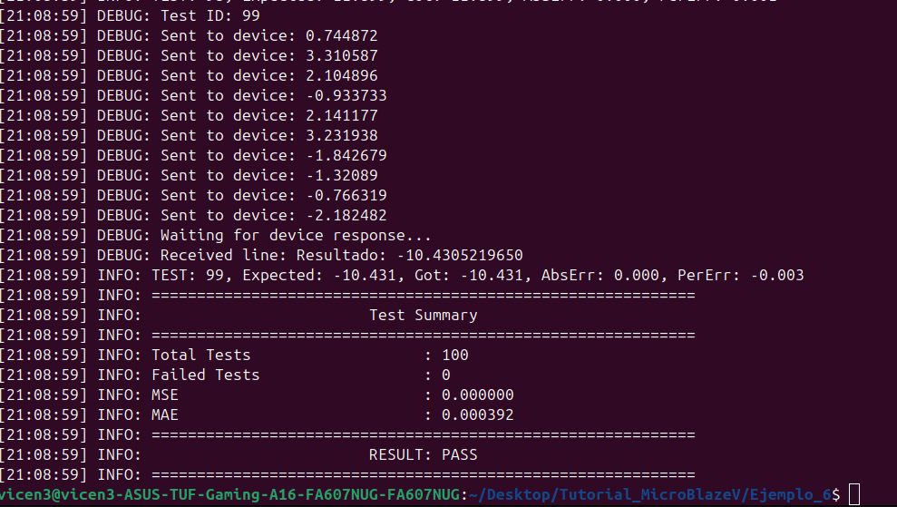{ #fig-Verificacion width="1000" }


{ #fig width="1000" }
