# Guía 7: Sistema de video con acceso directo a memoria


## Objetivo

En esta guía se espera que el lector pueda hacer uso de un periférico de video el cual obtiene su información directamente de memoria.

## Contexto

VGA (Video Graphics Array) es un estándar de video analógico introducido por IBM en 1987 que transmite la imagen mediante tres señales de color (R, G, B) acompañadas de dos señales digitales de sincronización: HSYNC y VSYNC. A diferencia de interfaces seriales modernas como HDMI o DisplayPort, VGA no encapsula los píxeles en paquetes ni incorpora un reloj embebido: la temporización es responsabilidad íntegra del transmisor. Para una resolución de 800×600 @ 60 Hz, por ejemplo, el estándar VESA define un reloj de píxel de 40 MHz y exige respetar con precisión los intervalos de front porch, pulso de sincronización y back porch tanto horizontales como verticales; cualquier desviación provoca una desincronización en el monitor. Esto implica que, en cada flanco activo del reloj de píxel  el controlador debe tener disponible un nuevo valor RGB en sus salidas. En una implementación sobre FPGA, este controlador se construye típicamente como una máquina de estados que genera los contadores horizontal y vertical, deriva HSYNC/VSYNC y consume píxeles desde un FIFO que actúa como interfaz hacia el resto del sistema.


<figure markdown="span">
  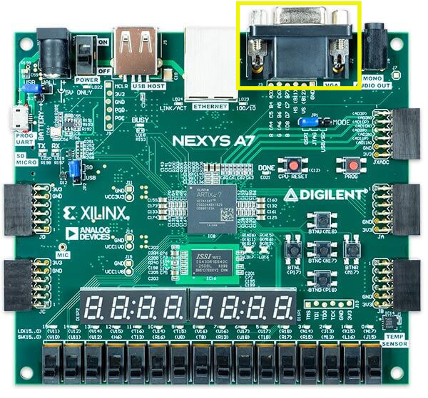{ #fig-vga-interface width="500" }
  <figcaption>Interfaz vga en la placa Nexys A7</figcaption>
</figure>

El problema es alimentar ese FIFO al ritmo exigido. Un framebuffer de 800×600 con color de 24 bits ocupa 2 MB, demasiado para almacenarlo en BRAM, por lo que se coloca en memoria externa. Si el MicroBlaze V tuviera que leer cada píxel desde DDR y escribirlo en el controlador VGA mediante instrucciones de lectura y escritura sobre el bus AXI memory-mapped, consumiría prácticamente el 100 % de su tiempo de CPU y, debido a la latencia variable del controlador DDR, los arbitrajes del interconnect AXI y las interrupciones, no podría sostener el ancho de banda constante de ~37 MB/s que la señal requiere. Por esto se implementa un AXI DMA (Direct Memory Access) que transfiere bloques de memoria de forma autónoma usando el rol de master sobre el bus AXI. Específicamente se emplea la variante MM2S (Memory-Mapped to Stream): el DMA lee el framebuffer desde DDR mediante transacciones burst AXI4 memory-mapped y entrega los datos por su puerto de salida como un flujo AXI4-Stream, un protocolo unidireccional punto a punto optimizado para transporte continuo de datos sin sobrecarga de direccionamiento. Este stream se conecta directamente al FIFO del controlador VGA, descargando al MicroBlaze V de toda la tarea de transferencia; el procesador solo configura los registros del DMA al inicio  y queda libre para ejecutar la lógica de aplicación, actualizando el contenido del framebuffer únicamente cuando es necesario.


## Diseño del hardware

Debido a que VGA es una interfaz grafica relativamente desactualizada, no admite una implementación directa equivalente a la de protocolos digitales modernos como UART o líneas GPIO discretas abordadas en secciones anteriores. Para subsanar esta limitación, se recurre a dos núcleos de propiedad intelectual (IP cores) desarrollados por Digilent, los cuales permiten adaptar el subsistema HDMI hacia la salida VGA física integrada en la placa Nexys A7. Los IP cores empleados son los siguientes:

- Dynamic Clock Generator (dynclk): Accede al bloque MMCM/PLL del FPGA Artix-7 a través del bus AXI4-Lite, habilitando la reconfiguración en tiempo de ejecución del reloj de píxel desde el software embebido. Esta funcionalidad resulta crítica dado que cada resolución estándar exige una frecuencia de pixel clock específica conforme a la especificación VESA DMT. En contraste, el IP Clocking Wizard fija dichas frecuencias al momento de realizar la síntesis, lo que obligaría a re-sintetizar e re-implementar el bitstream ante cada modificación de la resolución objetivo.

- RGB2VGA: Ejecuta el truncamiento de los 4 bits más significativos (MSBs) de cada canal cromático proveniente del bus HDMI, el cual opera con una profundidad de 24 bpp (8 bits por canal R/G/B, equivalente a aproximadamente 1.67×10⁷ colores), reduciéndolos a 4 bits por canal. Esto se ajusta a la profundidad de 12 bpp (4096 colores) soportada por la interfaz VGA en la Nexys A7.


Abra Vivado y agregue estas IP's agregando la carpeta Ejemplo_7/Ip a su repositorio como se vio en secciones anteriores.

Por temas de visualización se sugiere generar un sub systema conteniendo todo lo asociado a video (no afecta el funcionamiento del sistema ni su relacion con el procesador), para esto haga click derecho sobre el diagrama de bloques y seleccione "Create hierarchy" como se ve en la [](#crear-jerarquia).

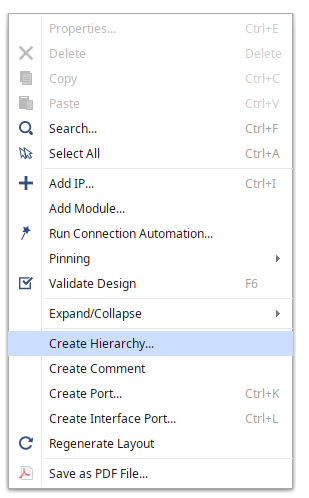{ #crear-jerarquia width="250" }

Luego en la ventana emergente vista en la  [](#vga-jerarquia) nombre a la jerarquia "vga"

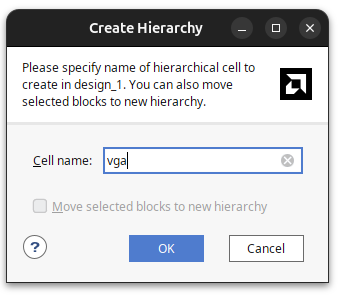{ #vga-jerarquia width="250" }

Lo cual generará el sub-sistema "vga" visto en la  [](#vga-bloque).

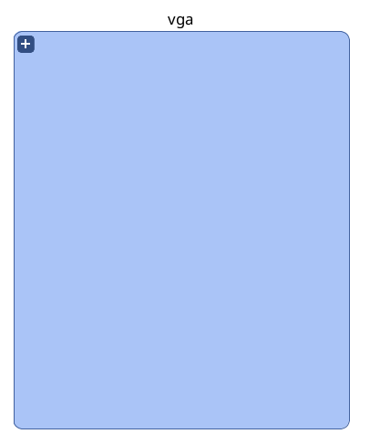{ #vga-bloque width="250" }


Haga doble click sobre este subsistema para empezar el diseño del subsistema en una pestaña aparte del diagrama de bloques global.

### AXI Video Direct Memory Access

Agregue al subsistema  la IP "AXI Video Direct  Memory Access", esta posee acceso directo a memoria, entregando un paso constante de informacion al siguiente bloque  como se puede apreciar en [](#fig-axi-vdma).

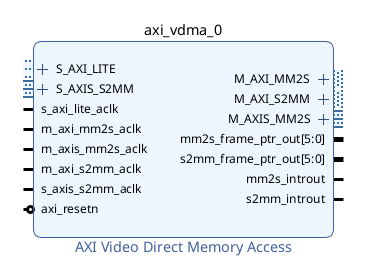{ #fig-axi-vdma width="500" }

Continuando a la configuracion, haga doble click sobre el bloque y ponga la configuracion vista en [](#fig-config-vdma).

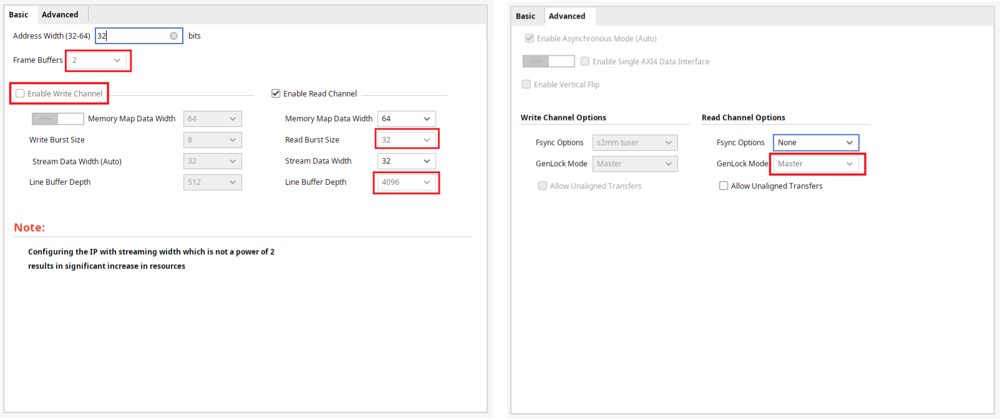{ #fig-config-vdma width="1000" }

Para esto:

- Cambie la cantidad de Frame Buffers a 2, esta es la cantidad de cuadros que se almacenaran en la memoria externa por iteracion.
- Inhabilite el canal de escritura "Enable Write Channel": Esto inhabilita el canal de AXI Stream a memoria, debido a que los frames seran descritos en el procesador, si se realizara una escritura de video con un periferico asociado a este, se mantendria activado.
- Cambie la el tamaño de lectura "Read Burst Size" a 32 bits, debido a la estructura del procesador, este tamaño de escritura esta asociado a la arquitectura del procesador y el tamaño de los buses de AXI.
-  Cambie el tamaño del buffer del frame "Line Buffer Depth" a 4046, este es el tamaño del buffer que se almacenara en memoria BRAM de la fpga. El bloque realiza una lectura de rafaga sobre la direccion de memoria donde se almacena el cuadro, y lo guarda en este buffer para poder enviar la informacion un pixel a la vez diminuyendo la posibilidad de jitter.
- En configuracion avanzada fijar la opcion Genlock en Master, Genlock es la configuracion asociada a la sincronizacion de cada cuadro. Al estar en Maestro se tiene que el bloque anuncia el cuadro en el que se encuentra sin esperar una señal de otro modulo. Se usa esta configuracion debido a que solo se tiene una fuente de video.

El bloque debería quedar como se ve en la figura [](#fig-vdma-final).

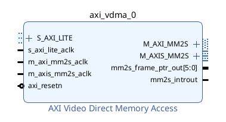{ #fig-vdma-final width="500" }


### AXI4-to-Stream to Video Out

Agregue el bloque "AXI4-to-Stream to Video Out"  como se ve en [](#fig-axistream-to-video). Este bloque se encarga de recibir los pixeles cuando del bloque de acceso directo a memoria, guardarlos en un buffer y alinearlos de manera que se entregue el primer pixel de manera sincronica al bloque encargado de la temporalizacion de video.


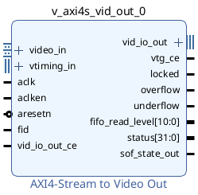{ #fig-axistream-to-video width="300" }

Luego haga doble click sobre el bloque y configure de acuerdo a la [](#fig-axistream-to-video-config).


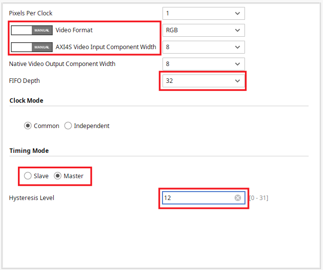{ #fig-axistream-to-video-config width="500" }


Estas configuraciones son:

- Video Format (RGB): La salida de video asociada a VGA.
- AXI4S Video Input Component Width (8): Valor predeterminado de envio desde DMA a AXI4S. 
- Timing Mode (Master) : Indica que la coordinacion de la salida de datos estara dada por el bloque encargado de la salida de video.
- Profundidad de FIFO (32) : Este es el tamaño del buffer interno del bloque, se usa un tamaño reducido debido a que en el bloque VDMA ya se posee un buffer grande que se manejara por software. Este FIFO solo se encargara de evitar varianza entre el dominio de reloj de AXI4 y el dominio de reloj asociado a la salida de video.


Una vez configurado el bloque deberia lucir como el de la [](#fig-axistream-to-video-final).

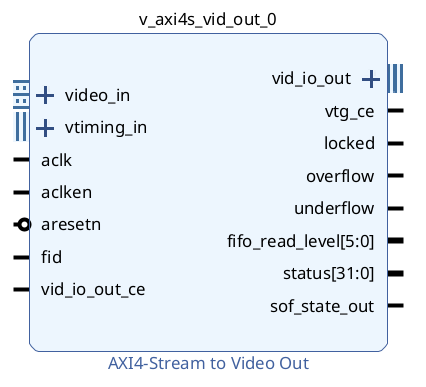{ #fig-axistream-to-video-final width="300" }


### Video Timing Controller

Luego agregue el bloque "Video Timing Controller" (VTC) como se ve en [](#fig-vtc)

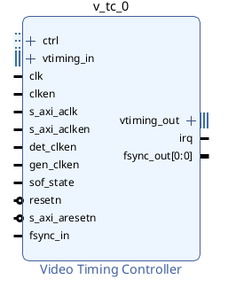{ #fig-vtc width="300" }

Este bloque se encarga de manejar la sincronizacion vertical y horizontal del display, diciendole al bloque que se encarga de la salida de video cuando emitir pixeles.

Haga doble click sobre este bloque para configurarlo y deshabilite la detección de sincronizacion de video como se aprecia en [](#fig-vtc-config), puesto que este bloque se encargara de esto. (Note que se mantiene activa la generacion de timing)

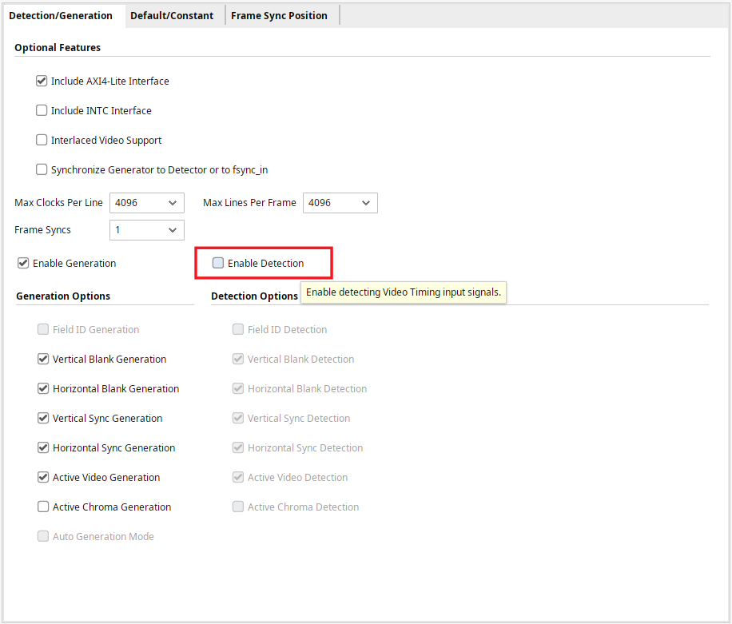{ #fig-vtc-config width="300" }


Una vez configurado deberia quedar como en la [](#fig-vtc-final).

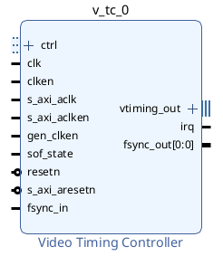{ #fig-vtc-final width="300" }


### Slice

Agregue el bloque Slice, el cual se usara para truncar la salida del bloque AXIVDMA para extraer solo la informacion relevante para VGA (la asociada a los valores de RGB), se deberia ver como en la [](#fig-slice).

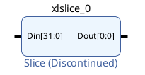{ #fig-slice width="300" }


Se tiene que los ultimos 24 pixeles estan asociados a los colores (8 bits para cada color) por lo que estos son los que usaremos. Para esto haga doble click sobre el bloque y configurelo de la manera que se ve en la figura [](#fig-slice-config).


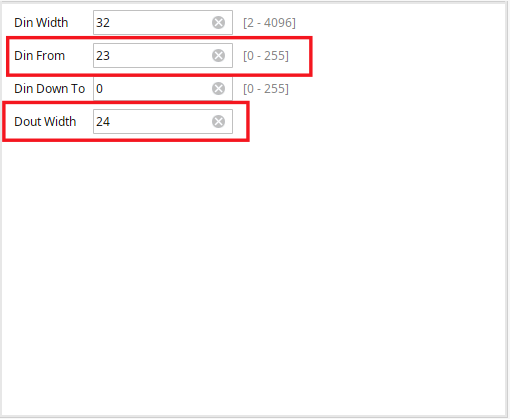{ #fig-slice-config width="300" }


Una vez configurado se deberia ver como en la [](#fig-slice-final).

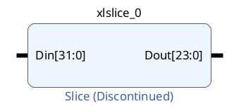{ #fig-slice-final width="300" }


### RGB to VGA

Agregue el bloque "RGB to VGA" (una de las IP's importadas) al diagrama de bloques como se ve en la [](#fig-rgb2vga), este bloque trunca las señales de 8 bits asociadas a cada color a la resolucion de preferencia. 

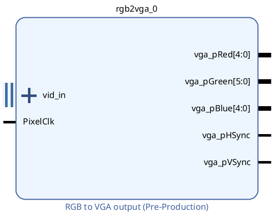{ #fig-rgb2vga width="300" }

Haga doble click y configure el bloque de acuerdo a lo visto en la [](#fig-rgb2vga-config). Se usa esta configuracion debido a que la placa Nexys A7 tiene una interfaz VGA con una resolucion de 4 bits por color

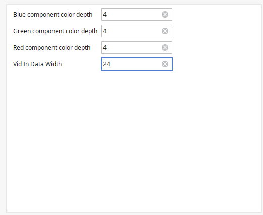{ #fig-rgb2vga-config width="300" }


### Dynamic Clock Generator


Agregue el bloque Dynamic Clock Generator al diagrama de bloques como se aprecia en [](#fig-dyn-clk)


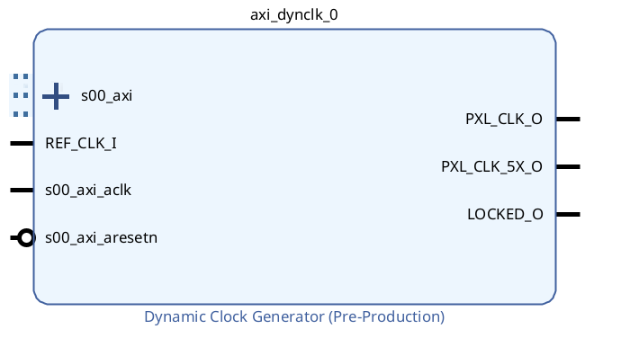{ #fig-dyn-clk width="300" }


### Interconexiones del Sub Sistema de Video


Conecte el puerto REF_CLK_I al puerto s00_axi_clk, ambos puertos del bloque Dynamic Clock generator como se aprecia en la [](#fig-conexion-1 ). Se realiza esta conexion debido debido a que se hara uso de un reloj de 100 Mhz para el sistema AXI y esta frecuencia de reloj es suficiente para hacer uso del PLL interno de la IP.


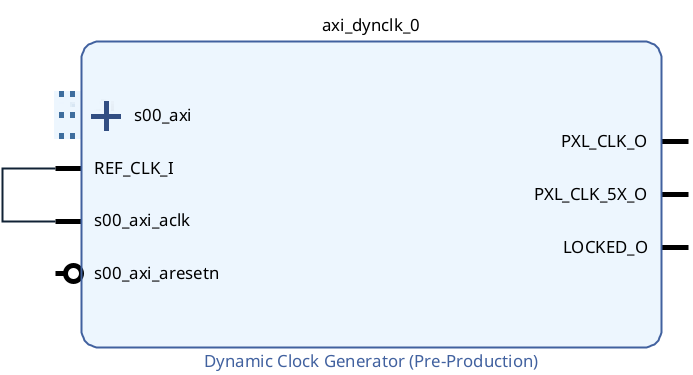{ #fig-conexion-1 width="300" }


Luego se conectara el reloj generado de esta IP al resto del sistema (Recordar que distinta frecuencia de reloj esta asociada a una distinta resolucion de video) como se aprecia en la [](#fig-conexion-5).


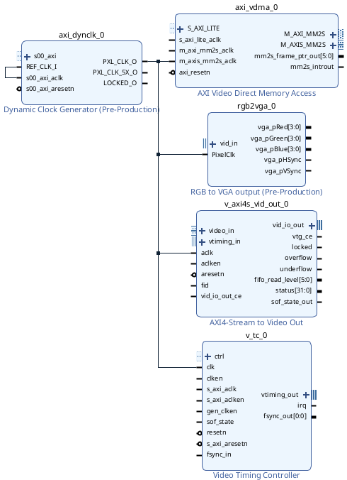{ #fig-conexion-5 width="400"}

Especificamente conecte PXL_CLK_O de Dynamic Clock Generator a:

- Puerto m_axis_mm2s_aclk de AXI Video Direct Memory Access (Note que es el puerto axiS, asociado a la modalidad Stream del protocolo AXI).
- PixelClk de RGB to VGA Output.
- aclk de AXI4-Stream to Video Out.
- clk de Video Timing Controller.


Luego conecte la interfaz vtiming_out de Video Timing Controller a vtiming_in de AXI4-Stream to Video Out como se ve en la [](#fig-conexion-6). Es a través de esta interfaz que el bloque VTC le indica que tan rapido o lento lanzar las tramas de video al bloque AXI4-Stream to Video Out.

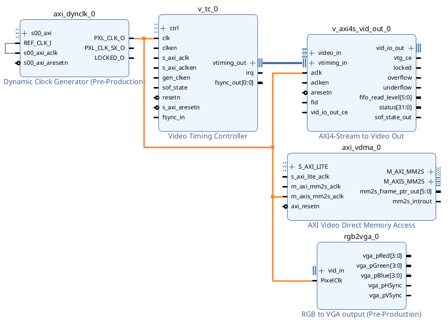{ #fig-conexion-6 width="1000"}


Conecte la interfaz vid_io_out de AXI4-Stream to Video Out a vid_in de RGA to VGA output como se ve en [](#fig-conexion-7).


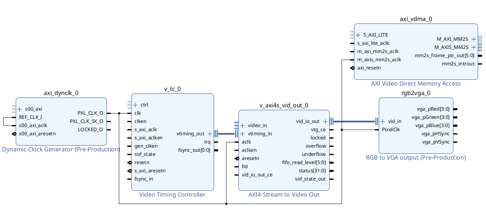{#fig-conexion-7 width="1000"}

Conecte el puerto m_axis_mm2s_tdata de AXI CDMA a Din de Slice (para truncar la informacion) como se ve en [](#fig-conexion-8).

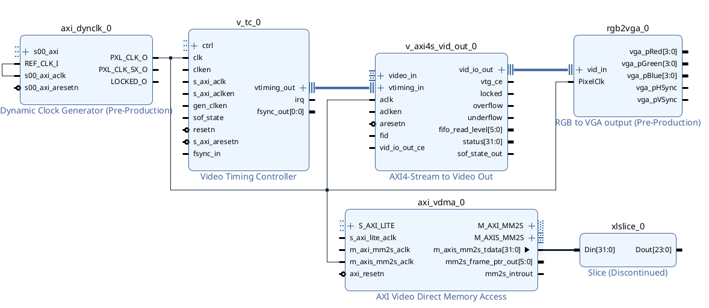{#fig-conexion-8 width="1000"}


Haga click en la interfaz **video_in** de *AXI4-Stream to Video out* para expandirla en puertos individuales y realice las siguientes conexiones para establecer el enlace entre la interfaz AXI-Stream de *AXI VDMA* a la de *AXI4-Stream to Video out*:

- Conecte la salida de Slice al puerto  x_axi_video_tdata del bloque AXI4-Stream to Video Out.
- Conecte el puerto m_axis_mm2s_tlast de AXI VDMA al puerto s_axis_video_tlast de AXI4-Stream to Video Out.
- Conecte el puerto m_axis_mm2s_tready de AXI VDMA al puerto s_axis_video_tready de AXI4-Stream to Video Out.
- Conecte el puerto m_axis_mm2s_tuser de AXI VDMA al puerto s_axis_video_tuser de AXI4-Stream to Video Out.
- Conecte el puerto m_axis_mm2s_tvalid de AXI VDMA al puerto s_axis_video_tvalid de AXI4-Stream to Video Out. 


Tras realizar todas las conexiones su diagrama debería quedar  como se ve en la [](#fig-conexion-13).

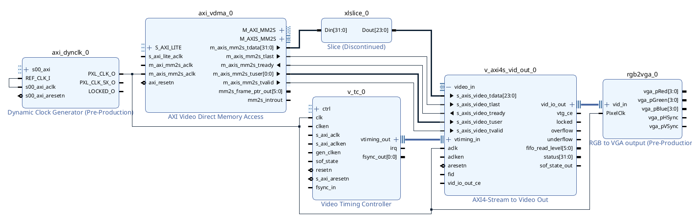{#fig-conexion-13 width="1000"}


### Crear puertos externos

Debido a que VGA no se encuentra entre las interfaces disponibles en la board file, se tienen que declarar como puertos genericos. Para esto seleccione los puertos de salida del bloque RGB to VGA output (Puede configurarlos individualmente o seleccionar varios manteniendo apretada la tecla control), haga click derecho y seleccione "Make External" como se aprecia en la [](#fig-external-ports).


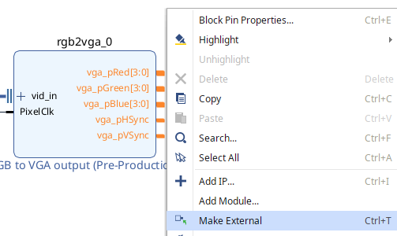{#fig-external-ports width="400"}


Con esto los puertos existen pero no han sido mapeados a los pines fisicos en la tarjeta, para esto se hace uso de un archivo de constraints, especificamente un Xilinx Design File (XDC). Este archivo cumple con varias funciones asociadas a llevar el diseño de logica configurable del software a la implementacion fisica:
Definiciones de relojes, restricciones de timing y mapeo de pines fisicos a los puertos del diseño.


Para agregar archivos de constraints basta con hacer el mismo procedimiento que se uso en secciones anteriores para añadir archivos verilog, pero cuando se abra la ventana emergente seleccione "Add or create constraints" como se ve en la [](#fig-constraints).

Agregue el archivo Ejemplo_7/constraints.xdc, note que dentro de este solo se han habilitado los pines asociados a VGA y se les ha asignado los nombres de los puertos recien creados.

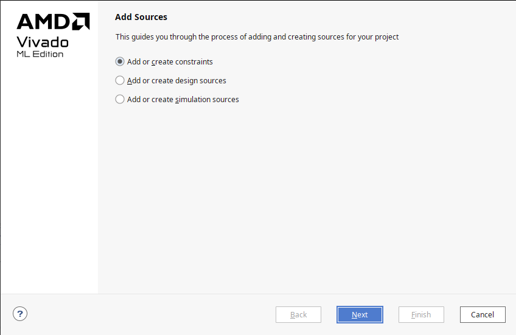{#fig-constraints width="500"}


Antes de incorporar el sistema al procesador, se vera brevemente la secuencia desde la perspectiva de hardware. Refierase a la [](#fig-diagrama-simple).


{#fig-diagrama-simple width="700"}
{#fig-diagrama-simple width="700"}


Se sigue la siguiente secuencia:

- Desde el modulo AXI VDMA se extrae el cuadro a desplegar.
- AXI VDMA se encarga de entregar el cuadro al bloque *AXI4-Stream to Video Out* a través de AXI4-Stream, se usa esta implementacion de AXI debido a que se realiza un paso constante de informacion sin direccionamiento de memoria.
- El bloque *Video Timing controller* se encarga de controlar el ritmo al que salen datos desde el bloque *AXI4-Stream to Video Out*.
- El cuadro pasa por el bloque *RGB2VGA* el cual se encarga de truncar los valores de los datos asociados al pixel a los permitidos por la interfaz VGA de la placa.


### Incorporación al Sistema

En esta seccion integraremos el sub sistema recien diseñado al procesador.

Haga click en la pestaña Diagram para salir del sub sistema y volver al nivel mas alto de jerarquia del diagrama de bloques.

Luego importe las IP's Memory Interface Generator y Clocking Wizard, configure como se vio en la sección anterior, debería quedar como la [](#fig-Mig).


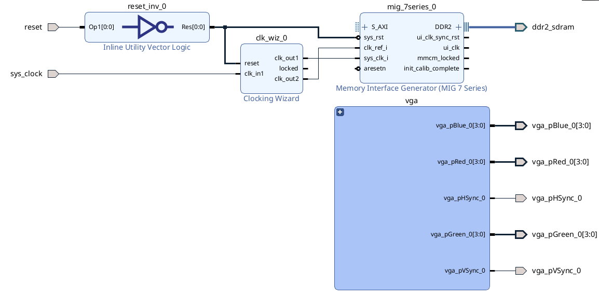{#fig-Mig width="600"}


Luego importe Microblaze-V y siga los pasos vistos en la sección anterior (aquí pondre un enlace a la sección), al momento de correr conexión automatica excluya vga de manera que la conexion automatica no mapee el subsistema al axi interconnect de la ram. Debería quedar como la [](#fig-preconnect).


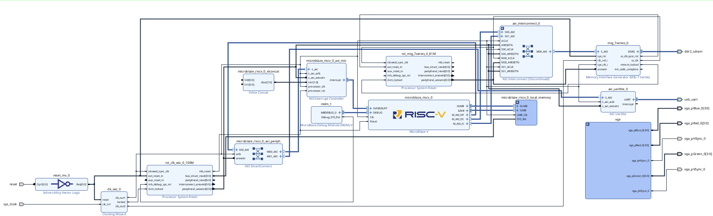{#fig-preconnect width="800"}

Finalmente corra nuevamente Connection automation, fijese que al correrlo el subsistema quede mapeado a AXI SmartConnect como en la [](#fig-vga-system) (Debería tener 5 puertos Master).

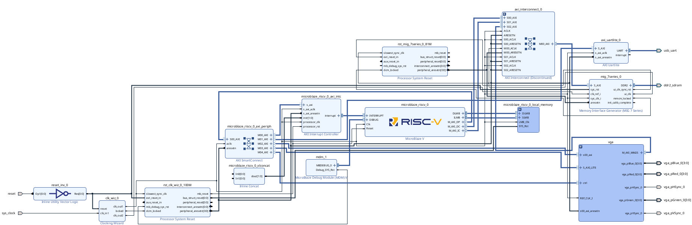{#fig-vga-system width="800"}


Finalmente siga los pasos asociados a extracción de hardware vistos en secciones previas. 

En la maquina del autor con estrategias de implementacion predeterminadas se obtuvo la utilizacion de recursos vista en la [](#tbl-resources).


<div markdown="1" style="text-align: center;">

Table: Utilización de recursos {#tbl-resources}

| Proceso  | LUT | FF | BRAM      |
| ------- | ----- | --------- | ---------------- |
| `Sintesis`   | 12891     | 15071        | 27     |
| `Implementacion`  | 11224    | 13905    | 27         |

</div>

## Diseño de Firmware

Abra Vitis, cree el archivo de plataforma y aplicación.

La aplicacion que se le dara al sistema es un cuadrado que rebota en los bordes de la pantalla (similar a los salva pantallas de los dvd).

Una vez creado el archivo de aplicación importe los archivos que se encuentran en la carpeta Ejemplo_7/src, siendo estos:

- app.c : Archivo donde se encuentra el main, aqui se inicializan los perifericos y se dibujan los cuadros a mostrar.
- display_ctrl.c y display_ctrl.h: Archivo fuente y encabezado donde se encuentran los controladores de vga, es en estos archivos donde se realiza la logica interna y coordinacion entre los modulos de DMA y salida de Video
- vga_modes.h: Encabezado que posee structs (tipos de datos que agrupan varias variables relacionadas) asociadas distintas resoluciones de monitor para facilitar el paso de esta informacion a las funciones de display_ctrl.c
- dynclk.c y dynclk.h: Controladores de la IP Dynamic Clock Generator de Diligent.


Si miramos en detalle el archivo app.c

```c
#include <stdio.h>
#include "xil_types.h"
#include "xil_cache.h"
#include "xparameters.h"
#include "display_ctrl.h"

// Tamaño del cuadro 
#define MAX_FRAME (1280*1024)
#define FRAME_STRIDE (1280*4)

DisplayCtrl dispCtrl; // Display driver struct
u32 frameBuf[DISPLAY_NUM_FRAMES][MAX_FRAME]; // Buffers para los cuadros
void *pFrames[DISPLAY_NUM_FRAMES]; // Arreglo de punteros a los cuadros

int main(void) {
	// Inicializar arreglos de punteros a los cuadros
	int i;
	for (i = 0; i < DISPLAY_NUM_FRAMES; i++)
		pFrames[i] = frameBuf[i];

	// Inicializar controlador del display (inicializa AXI_VDMA, Video Timing controller y Dinamic clock gen)
	DisplayInitialize(&dispCtrl, XPAR_XAXIVDMA_0_BASEADDR, XPAR_XVTC_0_BASEADDR, XPAR_AXI_DYNCLK_0_BASEADDR, pFrames, FRAME_STRIDE);

	// Elije el primer frame
	DisplayChangeFrame(&dispCtrl, 0);

	// Fija la resolucion
	DisplaySetMode(&dispCtrl, &VMODE_1280x1024);

	// Habilita la imagen
	DisplayStart(&dispCtrl);

	// Parametros obtenidos del controlador del display para la animacion
	int x, y;
	u32 stride = dispCtrl.stride / 4;
	u32 width = dispCtrl.vMode.width;
	u32 height = dispCtrl.vMode.height;

	u32 *frame;
	int right = 1;
	int down = 1;
	int xpos = 0;
	int ypos = 0;
	int step =2;
	u32 buff = dispCtrl.curFrame;

	// Animacion de un cuadrito moviendose
	while (1) {
			// Alterna entre los dos cuadros guardados en memoria
			buff = !buff;
			frame = dispCtrl.framePtr[buff];

			// Rellena la pantalla con blanco
			memset(frame, 0xFF, MAX_FRAME*4);

			// Ajusta la posicion del cuadrado (si llega al borde de la pantalla choca)
			if (right) {
				xpos=xpos+step;
				if (xpos == width-64)
					right = 0;
			}
			else {
				xpos=xpos-step;
				if (xpos == 0)
					right = 1;
			}
			if (down) {
				ypos=ypos+step;
				if (ypos == height-64) {
					down = 0;
				}
			}
			else {
				ypos=ypos-step;
				if (ypos == 0) {
					down = 1;
				}
			}

			// Dibuja el cuadrado en la posicion
			for (x = xpos; x < xpos+64; x++) {
				for (y = ypos; y < ypos+64; y++) {
					frame[y*stride + x] = 0;
				}
			}

			// Empujar los datos del Cache a la DDR
			Xil_DCacheFlush();

			// Cambia el frame activo al buffer
			DisplayChangeFrame(&dispCtrl, buff);

			// Espera a que el controlador del display este listo para cambiar los cuadros
			DisplayWaitForSync(&dispCtrl);
	}

	return 0;
}

```


Se tiene que el la función  DisplayInitialize() configura e inicializa tres IP's distintos:

- AXI VDMA: lee el framebuffer desde DDR y lo entrega como stream de píxeles.
- Video Timing Controller: genera las señales HSYNC/VSYNC/DE según la resolución elegida.
- Dynamic Clock Generator: ajusta el reloj de píxeles (para 1280x1024@60Hz son 108 MHz, no es un valor cualquiera).

Se tiene que la logica del display se basa en tener 2 cuadros en memoria externa (Dos cuadros de 1280×1024×4 bytes son 10 MB), mientras que el modulo VDMA esta leyendo 1 de los cuadros en el buffer para mandarlo en el monitor, el programa se encuentra dibujando el otro como se aprecia en la [](#fig-frames). Es por esto que esta la funcion DisplayWaitForSync(), la cual espera a que el siguiente cuadro este listo antes de realizar el cambio.

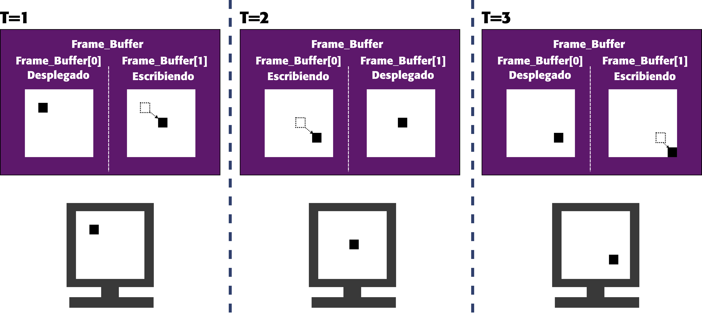{#fig-frames width="800"}

Se tiene que una vez que se ha realizado el dibujo, este dato se pasa de la cache de MicroBlaze V a la Memoria externa con la función Xil_DCacheFlush(), puesto que el modulo VDMA solo posee acceso a la memoria externa y no al cache del procesador.

## Validación 

Para corrobar el funcionamiento de la aplicación, cambie el parametro de la funcion DisplaySetMode(&dispCtrl, &VMODE_1280x1024) a la resolución del monitor que posea, en este caso se mantendrá la configuración  preexistente y se desplegarán los graficos sobre un monitor 1280x1024.

Una vez elegido el parámetro conecte su placa al computador, conecte el puerto vga a su monitor y programe la placa. Se debería ver como en la [](#fig-gif).

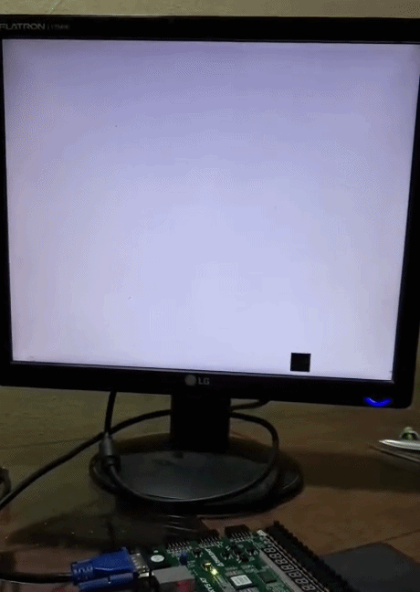{#fig-gif width="600"}