# Guía 8 : Uso de System ILA


## Contexto

Aqui pondre una explicacion en mayor detalle de AXI4-Lite, que es el foco de esta guía.

Incluirá:

- Descripcion mas detallada de cada uno de los 5 canales
- Descripcion de las señales.
- Formas de onda de ejemplo para cada transaccion.
- Explicar que las direcciones siempre son (direccion en canal de AXI + Direccion base del periférico mapeado en memoria)

## Diseño de Hardware

Abra Vivado y genere un nuevo proyecto. 

En este genere un diagrama de bloques. En el diagrama de bloques haga un sistema con MicroBlaze V con interrupciones habilitadas y con un periférico Uart como se ve en la[](#fig-bd_no_adder_tree). Si no recuerda como realizarlo puede revisar la [sección de diseño de Hardware de la guía 3](../../Ejemplo_3_Interrupts/Ejemplo_3/#diseno-de-hardware).

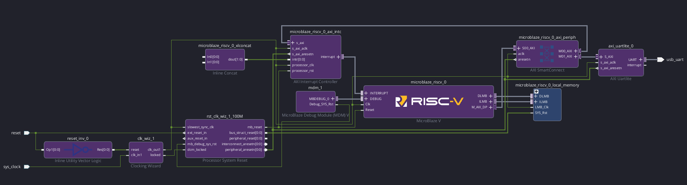{ #fig-bd_no_adder_tree width="1000" }

Desde el panel lateral *Boards* agregue **16 LEDs** y **16 Switches** al diagrama de bloques como se ve en la [](#fig_LEDS_Switches).


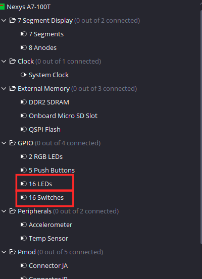{ #fig_LEDS_Switches width="500" }

Luego presione *Run Connection Automation* y mantenga las conexiones predeterminadas. Su diagrama de bloques debería verse como en la [](bd_Leds_switches). Note que los leds estan en GPI0 y los interruptores están en GPIO2.


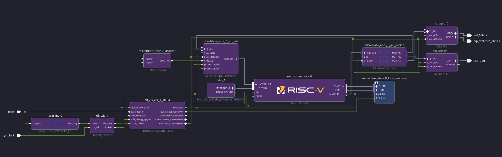{ #fig-bd_Leds_switches width="1000" }


Luego agregue al diagrama de bloques la IP *Axi timer*, la cual es usada para medir tiempo o generar eventos periodicos. Tras agregar la IP corra *Run Connection Automation* para integrar esta IP a la interconexion AXI del sistema. Debería verse como en la [](#fig-bd_timer).

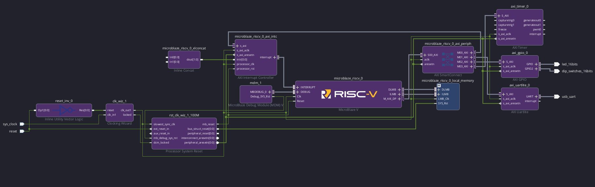{ #fig-bd_timer width="1000" }


Ahora integre la IP "System_ILA" como se ve en la [](#fig-System_ILA). Esta es una IP de depurado de Xillinx pata el monitoreo de señales a nivel de interfaz dentro de un sistema, particularmente AXI, AXI-Stream y AXI4-Lite. Al tener conocimiento de la naturaleza de la conexión, agrupa todas las señales correspondientes a una misma interfaz en el visor de ondas.

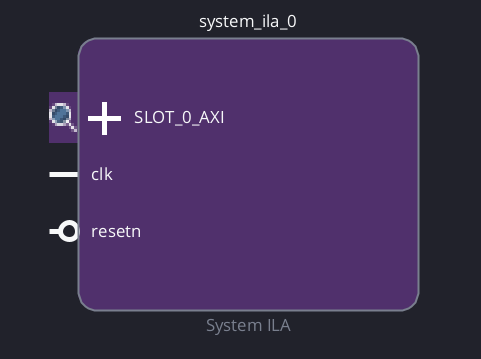{ #fig-System_ILA width="250" }


Haga doble click en la IP para abrir la ventana de configuración, en opciones generales están las siguientes opciones:


- **Monitor Type**: elige que observa la ip.
	- **Native**: Monitorea señales particulares.
	- **Interface**: Monitorea interfaces compuestas por varias señales como los canales de AXI.
	- **Mix**: Puede monitorear ambos.
- **Number of Interface Slots** : cuantas conecciones va a monitorear esta IP.
- **Sample Data Depth** : Profundidad del buffer de captura, es decir cuantas muestras son guardadas por evento gatillante.
- **Number of Comparators**: Numero de comparadores independientes por señal a usar como gatillante de captura. A cada señal gatillante se le puede asignar una condicion por comparador.
- **Trigger Out Port**: Señal de salida opcional que se pone en alto cuando este bloque es gatillado.
- **Trigger In Port**: Señal de entrada opcional que gatilla la captura de señales de manera independiente a las señales elegidas como gatillantes de forma interna en el bloque.
- **Capture Control**: Habilita calificacion de almacenado. Cuando esta apagado, el ILA almacena cada ciclo de reloj dentro del bufffer interno cuando es gatillado. Cuando esta activado se puede señalar una condicion de captura de manera que  solo los ciclos donde la condicion es verdadera se consume espacio del bugger inteno
- **Advanced Trigger**: Permite generar  condiciones de captura mas avanzadas basadas en maquinas de estado.

Tambien se tiene que este bloque automaticamente realiza una estimacion acerca de los recursos que va a utilizar y la muestra en un porcentaje de uso de las BRAMS disponibles en la placa. El consumo de recursos es directamente proporcional a la cantidad de interfaces medidas y tamaño de muestras por capturas.

En esta guía se van a medir dos interfaces por lo que fije **Number of Interface Slots** y para que el tamaño de la transacción no sea un impedimento para la visualizacion de la forma de onda, fije **Sample Data Depth** en 4096 como se ve en la [](#fig_System_ILA_Config).


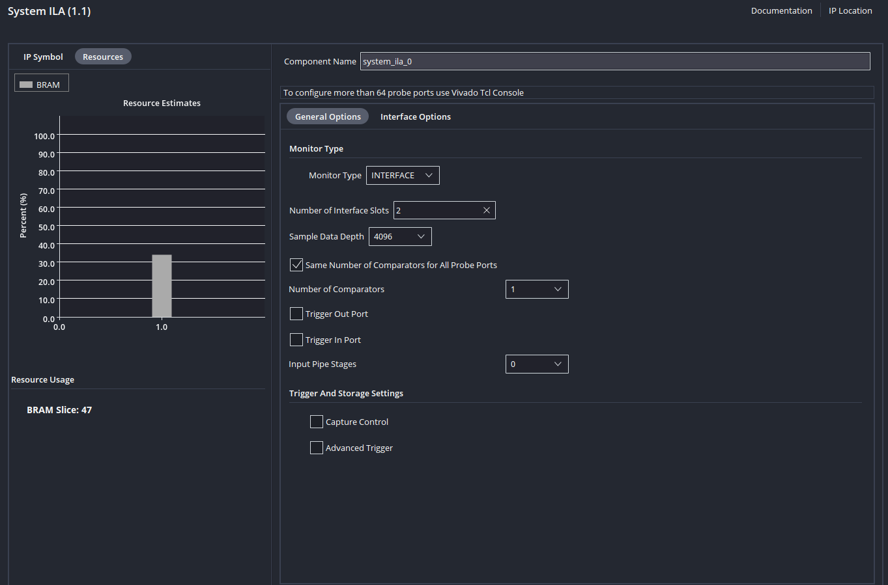{ #fig_System_ILA_Config width="1000" }

Note que no esta presente el botón *Run connection Automation*, esto es debido a que el System ILA se puede conectar a distintas interfaces AXI dentro de un mismo sistema.

Realice las siguientes conexiones para integrar el bloque al esquema axi y medir las dos interfaces de interés:

- *clk_out1* de **Clocking Wizard** a *clk* de **System ILA**.
- *peripheral_aresetn* de **Processor System Reset** a *reset* de **System ILA**.
- *SLOT_0_AXI* de **System ILA** a *S_AXI* de **AXI Timer**
- *SLOT_1_AXI* de **System ILA** a *S_AXI* de **AXI GPIO**

Debería verse como la [](#fig-conexion-ILA-SLAVE).

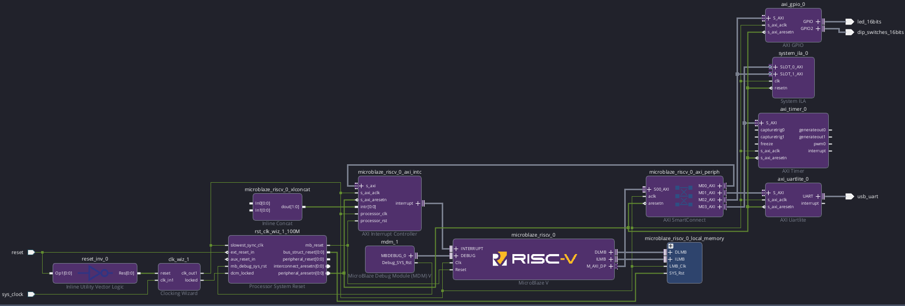{ #fig-conexion-ILA-SLAVE width="1000" }

Finalmente conecte *interrupt* de **AXI Timer** a *In0* de **Inline Concat** para habilitar las interrupciones del temporizador como se ve en [](#fig_bd_interrupt).

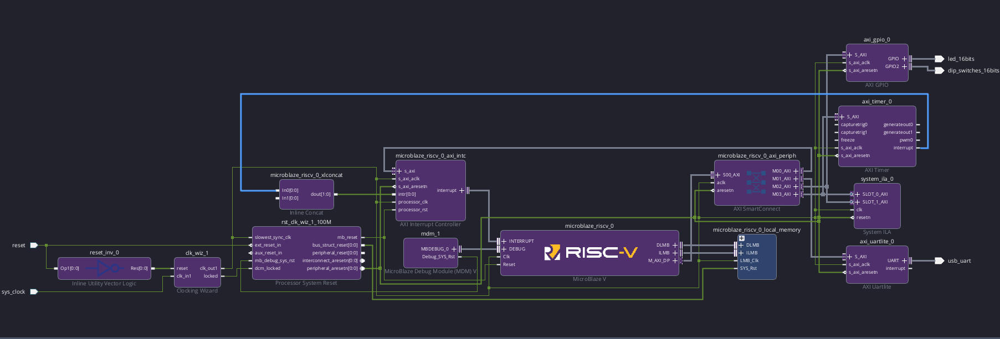{ #fig_bd_interrupt width="1000" }

Valide su diagrama de bloques, genere los productos de salida y la envoltura HDL.

Después de correr la síntesis y la implementación, el autor obtuvo la utilización de recursos vista en la [](#tbl-resources-global).

<div markdown="1" style="text-align: center;">

Table: Utilización de recursos {#tbl-resources-global}

| Proceso  | LUT | FF | BRAM      | 
| ------- | ----- | --------- | ---------------- |
| `Sintesis`   | 5718     | 6644        | 57     | 
| `Implementacion`  | 5686    | 7197    | 57         |

</div>

Tras exportar el archivo xsa **no cierre Vivado** debido a que el depurado a través de System ILA se realiza en esta plataforma.

## Diseño de Firmware


Abra Vitis, fije un workspace, cree un nuevo componente de plataforma y uno de aplicación.

En el componente de aplicación importe el archivo Ejemplo_8.c de la carpeta Ejemplo_8, la que tiene el siguiente código:

```c
#include <stdio.h>
#include <xgpio.h>
#include "xparameters.h"
#include "xil_printf.h"
#include "xtmrctr.h"
#include "xil_types.h"

XTmrCtr   TimerInstance;
XGpio     GpioInstance;


#define TIMER_COUNTER_0  0
#define SWITCH_CHANNEL  2
#define LED_CHANNEL     1

int main() {
    int Status;
    u32 valor_switches;
    u32 TimerValue1, TimerValue2;
	//Inicializacion de perifércos
    Status = XGpio_Initialize(&GpioInstance, XPAR_AXI_GPIO_0_BASEADDR);
    if (Status != XST_SUCCESS) return XST_FAILURE;
    Status = XTmrCtr_Initialize(&TimerInstance,XPAR_AXI_TIMER_0_BASEADDR);
    if (Status != XST_SUCCESS) return XST_FAILURE;

	// Fija que canal de GPIO es entrada y cual es salida
    XGpio_SetDataDirection(&GpioInstance, SWITCH_CHANNEL, 0xFFFFFFFF);
    XGpio_SetDataDirection(&GpioInstance, LED_CHANNEL,    0x00000000);
    // Escritura  (Canales AW W B)
    XGpio_DiscreteWrite(&GpioInstance, LED_CHANNEL, 0x00005555);
    // Lectura (AR R)
    valor_switches=XGpio_DiscreteRead(&GpioInstance, SWITCH_CHANNEL);

    // Cambio dinamico de estado de registro
    XTmrCtr_Start(&TimerInstance, TIMER_COUNTER_0);
    TimerValue1=XTmrCtr_GetValue(&TimerInstance, TIMER_COUNTER_0);    
    TimerValue2=XTmrCtr_GetValue(&TimerInstance, TIMER_COUNTER_0);

    
    return 0;
}
```

En este archivo se añade la librería "xtmrctr.h" que define el manejo del periférico AXI Timer.
Este programa sigue la siguiente secuencia:

- Se inicializan los periféricos.
- Define las direcciones de los GPIO (Switches como entradas y LEDs como salidas).
- Se realiza una escritura en los 16 LEDs con un patrón 0x0101010101.
- Se realiza una lectura del valor actual de los 16 switches.
- Se inicia el timer.
- Se mide el valor actual del timer dos veces.

Compile la aplicación haciendo click en *Build* del panel lateral. El autor obtuvo un ELF con un tamaño de 11.6 KB como se ve en la [](#tbl-elf-size).

<div markdown="1" style="text-align: center;">

Table: Tamaño del ELF {#tbl-elf-size}

| text  | data | bss | dec      |
| ------- | ----- | --------- | ---------------- |
|  7664  | 342     | 3616        | 11621     |

</div>


## Verificación

Para poder hacer uso del System ILA hay que programar la placa a través de Vivado, para esto hay que hacer que Vitis no programe la placa a nivel de hardware y se ocupe solamente de cargar la aplicación.

Para esto vaya al menu lateral y presione el botón de configuración,tiene que posicionar el mouse en *Run* o *Debug* para que aparezca como se ve en la [](#fig_Config_vitis_run).

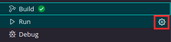{ #fig_Config_vitis_run width="500" }

En la ventana de configuración desmarque la casilla *Program Device* como se ve en la [](#fig_Disable_programing).

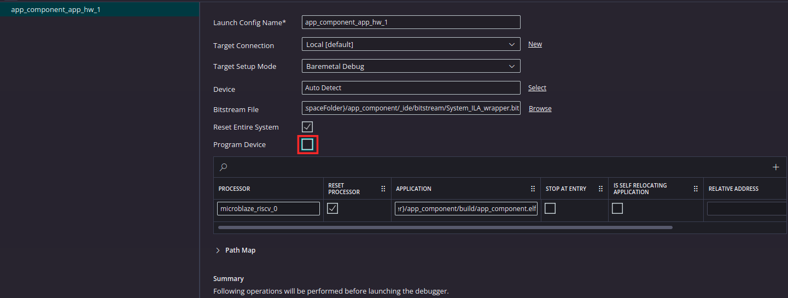{ #fig_Disable_programing width="1000" }

Conecte la FPGA a su ordenador.

Luego vuelva a Vivado y programe la placa, para esto vaya al menu lateral de la izquierda y presione *Open Target* como se ve en []().Esto lanzara un botón que dice "Auto_connect" , presionelo para que detecte automáticamente la placa.

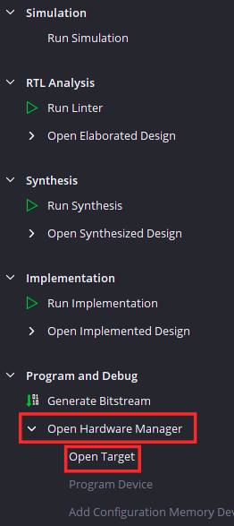{ #fig width="250" }

Esto lo llevará a la perspectiva de depurado de Vivado, como se ve en la [](#fig_Interfaz_Debugging_Vivado), están las dos interfaces definidas en la [](#fig-conexion-ILA-SLAVE) con  *slot_0* correspondiendo al timer y *slot_1* correspondiendo al modulo GPIO.


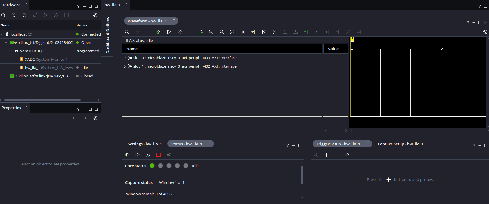{ #fig_Interfaz_Debugging_Vivado width="1000" }

Al hacer click en cualquiera de las dos interfaces AXI se expande en los 5 canales de AXI4-Lite definidos en [la sección de contexto](#contexto) como se ve en la [](#fig-5-channels).

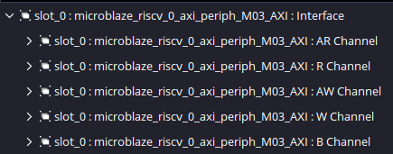{ #fig-5-channels width="1000" }

Para señalarle al bloque *System ILA* como realizar la captura de los datos hay que agregar señales particulares que actuaran como los gatillos que le diran cuando terminar y empezar una captura. Para esto haga click en el botón "+" de la pestaña Trigger Setup como se ve en [](#fig-Add_trigger).

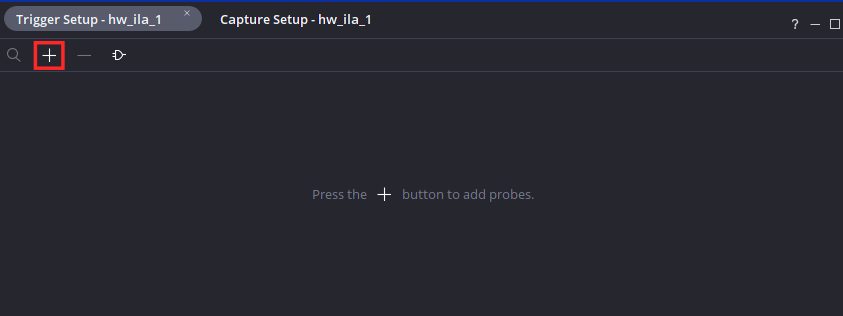{ #fig-Add_trigger width="1000" }


Las señales que mas nos sirven por canal son:

- WVALID: Señal que se pone en alto cuando el procesador realiza una escritura correctamente en el periférico.
- RREADY: Señal que se pone en alto cuando el procesador realiza una transacción de lectura correctamente.

Añada estas señales para *slot_0* y *slot_1* de manera que se puedan analizar todas las transacciones de ambas interfaces como se ve en la [](#fig_Señales_gatillantes).

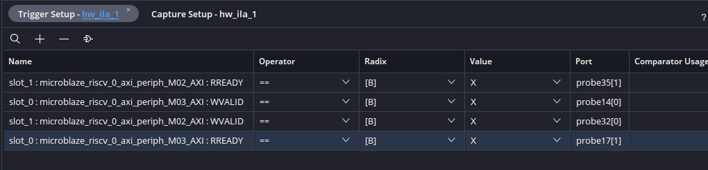{ #fig_Señales_gatillantes width="1000" }

Ya estando añadidas las señales, hay que añadirles una condición, en este caso en cada una de las señales haga click en la seccion *Value* y fijela en R (0-to-1-transition) de manera que cuando estas señales se pongan en alto se realice la captura. Debería quedar como en la [](#fig_Señales_gatillantes_rise).

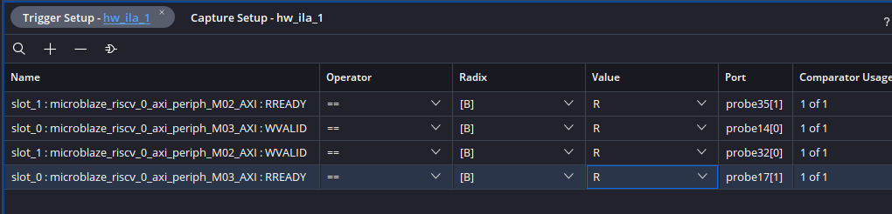{ #fig_Señales_gatillantes_rise width="1000" }

Ya que se tienen varias condiciones gatillantes, hay que asignarles una logica al conjunto para definir el comportamiento de la captura.  Haga click el boton de *Set Trigger Condition* visto en la [](#fig-Trigger_condition) y fijelo en "Set Trigger Condition to Global OR" de manera que todas las transiciones gatillen de forma individual la captura.

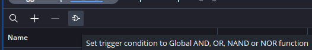{ #fig-Trigger_condition width="1000" }

Luego haga click en *Program Device* en el panel lateral visto en la [](#fig_Program_device) para programar la tarjeta, luego haga click en el pop-up "xc7a100t_0" que hace referencia al chip de la placa.

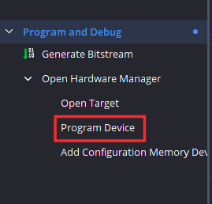{ #fig_Program_device width="500" }


Esto lanzará otra ventana emergente, donde se mostrará el archivo Bitstream (que posee la definicion de hardware de la placa) y el archivo *ltx* que contiene la definición del System ILA como se ve en la[](#fig_Bitstream_ltx).

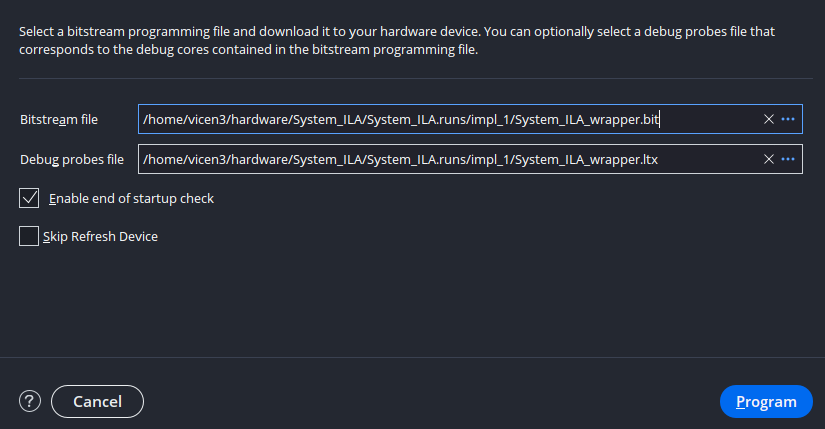{ #fig_Bitstream_ltx width="1000" }

Tras programar el hardware de la placa, hay que lanzar la aplicacion desde Vitis.

En vitis empiece una sesion de depurado, de manera que se puedan apreciar las transacciones linea a linea, debería verse como en la [](#fig_Sesion_depurado_Vitis).


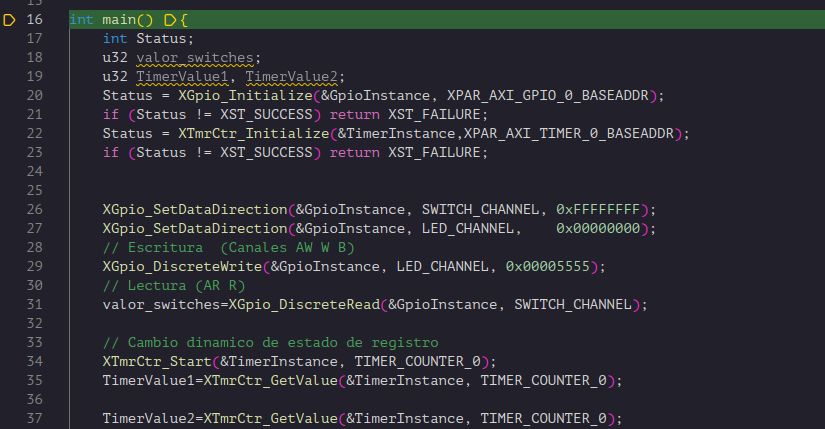{ #fig_Sesion_depurado_Vitis width="1000" }

Una vez este en la sesión de depurado de Vitis, vuelva a Vivado para armar el ILA. 

En Vivado presione el botón *auto-retrigger* de ILA de manera que cada vez que termine una captura, el ILA se prepare automaticamente para recibir otra. Luego prepare el Bloque para capturas haciendo click en el boton de  *Run Trigger* como se ve en la [](#fig_Auto_trigger).

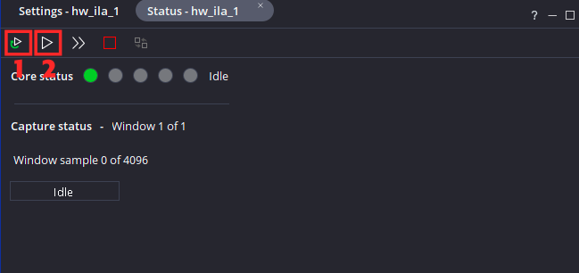{ #fig_Auto_trigger width="1000" }

Luego vuelva a Vitis y presione *Step Over(F10)* hasta pasar la linea:

```c
Status = XTmrCtr_Initialize(&TimerInstance,XPAR_AXI_TIMER_0_BASEADDR);
```

Donde se realiza la inicializacion del periférico AXI Timer. Note que el periférico AXI GPIO no realiza ninguna escritura ni lectura de registros al momento de inicializarse.

Una vez que paso esa linea, vuelva a Vivado. Notará que ahora hay datos en el visor de ondas, esto es debido a que se realizaron escrituras en el modulo para inicializarlo.

Expanda los canales de escritura de *slot_0*: **AW Channel** y **W Channel** como se ve en la [](#fig_inicializacion_timer_prezoom).

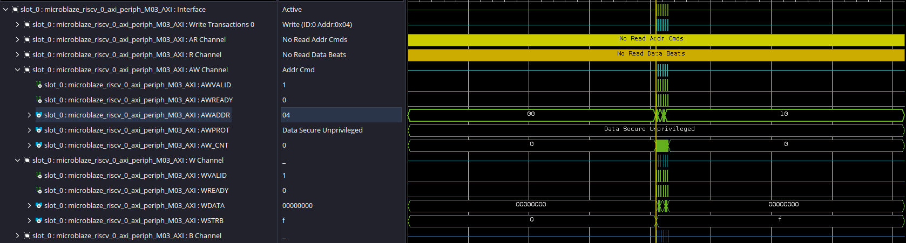{ #fig_inicializacion_timer_prezoom width="1000" }

Para verlo en mas detalle haga click en Zoom in como se ve en la [](#fig_inicializacion_timer_zoom). Note que el zoom se realizará enfocando el marcador amarillo el cual puede arrastrar con el mouse.

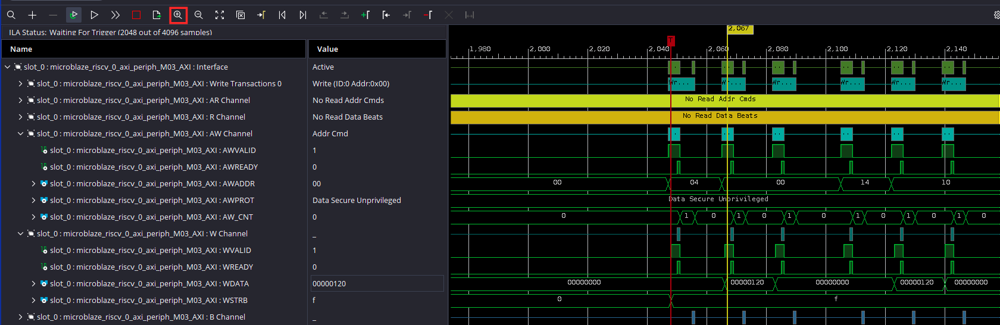{ #fig_inicializacion_timer_zoom width="1000" }


Para entender la secuencia hay que revisar el mapa de registros de AXI timer visto en la [](#Register_map) basado en la [documentacion oficial](https://docs.amd.com/v/u/en-US/axi_timer_ds764) el cual indica cual es la función de cada registro interno de la IP. Note que por defecto la IP internamente maneja dos temporizadores.

<div markdown="1" style="text-align: center;">

Table: Tamaño del ELF {#Register_map}

| Nombre Registro  | Direccion | Descripcion | 
| ------- | ----- | --------- |  
|  TCSR0  | 0x00     |    Registro de control de timer 0    | 
|  TLR0  | 0x04     |  Registro de carga de timer 0      | 
|  TCR0  | 0x08     |    Registro que guarda el valor actual del timer 0   | 
|  TCSR1  | 0x10     |    Registro de control de timer 1    | 
|  TLR1  | 0x14     |    Registro de carga de timer 1    | 
|  TCR1  | 0x18     | Registro que guarda el valor actual del timer 1     | 

</div>

Enfocandonos en la forma de onda vista en la [](#fig-Waveform_Inicializar_timer).

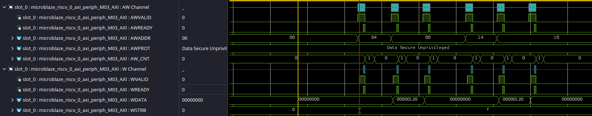{ #fig-Waveform_Inicializar_timer width="1000" }


En la forma de onda se realizan 6 operaciónes de escritura mostradas en la [](#tbl-init-timer). Note que varios bits dentro de un mismo registro pueden cumplir distintas funciones, para mas información de que representa cada bit en cada registro de la IP, referirse a [la documentación oficial](https://docs.amd.com/v/u/en-US/axi_timer_ds764).


<div markdown="1" style="text-align: center;">

Table: Tamaño del ELF {#tbl-init-timer}

| AWADDR  | WDATA | Significado | 
| ------- | ----- | --------- |  
|  0x04  | 0x00000000     |     Se carga el valor 0 registro de carga al timer 0| 
|  0x00  | 0x00000120     |     Se fija el timer 0 al estado reset y se fija el valor actual del timer al valor del registro de carga del timer 0 | 
|  0x00  | 0x00000000     |     Se sale del estado de reset e inhabilita el timer 0 | 
|  0x14  | 0x00000000     |     Se carga el valor 0 registro de carga al timer 1| 
|  0x10  | 0x00000140     |     Se fija el timer 1 al estado reset y se fija el valor actual del timer al valor del registro de carga del timer 1 | 
|  0x10  | 0x00000000     |     Se sale del estado de reset e inhabilita el timer 1 | 
</div>

Esta secuencia esta descrita en la implementación de la función que inicializa el periférico :XTmrCtr_Initialize(), la cual hace un llamado a la funcion XTmrCtr_InitHw() donde esta la siguiente secuencia:

```c
/* Set the compare register to 0. */
XTmrCtr_WriteReg(InstancePtr->BaseAddress, TmrIndex,
            XTC_TLR_OFFSET, 0);
/* Reset the timer and the interrupt. */
XTmrCtr_WriteReg(InstancePtr->BaseAddress, TmrIndex,
            XTC_TCSR_OFFSET,
            XTC_CSR_INT_OCCURED_MASK | XTC_CSR_LOAD_MASK);
/* Release the reset. */
XTmrCtr_WriteReg(InstancePtr->BaseAddress, TmrIndex,
            XTC_TCSR_OFFSET, 0);
```

Note que son 3 escrituras en registros y al ser 2 temporizadores se realiza un total de 6 escrituras.


Debido a que se activó el auto-gatillado del ILA,este ya se encuentra listo para una nueva captura. Avance hasta pasar la linea donde se define si el canal de interruptores corresponde a una salida o a una entrada:

```c
    XGpio_SetDataDirection(&GpioInstance, SWITCH_CHANNEL, 0xFFFFFFFF);
```


Para entender la secuencia hay que revisar el mapa de registros de AXI GPIO visto en la [](#Register_map_GPIO) basado en la [documentacion oficial](https://docs.amd.com/v/u/1.01b-English/ds744_axi_gpio). 

<div markdown="1" style="text-align: center;">

Table: Tamaño del ELF {#Register_map_GPIO}

| Nombre Registro  | Direccion | Descripcion | 
| ------- | ----- | --------- |  
|  GPIO_DATA  | 0x00     |    Registro de datos de canal GPIO 1    | 
|  GPIO_TRI  | 0x04     |  Registro de estado de canal GPIO 1      | 
|  GPIO2_DATA  | 0x08     |    Registro de datos de canal GPIO 2    | 
|  GPIO2_TRI  | 0x0C     |  Registro de estado de canal GPIO 2      | 

</div>

En este caso se busca definir el canal 2 (los interuptores) como entrada, para esto hay que poner en alto cada bit que se desee usar como entrada de el registro de estado. Por lo que se realiza una escritura de 0xFFFFFFFF sobre el registro en la dirección 0x0C. Vuelva a Vivado y expanda los canales AW y W de *slot_1*. Se debería ver como en la [](#fig_WV_direccion_sw).


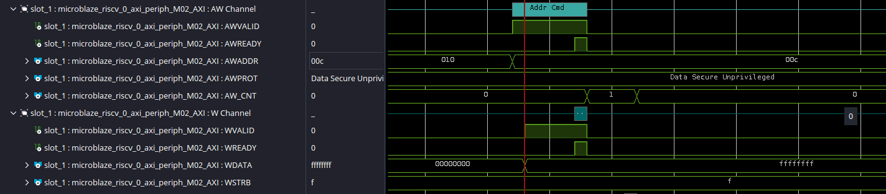{ #fig_WV_direccion_sw width="1000" }


Avanze hasta pasar la linea donde se indica que el canal de leds corresponde a una salida:
```c
    XGpio_SetDataDirection(&GpioInstance, LED_CHANNEL,    0x00000000);
```

En este caso se busca definir el canal 1 como salida, para esto hay que poner en bajo cada bit que se desee usar como salida en el registro de estado correspondiente a este canal.Por lo que se realiza una escritura de 0x00000000 sobre el registro en la dirección 0x04. Vuelva a Vivado y debería ver en la forma de onda lo que se ve en la [](#fig_WV_direccion_LED).

{ #fig_WV_direccion_LED width="1000" }

Avanze hasta pasar la linea conde se realiza  una escritura de las sobre el canal GPIO de las LEDs:

```c
    XGpio_DiscreteWrite(&GpioInstance, LED_CHANNEL, 0x00005555);
```

En este caso se va a realizar una escritura sobre el registro de datos del canal GPIO 1. Se escribirá el valor 0x00005555 en el registro de datos del canal 1 (con direccion 0x00) como se ve en la [](#fig_wv_escritura_LEDS). Si se fija en su tarjeta, deberia ver un patron de leds intercalado.

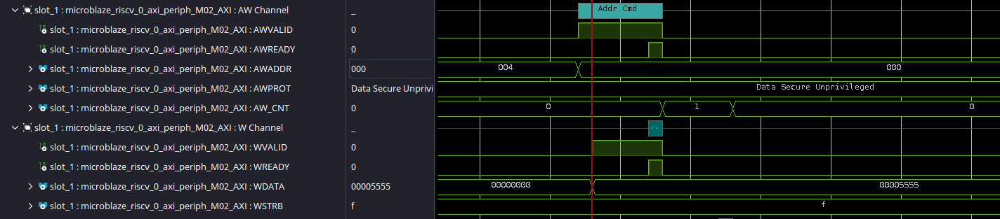{ #fig_wv_escritura_LEDS width="1000" }


Antes de pasar a la siguiente linea, fije los interruptores físicos de su tarjeta Nexys A7 en un valor de su preferencia.En el caso de esta guia se mantendran en alto (en dirección a las LEDS) solo los 4 interruptores menos significativos, formando asi el valor 0x0000000F.

Avanze hasta pasar la linea donde se lee el estado actual de los interuptores:

```c
    valor_switches=XGpio_DiscreteRead(&GpioInstance, SWITCH_CHANNEL);
```

En este caso se va a realizar una lectura sobre el registro de datos del canal GPIO 2 (direccion 0x08).Debido a que en este caso se desea observar una lectura lo que dirijase a los canales R y AR de *slot_0* como se ve en la  [](#fig_wv_Lectura_SW).

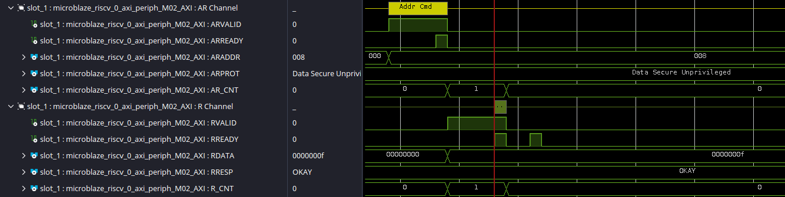{ #fig_wv_Lectura_SW width="1000" }


Luego pase a la linea donde se inicializa el timer.

```c
    XTmrCtr_Start(&TimerInstance, TIMER_COUNTER_0);
```

Esta funcion va a realizar dos escrituras, ambas sobre el registo de control del temporizador 1 (dirección 0x00). Primero se escribe 0x20 para pasar el valor del registro de carga al registro de valor actual. Luego se escribe 0x80 para habilitar el contador de manera que empiece a contar como se ve en la [](#wv_Timer_start) donde se leen las interfaces AW y W de *slot_0*.

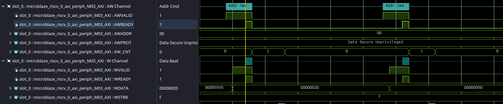{ #wv_Timer_start width="1000" }

Luego pase a la linea donde se lee el valor del timer. 

```c
    TimerValue1=XTmrCtr_GetValue(&TimerInstance, TIMER_COUNTER_0);
```

En este caso se va a realizar una lectura sobre el registro de valor actual del contador 1 el cual posee la dirección 0x04. Note que el valor de actual de este registro depende de cuantos ciclos de reloj han pasado desde la habilitación del contador. Para ver esta transacción vaya a los canales R y AR de la *slot_0*  como se ve en la [](#wv_Timer_start1).

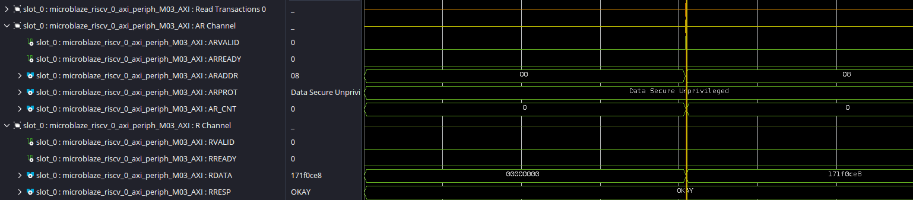{ #wv_Timer_start1 width="1000" }

Luego pase a la linea donde se lee el valor del timer de nuevo.

```c
    TimerValue2=XTmrCtr_GetValue(&TimerInstance, TIMER_COUNTER_0);
```

Nuevamente se va a realizar una lectura sobre el registro de valor actual del contador 1 el cual posee la dirección 0x04. Note que el valor de actual de este registro depende de cuantos ciclos de reloj han pasado desde la ultima lectura. Para ver esta transacción vaya a los canales R y AR de la *slot_0*  como se ve en la [](#wv_Timer_start2).


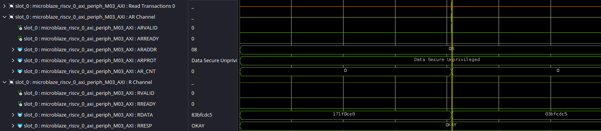{ #wv_Timer_start2 width="1000" }
